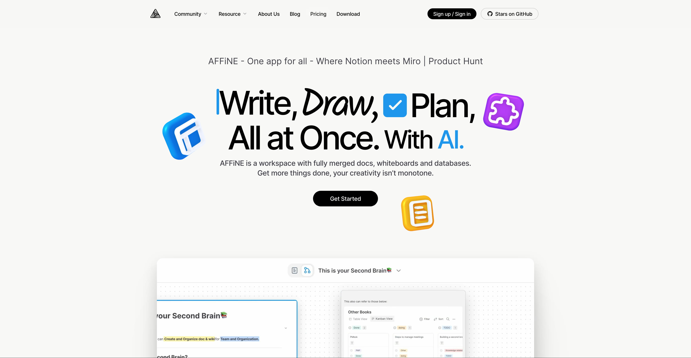
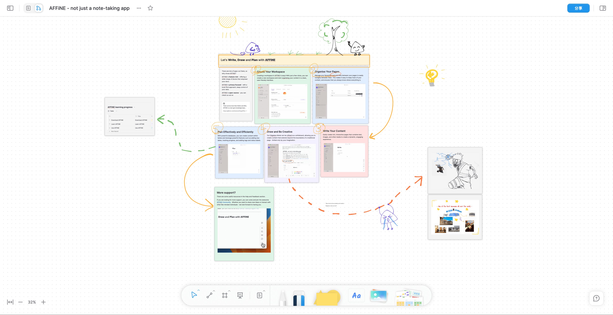
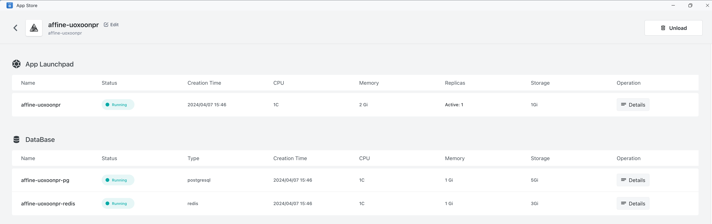
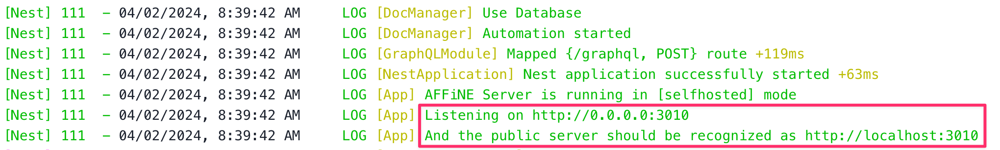
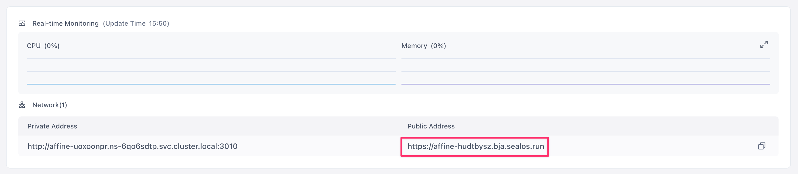
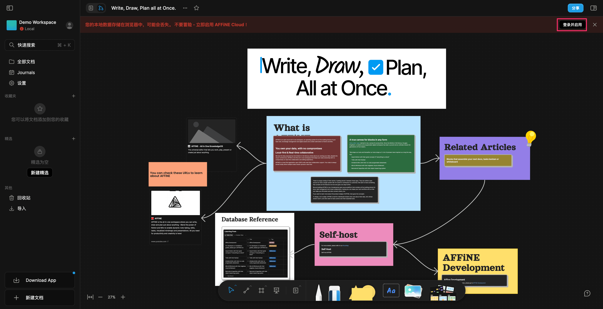
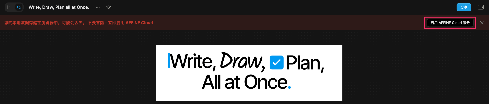

AFFiNE is a completely open-source alternative to Notion and Miro, with a greater emphasis on privacy and security. Unlike Notion, AFFiNE prioritizes the storage of note content locally. The GitHub repository can be found at [https://github.com/toeverything/AFFiNE](https://github.com/toeverything/AFFiNE).

<!--truncate-->

Built using Rust and TypeScript, AFFiNE offers developers maximum flexibility with a simple, single-command setup. This allows for easy customization and deployment of the application.

While Miro and Notion focus primarily on whiteboards and pages, AFFiNE positions itself as an integrated KnowledgeOS. It supports kanban boards, tables, and rich text paragraphs as building blocks to create pages or whiteboards, enabling comprehensive document editing, data processing, and brainstorming in one place.

## Key Features of AFFiNE

### 1. Seamless Integration of Documents and Whiteboards

AFFiNE stands out as one of the few applications that allows users to place any type of content on a borderless canvas, including rich text, sticky notes, embedded web pages, multi-view databases, linked pages, and even slides.

Each page in AFFiNE has two views, allowing users to access and edit fully functional blocks anywhere, in any form.

### 2. Multi-modal AI Copilot

AFFiNE's AI capabilities can assist with a wide range of tasks, from writing professional work reports and turning outlines into expressive slides to summarizing articles into well-structured mind maps. It can even help users draw and write prototype apps and web pages with just a single prompt.

### 3. Local-First & Real-Time Collaboration

AFFiNE adheres to the concept of local-first, emphasizing data privacy. Users have the option to opt out of the cloud service and synchronize their data independently, providing them with greater control over their information.

### 4. Self-Hosting

Users can freely fork and build custom versions of AFFiNE or self-host the application. AFFiNE also plans to launch a plugin community and support third-party modules in the future.

## Self-Hosting AFFiNE

Self-hosting AFFiNE requires PostgreSQL and Redis databases, which can be complex to set up. However, the [Sealos app store](https://sealos.run/docs/guides/templates/) offers a one-click deployment template that simplifies the process.

To get started, open this link:

Set the administrator's email (AFFINE_ADMIN_EMAIL) and password (AFFINE_ADMIN_PASSWORD), then click "Go to Sealos deployment" in the upper right corner.

> New users of [Sealos](https://sealos.io) will need to register and log in to a Sealos public cloud account. After logging in, you'll be redirected to the template deployment page.

On the deployment page, click "Deploy Application" in the upper right corner to initiate the deployment process. Once the deployment is complete, click "Details" to view the application details page.

Wait for the instance status to change to "running," then click the log icon to view the logs:

A successful startup will display the following log:

Click on the external network address to open the visual interface of AFFiNE:

By default, AFFiNE uses local browser storage. To log in to your self-hosted instance, click "Log in and enable" in the upper right corner:

After logging in, be sure to click "Enable AFFINE Cloud Service" to avoid data loss, as failing to do so will result in data being stored in the local browser:

Once the self-hosted cloud service is enabled, you can start using AFFiNE and take advantage of all its features.