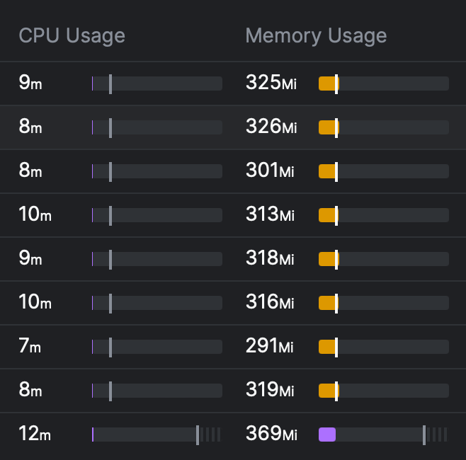
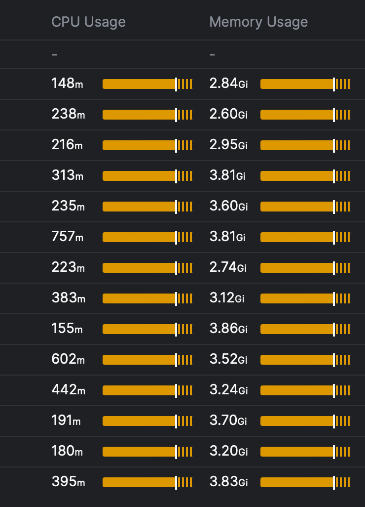
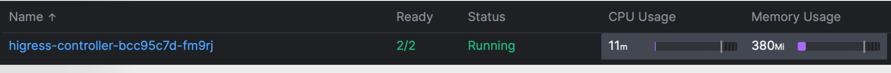
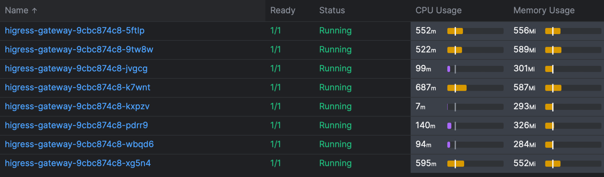

[Sealos](https://sealos.run) 公有云几乎打爆了市面上所有主流的开源网关，本文可以给大家很好的避坑，在网关选型方面做一些参考。

<!--truncate-->

## Sealos Cloud 的复杂场景

[Sealos 公有云](https://cloud.sealos.io)上线以来，用户呈爆发式增长，目前总共注册用户 8.7w，每个用户都去创建应用，每个应用都需要有自己的访问入口，就导致整个集群路由条目非常巨大，需要有支撑数十万条 ingress 的能力。

另外，在公网提供共享集群的服务，对多租户要求极为苛刻，用户之间的路由必须不能相互影响，需要非常好的隔离性，以及流量控制能力。

公有云的受攻击面是很大的，黑客会攻击云上跑的用户应用，也会直接攻击平台的出口网络，安全性上也有非常大的挑战。

对控制器的性能和稳定要求都比较高，很多控制器路由条目一多时消耗资源会非常大，甚至 OOM 导致网关奔溃。

## 排除 Nginx Ingress 

我们最早用的就是 Nginx Ingress, 最后发现有几个核心问题无法解决：

* reload 问题，每次有 ingress 变更会导致断连一小会，而一个集群用户一多的时候，ingress 的创建变更会是个频繁事件，就会导致网络经常不稳定。
* 长链接不稳定，也是因为变更，在用的长链接会经常断。
* 性能不行，生效时间慢，消耗资源多。

所以几乎排除掉了很多底层用 Nginx 实现的网关。我们实测下来基于 Envoy 实现的网关性能彪悍太多，几乎控制面和数据面都不怎么消耗性能。

这是 Envoy 的：



这是 Nginx 的：



差距非常之大，所以我们就可以排除掉 Nginx 系列选项了。彻底拥抱 Envoy。

## 关于 APISIX

APISIX 本身是个优秀项目，解决了 Nginx reload 的一些问题，所以我们 [Laf](https://laf.run) 早期也用了 APISIX，但是很不幸 APISIX 的 Ingress Controller 并不是很稳定，控制面奔溃给造成了我们好几次大的故障，还出现过控制器 OOM 等问题，我们本来真的很想用，但是最终还是因为故障问题被强制劝退，当然 APISIX 社区也在一直跟进这些问题，希望能越做越好。

总结一下就是: APISIX 本身稳定性很好，但是控制器需要优化的东西还很多，稳定性也有待提高。社区支持力度也很大，无奈我们线上问题火烧眉毛没法按照社区的节奏慢慢迭代，只能先切成别的网关了。

## Cilium Gateway

[Sealos 的 CNI](https://sealos.run/docs/self-hosting/lifecycle-management/quick-start/deploy-kubernetes#%E5%AE%89%E8%A3%85-k8s-%E9%9B%86%E7%BE%A4-1) 很早就切换成 Cilium 了，确实很强，所以我们想着网关也统一用 Cilium 得了，但是现实很骨感。

Cilium Gateway 只支持 LB 模式，这样就强依赖云厂商的 LB，而我们也有一些私有化的场景，所以不希望耦合，稳定性方面也遇到了路由非常多的时候 Ingress 生效特别慢的问题，需要分钟级生效，这样用户的体验就很差了，我们能接受的是 5s 内路由生效。所以结论就是只能再等等。

## Envoy Gateway

K8s 标准的发展来看，会逐渐从 Ingress 迁移到 Gateway 的标准，而我们底层又更倾向使用 Envoy，那 Envoy Gateway 的实现似乎是一个很好的选择，所以我们调研了 Envoy Gateway, 但是这个项目还是太过于早期，遇到了一些不稳定的 bug，比如会 OOM，pathpolicy 不生效，有些特性在 merge gateway 模式下不生效等问题，在持续解决中，我们也在不断帮助上游社区提改进意见和贡献，希望未来可以能达到生产可用的状态。

## 逼格很高但不那么实用的 Gateway 标准

Gateway 的处境很尬感，我的感觉是设计者并没有真的实践过多租户场景，当多租户共享一个集群时，就要明确区分管理者和使用者的权限问题，Gateway 设计之初就没完全考虑清楚，举个例子：

```yaml
apiVersion: gateway.networking.k8s.io/v1
kind: Gateway
metadata:
  name: eg
spec:
  gatewayClassName: eg
  listeners:
  - name: http
    port: 80
    protocol: HTTP
    # hostname: "*.example.com"
  - name: https
    port: 443
    protocol: HTTPS
    # hostname: "*.example.com"
    tls:
      mode: Terminate
      certificateRefs:
      - kind: Secret
        name: example-com
```
这里监听端口这类的配置应该是给集群管理员而不是普通用户，而 TLS 证书的配置属于某个应用，管理员可以有权限配置，主要还是每个用户去配置自己的，所以这里面权限就没有分开。 那就只能让用户也有权限配置 Gateway，所以这里就又需要在控制器里实现很多的权限控制的细节问题，如端口号白名单，冲突检测等。

个人觉得更优雅的设计是把其中租户级别的字段下沉到 HTTPRoute 中实现，或者一个单独的 CRD,这样用户态和超级管理员就可以分开的更清楚。 现有的方式也能做，就是有点混杂。

## 最终 Higress 胜出

除了以上重点的项目我们还测试了很多其他项目，我这里就不一一列举了。 Sealos 最终选了 Higress。

我们目前选择网关的逻辑很简单，主要就是在满足我们功能的前提下足够稳定，最终选择 Higress 几乎是排除法得出来的。

稳定性是排在第一位的，在我们的场景里面能够达到生产可用的目前只有 Higress，不过实践过程中也出现过一些问题，好在 Higress 社区的支持力度很大，很快速的解决了，主要有几个：

1. ingress 生效速度慢，路由条目多时 2min 多新建路由才能生效，社区最后优化到了 3s 左右，这已经到极致了，也没有再优化的必要了，因为已经比容器 Ready 时间还短了, Higress 使用了一种增量加载配置的机制，让海量路由条目时也能有夸张的性能。
2. 控制器 OOM,在无动态加载时资源消耗比较大，出现过 OOM 的情况，目前三高问题都解决掉了。
3. 超时问题，有一个进一步优化加载延时的参数配置 onDemandRDS 在我们一个主集群会偶发请求超时，目前是把该配置关闭了，还在进一步查看原因，而在其它集群中未发现这个问题。

安全性方面，我们很多时候的故障问题都是性能问题造成的，流量过大，打爆网关比较常见，所以网关的性能变得至关重要，实测下来 Envoy 要彪悍很多，控制器写的好不好也生死攸关，这个方面 Higress 表现出众：





在我们已经海量路由，超高并发的情况下，需要的资源少的可怜。 

Higress 还兼容 Nginx Ingress 语法，主要是一些 annotations，我们之前的代码都是用的 Ingress，所以几乎没有任何迁移成本，直接几分钟的升级就可以搞定。

同样为了促进社区更好的发展我们也给 Higress 一些意见：

* 能对 Gateway 的标准有更好的支持，目前虽然已经支持了 v1 版本，但还没有完全兼容 ingress 上的能力。
* 能开放出一些大杀器的功能，比如安全和熔断方面的能力。让开源和商业结合的更紧密一些，我们倒是不排斥付费，但是随着平台发展，需要更强的一些功能。
* 周边功能建议更多通过插件机制扩展，让核心功能更内聚一些，简单可依赖。

## 总结

网关对于云和应用而言是个非常非常核心的组件，随着我们规模的不断扩大也会出现很多新的挑战，我们希望能和上下游社区建立紧密的合作，让开源网关能得到更好的发展，让更多开发者受益。

以上列举的很多网关都很优秀，Sealos 没用不代表项目不厉害，只是我们的场景苛刻且奇葩，真的在公网环境能支持多租户的网关并不多，所以各位看官还是要从自己的场景出发，我们的选型仅作参考，同样 Sealos 本身也会以一个开放心态来继续跟进其他网关的发展。

最后非常感谢 Higress 开源社区的大力支持，感谢阿里云云原生团队开源了这么优秀的项目，造福广大社区用户。
