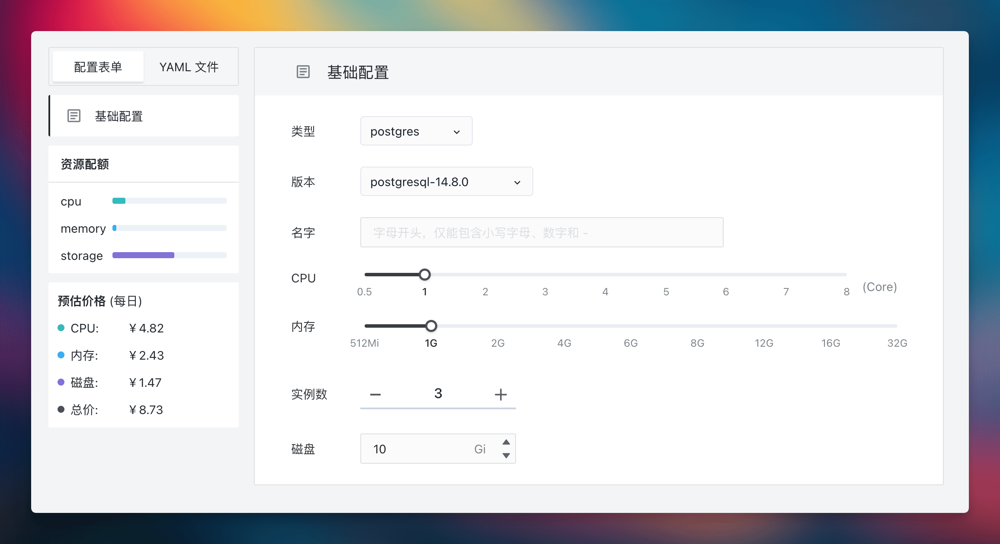

昨天冯老板发了一篇文章探讨了[为什么将数据库放入 K8S 中不是一个明智的选择](https://mp.weixin.qq.com/s/4a8Qy4O80xqsnytC4l9lRg)。

如果是四年前有人质疑容器化数据库我觉得还可以 battle 一下，都 2023 年了还有人不能认清这个大势，我就有必要来谈谈我的看法了。

<!--truncate-->

我从 K8s 0.9 版本时就开始做这件事，当时确实略早，CSI 都不成熟，到 1.0 才稍微稳定点，当时我在科大讯飞工作，负责的项目是建设和维护一整套系统，这套系统最终支撑了公司内部的 PaaS 服务。

我们构建了一个 30 台物理机的集群，别看这个集群很小，但是非常有技术含量，里面跑了近 3000 个应用，而且是各种类型的，包括但不限于微服务，数据库，消息队列，缓存等等。**这个集群被公司内部几百名开发人员同时使用，但是整个集群的运维工作只需不到半个人力就能完成，如果没有 K8s 这一切绝对不可能。**

我们还在不影响上层应用的情况下，无感知地升级了 Linux 内核。这种无感知升级如果没有 K8s 的支持是无法想象的，光是和各个业务线沟通可能都需要半年。

我见过另外一个集群，跑了 400 个数据库而已，堆了 400 台服务器和 40 个人的运维团队，集群的整体利用率却不到 10%。整个集群无人敢动，只能一直堆人，人肉运维。这种情况虽然可以归咎于组织的不专业，但实际上，很多团队都面临着类似的挑战，无法有效地管理和优化他们的基础设施。

后来我去了阿里，所有的交付类场景数据库全部是跑在 K8s 上。迄今为止我们在容器里跑数据库五年有余，0 故障。

## 数据库 on K8s：专业能力的普及化

绝大多数做业务的公司对数据库的处理通常存在两个问题：要么是数据库管理水平一般，无法充分发挥数据库的潜能；要么是每年需要在数据库管理上花费大量成本。[数据库 on K8s](https://sealos.run/docs/guides/dbprovider/) 可以让这一切标准化，有了标准，人与人之间才可以协作，生产力改变生产关系，从而大幅提效，让绝大多数不具备专业能力的团队享受到专业能力，本质上分工更明确了，就像农业和畜牧业分离一样，各自专注于自己的领域，从而提高整体的效率和产出。

以 KubeBlocks 团队为例，我相信绝大多数公司在数据库层面的积累和专业能力都没有他们强。而且他们将这些实践经验转化为代码，写成了控制器，以极其简单的方式赋能给其他企业。K8s 让这一切成为可能。

你可能会问：为什么不用 Ansible？运维人员可能很推崇 Ansible，因为和他们手头上的工具很匹配，用起来很顺手。Ansible 的核心思想是帮助用户部署和执行运维操作，而 K8s 的控制器则是基于另一种思路：**机器能做的事就不应该由人来做**。通过 Operator，可以实现 **24 小时不间断地同步期望状态和实际状态**，而这是用 Ansible 很难实现的，你用 Ansible 实现是想写个定时任务嘛？

这就像在操作系统诞生之前，程序员需要手动给纸带穿孔来运行程序。有人可能会说，用纸带也能运行程序，甚至可以把程序刻录在光盘上运行，为什么还需要操作系统呢？

这其实是同样的道理：Ansible 对运维人员来说是一款好工具，但 K8s 的目标是消除低端运维工作 (即编写和执行 Ansible 脚本的工作)。通过 K8s，我们可以实现更高效、更自动化的数据库管理，从而让那些不具备专业数据库管理能力的团队也能享受到专业级的服务。

## 数据库 on K8s 的优势

大部分人对于在 K8s 上运行数据库的担忧无非就集中在这几个问题上：

**稳定性不知道怎么样？**

**出了问题我没法排查？**

**性能是不是不够好？**

### 复杂度

在 K8s 上运行数据库，复杂度主要分为两个方面：

1. 建设这套系统的复杂度
2. 使用上的复杂度

**第一：建设这套系统的复杂度**

如果直接基于原生的 K8s (裸 K8s) 去构建数据库系统，成本会相对较高，而且对于新手来说，这样的操作并不友好，你需要自己建设 K8s 存储驱动、数据库控制器等多个组件，没有深厚的专业知识和实践经验是搞不定的。

这个时候发行版的优势就体现出来了，类似于 Linux 系统中，大多数人更倾向于使用 CentOS、Ubuntu 等发行版，而不是直接操作内核。我们也可以将 K8s 视为一种 “云内核”，如果你只是直接使用内核而不进行适当的定制和优化，可能会觉得它不够好用。因为内核本身只是提供了一个框架，很多功能和优化需要用户自己去实现。而 K8s 发行版则帮助用户解决了这一问题。例如，[Sealos 可以帮你一键](https://sealos.run/docs/self-hosting/lifecycle-management/quick-start/deploy-kubernetes)构建**包括高可用性集群、存储插件和数据库在内的完整系统**。这一切只需要简单的两条命令：

```bash
$ sealos run labring/kubernetes:v1.27.7 labring/helm:v3.9.4 labring/cilium:v1.13.4 \
     --masters 192.168.64.2,192.168.64.22,192.168.64.20 \
     --nodes 192.168.64.21,192.168.64.19 -p [your-ssh-passwd]
$ sealos run labring/openebs:v3.9.0 labring/mysql:8.0
```

然后就没有然后了，一个包含高可用集群、存储插件和数据库的系统就诞生了。虽然 Ansible 可以帮助你解决安装问题，但它**无法处理运行时的自愈、多租户等问题**，而 on K8s 可以让数据库 as a Service。

**第二：使用上的复杂度**

通过云操作系统发行版和控制器，用户可以实现产品化的数据库服务，而不是靠脚本解决问题。



这个页面我相信没有人不会使用吧？即使是菜鸡如我，都有能力建设起一个具有 3 副本的 PostgreSQL 集群，并且包含备份、恢复和监控等功能。这种能力不仅可以赋予企业中的所有开发者，也**展示了 “云计算思维” 与 “脚本思维” 的根本区别**。**云计算让每个人都能够提供服务 (as a Service)，而传统的脚本方法只是运维人员的一种便捷工具。**

### 稳定性

我们团队在数据库领域谈不上专业，都能建立起相当稳定的数据库系统，更别说专门研究这个领域的顶尖专家了。这个事情使用者不用操心，扔给专业的人去做就可以了。

举个例子，[Sealos 公有云](https://cloud.sealos.io)目前运行了数千个应用，这些应用的数据库都是完全容器化的，由 KubeBlocks 团队提供支持。一旦数据库出现任何问题，我们只需将问题扔给他们即可。从成本角度来看，随便招聘一个 DBA 的成本都远高于我们支付 KubeBlocks 商业版的费用了，而且 Sealos 还是平台的建设方，对于使用数据库的最终用户来说就更不用关心了。从目前的运行情况来看，我们的稳定性已经远超许多非专业团队的运维水平。

而且基本上数据库的生命周期管理就那么多事，稳定性问题是会随着时间的推移被收敛的，这些问题不断在代码层面被解决掉，最终用户关心的越来越少。这一点类似于 Linux 系统的稳定性，随着技术的不断成熟和优化，其稳定性已经达到了非常高的水平。**一个良好的软件架构会不断提升和收敛其鲁棒性，并逐渐减少对人的依赖，比如使用 Oracle 的人喝茶时间一定比用开源 MySQL 的人喝茶时间多。**

所以无论从现实情况还是理论分析来看，稳定性都不应该成为用户在 K8s 上运行数据库的障碍。**将数据库运行在 k8s 上，实际上是在利用几十名顶尖数据库专家的经验，他们将自己的知识和技能沉淀到代码中，以标准化的方式为用户服务。单靠脚本很难将这些经验沉淀得如此彻底和高效。**。单靠脚本很难将这些经验沉淀得如此彻底和高效。

### 性能

说数据库跑容器性能不好的大概率都是不会玩的，KubeBlocks 团队做过深入的测试与调优，并撰写了很详细的分析文章，很多人觉得真复杂，但是其实这个复杂的事又不需要用户去做。**这些复杂性已经被内嵌在控制器的代码中，对于最终用户来说，这一过程并不复杂**。而且，容器对数据库性能的影响几乎可以忽略不计，真正重要的是磁盘 IO 和网络带宽时延等因素。

OpenEBS 裸盘+数据库控制器的方案就可以有效解决性能问题。有了数据库控制器，就无需依赖于分布式存储。控制器能够保证数据库多副本的高性能和高可用性，无论是有状态服务还是无状态服务，对于用户来说都感觉不到差异。如果实例发生故障，控制器会自动进行调整。这才是一种极致的数据库使用体验。

[Sealos](https://sealos.run) 目前已经采用了这种解决方案，在保证高可用性的同时，又不牺牲性能。它可以直接对接裸盘，进行自动扩容、备份和恢复。如果节点发生故障，控制器会自动启动新节点，同步数据并将其加入集群。这些高级功能只能在云操作系统中实现，传统的脚本方法只能望尘莫及，而且后者通常还需要人工介入，比如半夜挂了就只能 on call 了。

所以**在 K8s 上运行数据库不仅没有性能问题，其稳定性甚至都超过了大多数运维人员的能力**。而且，这种方式已经做到了简单易用和自助操作，你要不要用？

## 不脱离实际场景去否定和肯定

在讨论数据库是否应该容器化时，我们必须考虑不同的实际应用场景。

有些公司的数据库已经非常稳定的以非容器化的方式在运行了，也不差钱养着一群数据库专家，这样的情况当然没有动力把数据库搬到 K8s 上，搬出问题谁来背锅？例如，银行通常使用专门的 Oracle 一体机，只需支付订阅费用即可，这样的系统很难有迁移的动力。

然而，对于许多业务开发团队和组织来说，他们现在面临着一个新的选择：**以极低的成本获得高度专业的数据库能力，从而将核心团队的精力全部集中在业务开发上。**

要达到这一效果，他们可以选择直接使用 RDS (关系数据库服务) 这样的数据库云服务，或者采用基于 K8s 的数据库解决方案。这种方法需要一个长时间运行的管理进程来替代人工角色，以赋予那些不懂数据库的团队相应的能力。这就是一个大的趋势，固定成本 (例如开发控制器的成本) 提升了，但是边际成本 (每个使用数据库的团队的成本) 会大幅降低。

当前有很多方案可以做到这一点，比如基于虚拟机或基于 Ansible，但毋庸置疑基于 K8s 的控制器在当前看来是最优解。即便是提供类似 RDS 这种能力的服务，底层使用 k8s 技术栈也是最优解。相比之下，虚拟机就不太行了，重，成本自然高，而且有更多的性能消耗。而像 Ansible 这类工具想要实现自助服务和多租户支持，更是异想天开。

## 总结

### K8s 的重要性

K8s 是个大杀器，像是无崖子一甲子的功力你能发挥几成，如果 K8s 不跑数据库，你大概只能发挥 1 成功力。用好 K8s 能够极大地增强数据库运维的效能。

### 技术进步带来的分工变革

随着技术的不断进步，数据库的管理者和使用者会逐渐分离，传统的人工操作正在逐步被自动化程序所取代。在这个过程中，标准化就成了有效协作的基石。目前没有看到比容器技术和 K8s 更强的事实标准诞生，因此，将数据库跑到 K8s 上是大势所趋。

### 实践案例和效益

目前已经有很多团队在成本、易用性、稳定性和性能等多个维度上成功实践了 K8s，取得了显著的成果，也尝到了这样做的甜头。由奢入俭难，一旦企业体验到了 K8s 带来的好处，很难再回到传统的运维方式。以 Sealos 为例，从 v2 使用 ansible，到 v3 完全转向 golang，[现在已经发展到 v4 和 v5](https://github.com/labring/sealos)，这种技术的演进正是基于 “云计算” 和 “云操作系统” 的思维，而不是传统的 “运维脚本” 思维。脚本连个 API 都实现不了你我谈先进生产力？设计一个系统优先考虑的不一定是给人用的，而是给别的系统调用的，这样整个自动化才能起飞，这就是为什么 API > CLI > GUI 的原因。

### 运维角色的转变

目前还是有很多存量市场的 DBA 运维人员想保住自己的饭碗在唱衰这个方向，但是英明的决策者迟早会发现采用 K8s 可以大幅降低人力成本，提高效率和系统稳定性。**良禽择木而栖，希望很多运维同学能意识到你们在逐渐被取代是事实，当年我们做讯飞云的时候有近 40 人的运维团队，做完之后连运维这个组都没了**。在阿里云的时候我们团队也是 0 运维人员。

### K8s 的快速成熟和生态发展

K8s 在以极快的速度走向更成熟，生态在蓬勃发展，诞生了短期的乱象，让落地实践变得无所适从。但是不要担心，优秀的发行版一定会出现，发行版就在做 “熵减” 的事情，简化用户的使用体验，就像 Linux 内核到 Linux 发行版的演进一样，Sealos 就是其中一款基于 K8s 的云操作系统发行版。我最近一段时间回访了将近 200 名 Sealos 的付费用户，没有一个用户反馈上面的数据库不会用的，有反馈不稳定的，几个原因，磁盘满了，升级导致的问题等，这几个问题都被收敛掉了，最终趋近于 0，至少可以说是比用户自己搭建的稳定性高出好几个 9。

### 企业的选择

企业选不选这样的方案还是根据自己实际情况来判断，但是聪明的企业在尝试数据库 on K8s 之后会带来极大的好处，例如选择了 Sealos + KubeBlocks 的组合，就相当于拥有了：

1. 一个拥有8年以上经验的专业 K8s 团队。
2. 一个 P10 带了一帮 P8-9 的顶尖专业数据库团队。
3. 一个极友好的产品体验，鲁棒性极高，性能极高的数据库系统。

连招聘一个专家的成本都不到。当然这种选择一定有阻力，阻力大部分来自于企业内部那些想保住自己饭碗其实可以不太需要的人。

我本可以对冯老板的论调逐条反击，但是边看文章边写还是太累了，碎碎念这些，希望看看到底有多少人能有更高级点的认知，希望能听到更多支持 OR 反对我们的声音，一起探索真理～