如今搜索功能已成为几乎所有应用不可或缺的一部分。无论是电商平台、内容管理系统，还是企业内部知识库，用户都期待能够快速、准确地找到他们需要的信息。然而，传统的搜索解决方案往往面临着诸多挑战：响应速度慢、相关性差、难以适应大规模数据、缺乏灵活性等。这些问题不仅影响用户体验，还可能导致用户流失，最终影响业务增长。

为了解决这些问题，我们将为您介绍一款强大而灵活的开源搜索引擎 - [Meilisearch](https://www.meilisearch.com/)。作为一个使用 [Rust](https://www.rust-lang.org/) 语言编写的独立搜索引擎，Meilisearch 以其简单的部署流程、快速的查询响应和丰富的功能集而著称。您只需一个命令行二进制文件，就能运行 Meilisearch 服务器并开始查询，大大简化了搜索引擎的使用门槛。它不仅支持模糊匹配和无模式索引等先进特性，还提供了用于演示目的的 Web 前端界面。

<!--truncate-->

在本教程中，我们将深入探讨 Meilisearch 的核心优势和实际应用。我们将涵盖以下内容：

+ Meilisearch 的核心特性和优势概述
+ 如何安装和配置 Meilisearch
+ Meilisearch 的基本使用方法
+ 将 Meilisearch 集成到实际应用中（以 Flarum 论坛为例）
+ Meilisearch 与其他搜索解决方案的比较

## 先决条件

在开始之前，请确保您具备以下条件：

- 基本的命令行操作知识
- 对 RESTful API 的基本理解
- （可选）一个 [Sealos](https://sealos.run) 账户，用于快速部署 Meilisearch

## Meilisearch 简介

[Meilisearch](https://github.com/meilisearch/meilisearch) 是一个使用 **Rust 语言编写**的强大开源搜索引擎。它提供了闪电般快速的全文搜索功能，并且易于使用和集成。Meilisearch 的设计理念围绕着以下核心原则：

1. **速度至上**：在任何规模的数据集上，都能在 50 毫秒内返回结果。
2. **相关性优先**：通过智能排序算法，确保最相关的结果总是排在前面。
3. **开发者友好**：提供直观的 API 和丰富的文档，大大降低了集成和使用的门槛。
4. **高度可定制**：灵活的配置选项，允许开发者根据具体需求调整搜索行为。

自 2018 年首次发布以来，Meilisearch 凭借其简单易用的特性和卓越的性能，迅速在开源社区中脱颖而出。目前，它在 GitHub 上已经获得了超过 40,000 颗星。


## Meilisearch 的核心特性

Meilisearch 提供了丰富多样的搜索功能，可以满足从个人项目到大型企业应用的各种需求。以下是其核心特性：

### 搜索性能

- **闪电般的速度**：无论数据集大小如何，都能在 50 毫秒内返回结果。
- **即时搜索**：支持 "搜索即输入" (Search-as-you-type) 功能，提供实时反馈。
- **拼写容错**：智能处理拼写错误，即使查询中存在错误也能返回相关结果。

### 相关性优化

- **自定义排序**：允许根据业务需求自定义搜索结果的排序规则。
- **分面搜索**：支持多维度的结果过滤和导航。
- **同义词管理**：可以设置同义词，提高搜索的灵活性。

### 多语言支持

- **多语言优化**：针对多种语言进行了优化，包括中文、日文等非拉丁语系。
- **停用词处理**：可配置停用词列表，忽略对搜索结果影响不大的常见词。

### 高级功能

- **地理位置搜索**：支持基于地理位置的搜索和排序。
- **多租户支持**：通过租户令牌实现数据隔离和访问控制。
- **高亮显示**：在搜索结果中高亮显示匹配的文本。
- **文档管理**：支持添加、更新和删除索引中的文档。

### 开发者友好

- **RESTful API**：提供简洁明了的 API，易于集成。
- **多语言 SDK**：官方提供多种编程语言的 SDK。
- **详细文档**：提供全面的文档和示例。
- **可自托管**：支持在自己的基础设施上部署和管理。

## Meilisearch vs. 其他搜索解决方案

为了更直观地展示 Meilisearch 的优势，我们可以将其与市面上的其他主流搜索解决方案进行对比：

| 特性         | Meilisearch    | Elasticsearch                | Algolia   |
| ------------ | -------------- | ---------------------------- | --------- |
| 响应速度     | <50ms          | 因环境和配置而异，通常>100ms | <100ms    |
| 易用性       | 高             | 中                           | 高        |
| 自动错误纠正 | 是             | 需配置                       | 是        |
| 多语言支持   | 优秀           | 良好                         | 优秀      |
| 地理位置搜索 | 支持           | 支持                         | 支持      |
| 开源         | 是             | 是（部分功能闭源）           | 否        |
| 定价         | 免费（自托管） | 免费（自托管），付费云服务   | 付费 SaaS |

虽然 Elasticsearch 在功能全面性和生态系统方面略胜一筹，Algolia 则在云服务和开箱即用体验上有优势，但 Meilisearch 在速度、易用性和开源友好度上独树一帜。特别是对于中小型项目和希望完全控制搜索基础设施的团队来说，Meilisearch 提供了一个完美的平衡点。

## Meilisearch 的安装和配置

Meilisearch 的安装和使用相对简单，提供了多种安装方式以适应不同的环境和需求。

对于没有技术背景的同学而言，你也不用担心安装问题，[Sealos 应用商店](https://sealos.run/docs/guides/templates/)提供了一键部署的应用模板，点一下鼠标即可完成部署，非常丝滑。

**如果你想快速部署一个 Meilisearch，又不想陷入繁琐的安装和配置过程**，可以试试 Sealos。

直接打开 [Meilisearch 应用模板](https://template.bja.sealos.run/deploy?templateName=meilisearch)，然后点击右上角的 “去 Sealos 部署”。

> 如果您是第一次使用 [Sealos](https://sealos.run/)，则需要注册登录 Sealos 公有云账号，登录之后会立即跳转到模板的部署页面。

这里有两个关键的环境变量需要特别注意一下，正确配置这些变量可以确保您的 Meilisearch 的安全和性能。

1. **MEILI_ENV**：用于配置实例的环境，只能是 **production** 或 **development**。

   production 模式：

   - 禁用了搜索预览界面。

   development 模式：

   - 启用了搜索预览功能。

2. **MEILI_MASTER_KEY**：用于设置 Meilisearch 的主密钥，它会自动保护除 `GET /health` 之外的所有路由。只有通过 API 密钥才能访问其他端点，包括搜索预览界面。

   在 production 模式下：

   - 提供主密钥是强制性的。
   - 如果没有提供主密钥或密钥长度小于 16 字节，Meilisearch 将抛出错误并拒绝启动。

   在 development 模式下：

   - 提供主密钥是可选的。
   - 如果没有提供主密钥，所有路由将不受保护且可公开访问。

无论在哪种模式下，如果你没有提供主密钥或提供的密钥长度小于 16 字节，Meilisearch 都会建议你使用一个自动生成的主密钥。

总结一下：**如果是 production 模式，则必须要提供主密钥；如果是 development 模式，则可以不提供主密钥。**

密钥的生成非常简单，直接在 Linux 或者 macOS 终端里执行以下命令即可生成一个随机密钥：

```bash
openssl rand -base64 48
```

填好参数之后，点击右上角的 “部署应用” 开始部署。

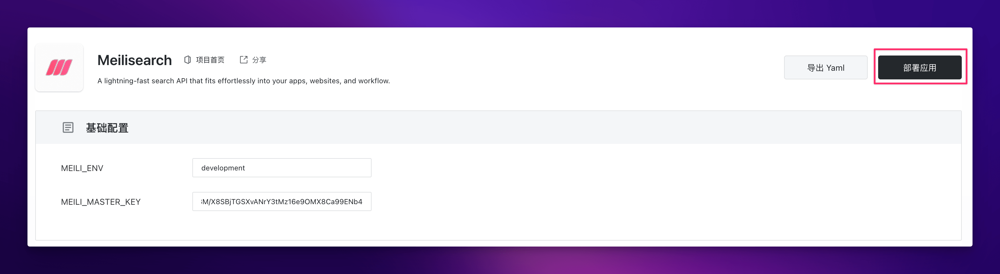

部署完成后，直接点击应用的 “详情” 进入该应用的详情页面。

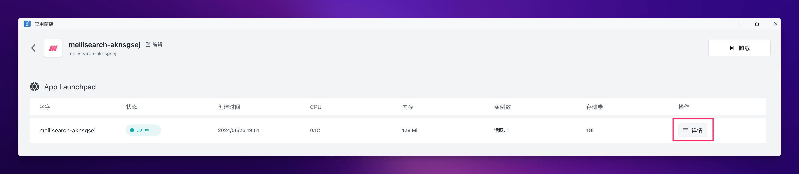

等待应用状态变成 running 之后，直接点击外网地址便可打开 Meilisearch 的搜索预览界面。

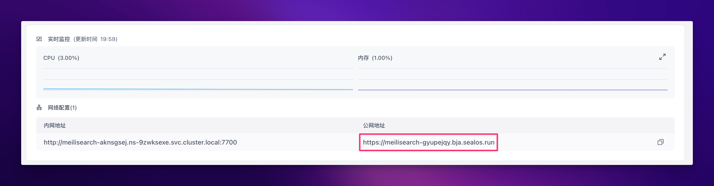

打开之后是这个样子的，输入你设置的密钥，就可以访问了。

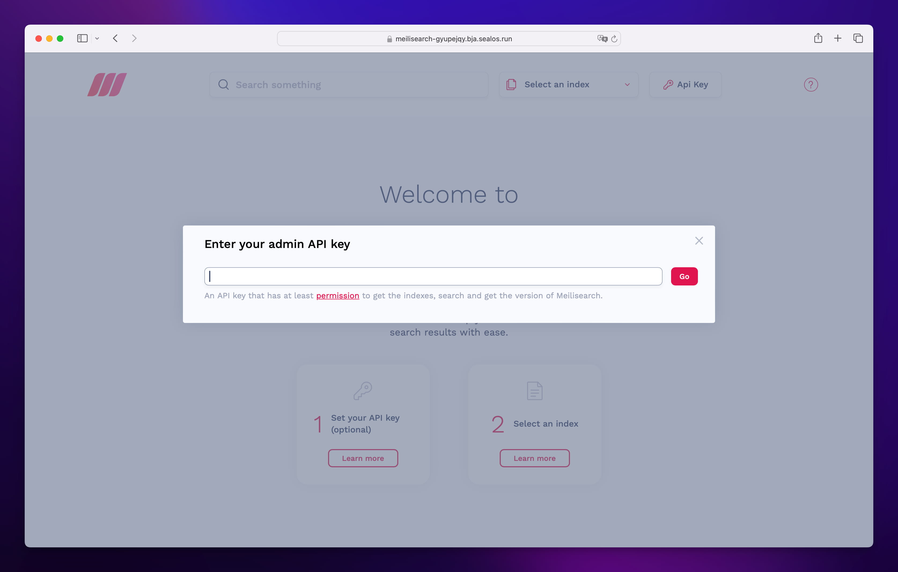

除此之外，还有另外一种打开方式，先刷新 Sealos 桌面 (也就是在 [cloud.sealos.run](https://cloud.sealos.run) 界面刷新浏览器)，然后你就会发现 Sealos 桌面多了个图标：

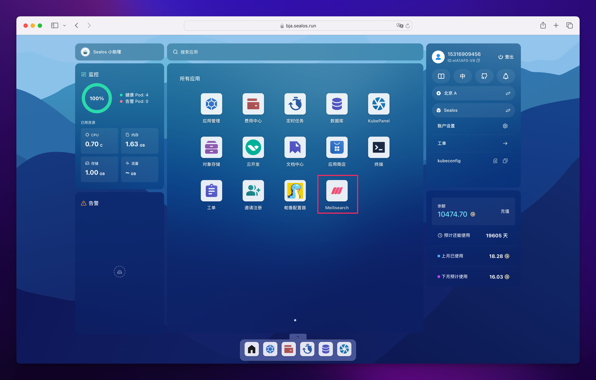

直接点击这个图标就可以打开 Meilisearch 的搜索预览界面了。

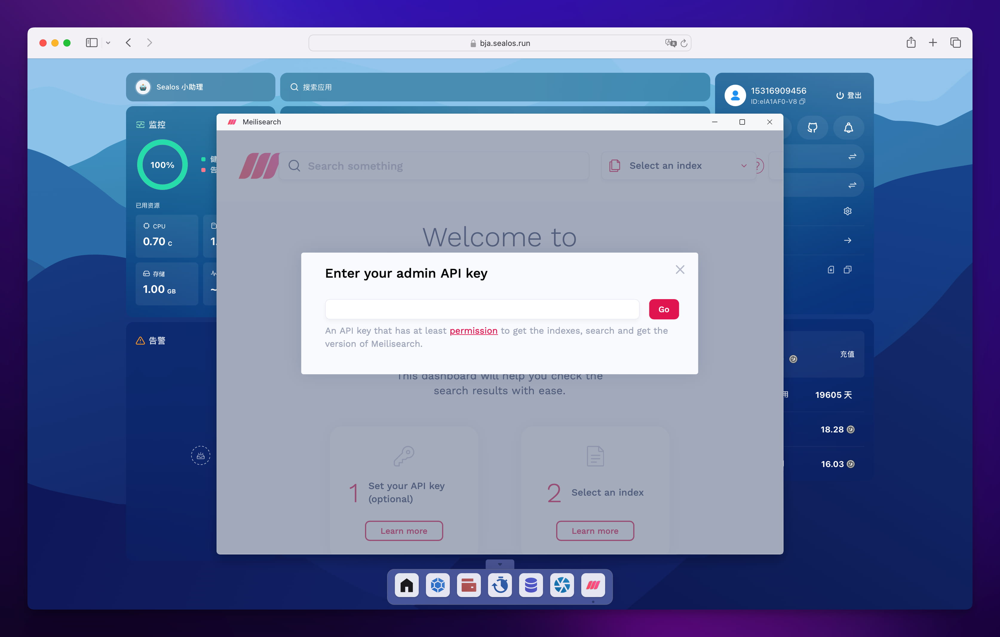

是不是有点似曾相识？没错，很像 **Windows 的快捷方式！**

单机操作系统可以这么玩，Sealos 云操作系统当然也可以这么玩。

## Meilisearch 的基本使用

Meilisearch 提供了直观的 RESTful API，使得与各种编程语言和框架的集成变得非常简单。以下是一些基本操作示例：

### 1. 创建索引

```bash
$ curl \
  -X POST 'http://localhost:7700/indexes' \
  -H 'Content-Type: application/json' \
  -H 'Authorization: Bearer YOUR_API_KEY' \
  --data-binary '{
    "uid": "movies",
    "primaryKey": "id"
  }'
```

### 2. 添加文档

```bash
$ curl \
  -X POST 'http://localhost:7700/indexes/movies/documents' \
  -H 'Content-Type: application/json' \
  -H 'Authorization: Bearer YOUR_API_KEY' \
  --data-binary '[
    {
      "id": 1,
      "title": "Carol",
      "genres": ["Romance", "Drama"]
    },
    {
      "id": 2,
      "title": "Wonder Woman",
      "genres": ["Action", "Adventure"]
    }
  ]'
```

### 3. 搜索文档

```bash
$ curl \
  -X POST 'http://localhost:7700/indexes/movies/search' \
  -H 'Content-Type: application/json' \
  -H 'Authorization: Bearer YOUR_API_KEY' \
  --data-binary '{
    "q": "wonder"
  }'
```

## 将 Meilisearch 集成到 Flarum 论坛

为了展示 Meilisearch 在实际应用中的强大功能，我们将以 Flarum 论坛为例，演示如何接入 Meilisearch 来提升搜索能力。

> 关于 Flarum 的安装和使用方法，可参考我们之前写的文章：[Flarum 安装和使用教程](https://zhuanlan.zhihu.com/p/703201822)

### 1. 安装 Meilisearch SDK

在 Flarum 应用详情界面，点击右下角的终端按钮：

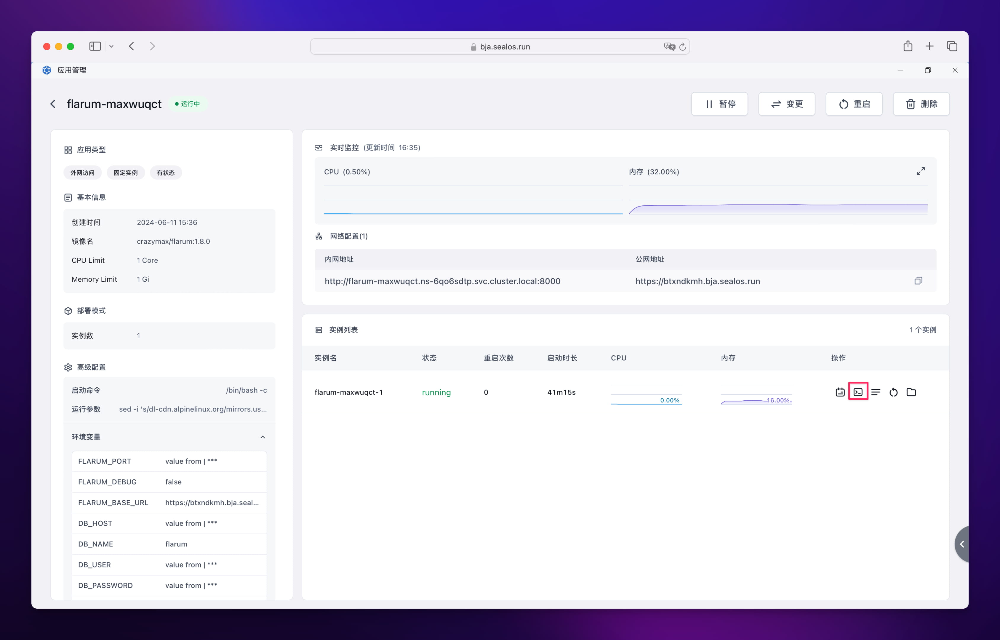

在打开的终端中执行以下命令安装 Meilisearch SDK：

```bash
extension require meilisearch/meilisearch-php
```

### 2. 安装 Scout Search 扩展

和上面一样，在 Flarum 容器终端中执行以下命令安装 Scout Search 扩展：

```bash
extension require clarkwinkelmann/flarum-ext-scout
```

### 3. 启用 Scout 扩展

在 Flarum 管理后台中启用 Scout 扩展，并选择 Meilisearch 作为搜索引擎，index 名称可写可不写。

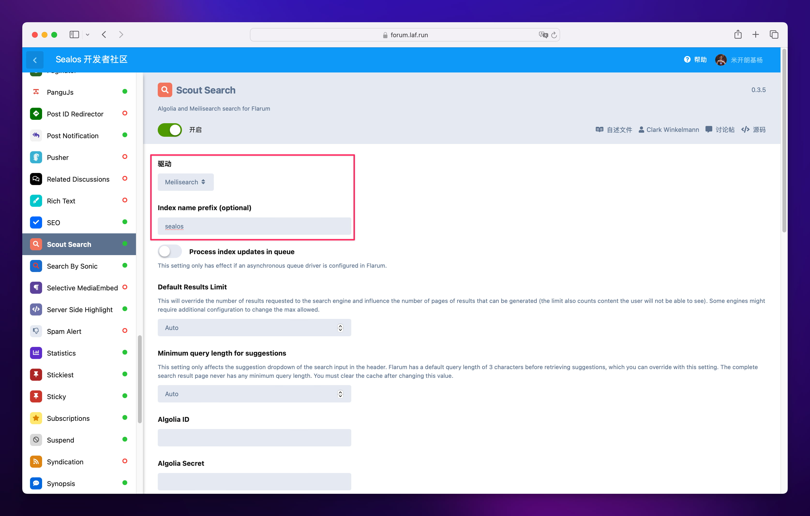

下面还需要配置 Meilisearch 的 URL 和密钥。

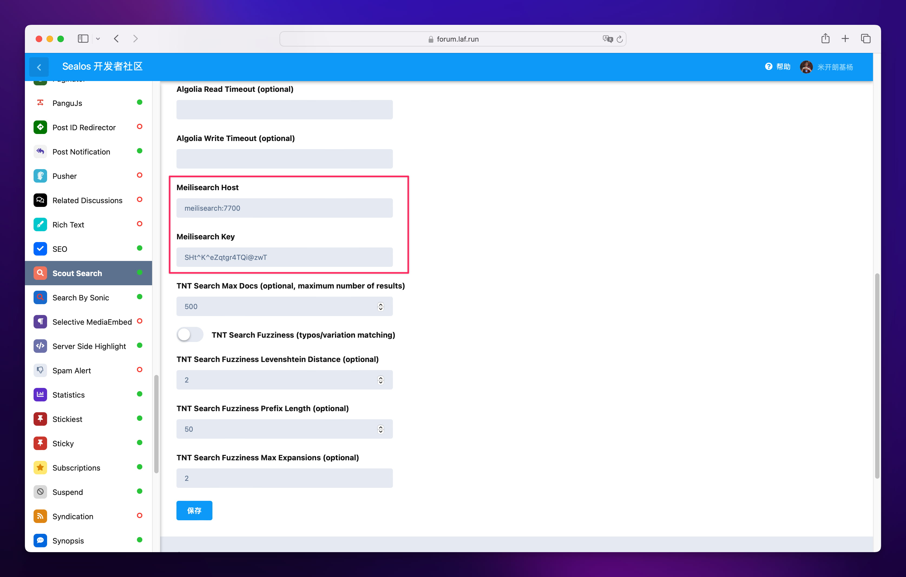

如果你的 Meilisearch 和 Flarum 部署在同一个 Sealos 可用区，那么可以直接使用 Meilisearch 的内网地址，进入 Meilisearch 的应用详情页面，点击内网地址便可复制 Meilisearch 的内网地址，然后作为上面 Scout 插件 Meilisearch Host 的值粘贴进去即可。

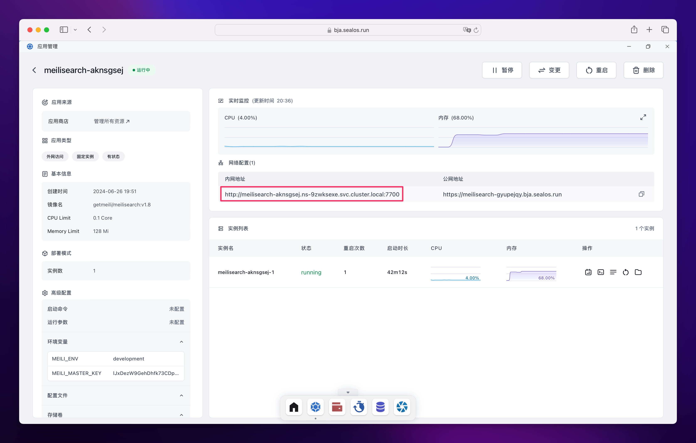

### 4. 增加 Meilisearch 内存

Sealos 中部署的 Meilisearch 默认只给了 128M 内存，如果要接入 Flarum，这个内存是不够用的，需要调整到 1G 才够用。操作方法如下：

进入 Meilisearch 的应用详情页面，点击右上角的 “变更”：

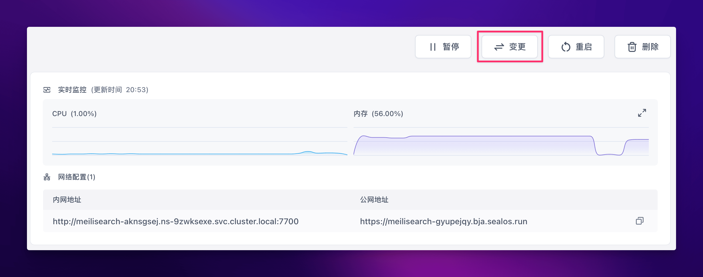

将内存调整到 1G，然后点击右上角的 “变更” 即可。

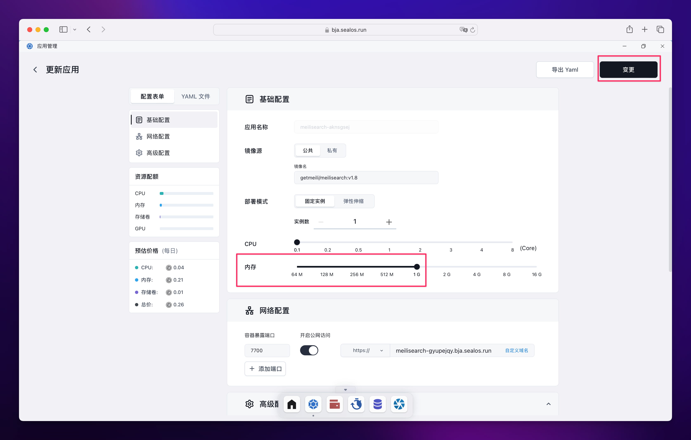

### 5. 导入 Meilisearch 索引

使用以下命令将现有数据导入 Meilisearch 索引：

```bash
php flarum scout:import-all
```

下面这种结果就是导入成功了：

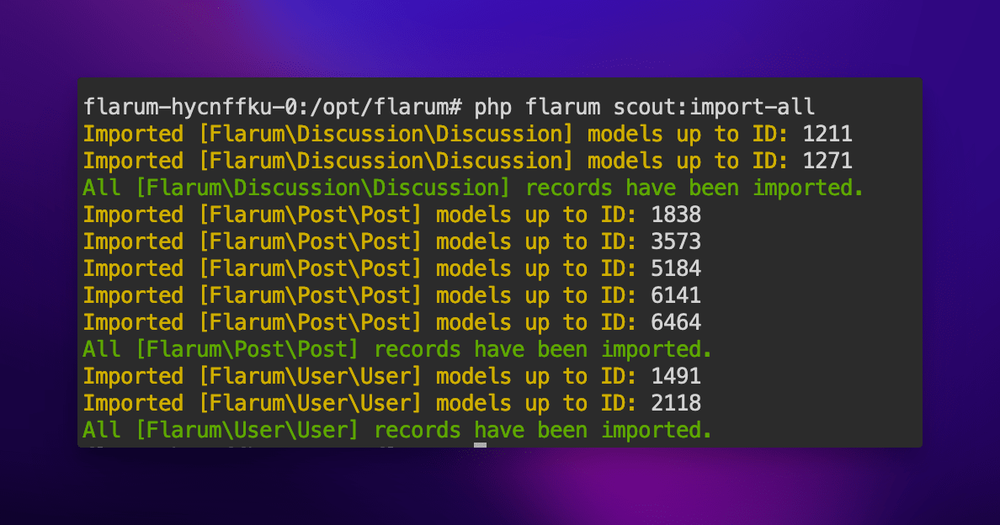

最后来测试一下中文搜索功能：


## 总结

Meilisearch 为开发者提供了一个强大而灵活的搜索解决方案，特别适合那些需要快速、相关且易于实现的搜索功能的应用。通过本教程，我们探讨了 Meilisearch 的核心特性、安装配置过程，以及如何将其集成到实际应用中。

我们鼓励您进一步探索 Meilisearch 的高级功能，如自定义排名规则、同义词设置等，以充分发挥其潜力。同时，关注 Meilisearch 的官方文档和社区更新，以获取最新的功能和最佳实践。