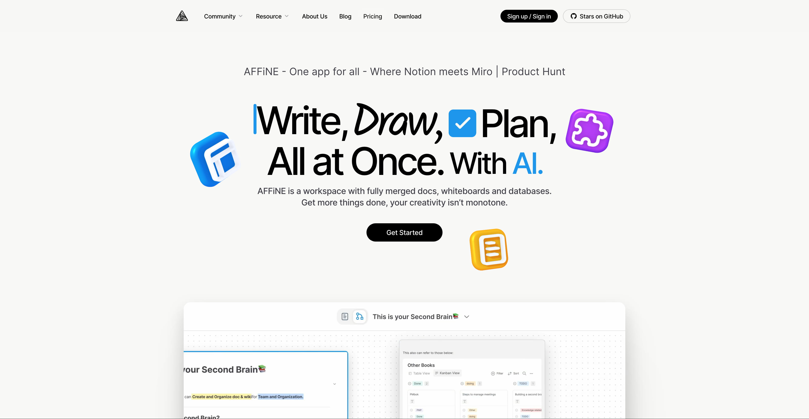
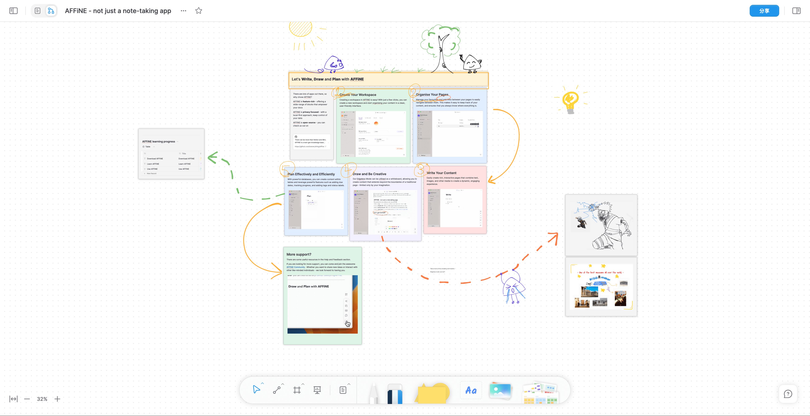
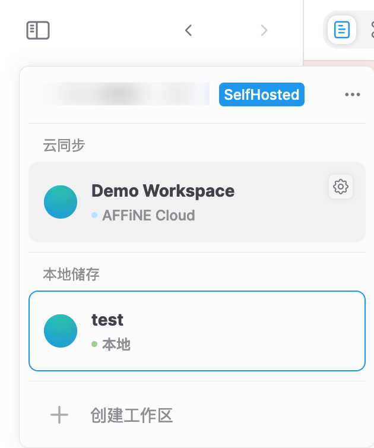
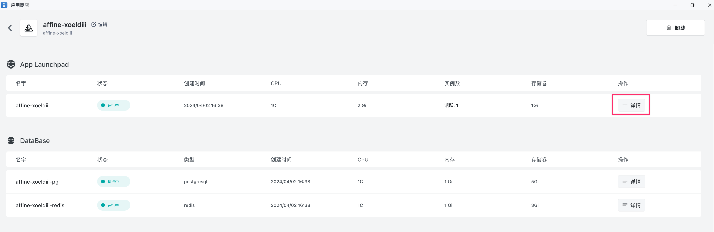
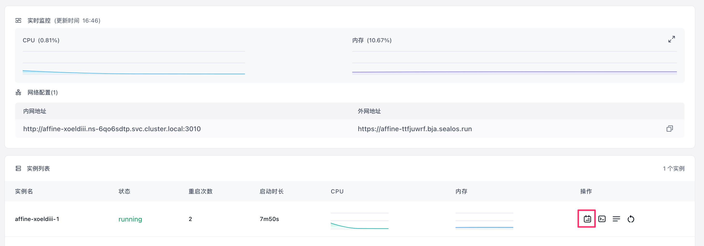
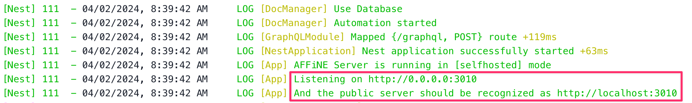
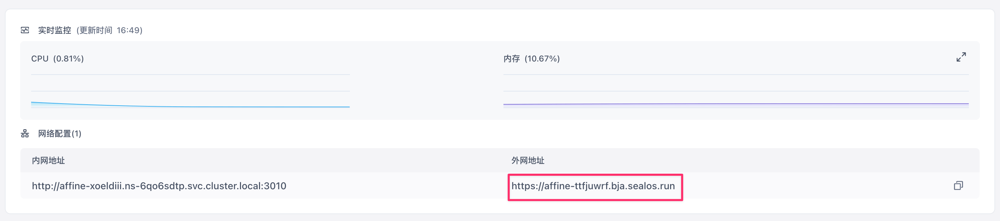
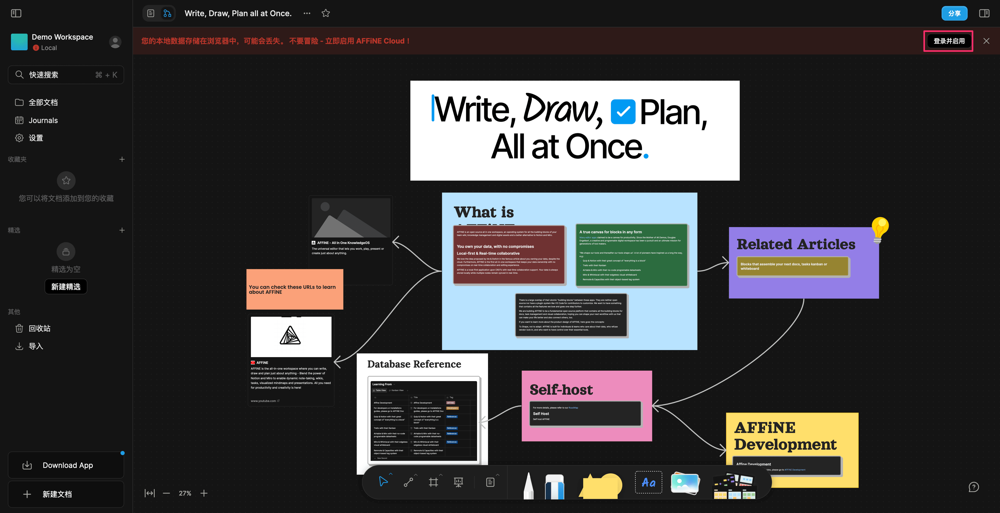
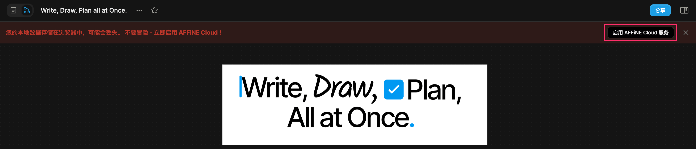

AFFiNE 是一款完全开源的 Notion + Miro 替代品，与 Notion 相比，AFFiNE 更注重隐私安全，优先将笔记内容保存到本地。

<!--truncate-->

GitHub 地址：[https://github.com/toeverything/AFFiNE](https://github.com/toeverything/AFFiNE)

AFFiNE 使用 Rust 和 Typescript 构建，只需要一个命令即可运行整个项目，AFFiNE 以最简单的方式给了所有开发者最大的想象力。

与专注于白板和页面的 Miro 和 Notion 不同，AFFiNE 将其定位定义为一体化的 KnowledgeOS。它支持看板、表格和富文本段落作为构建块来形成页面或白板，可以在这里进行文档编辑、数据处理或头脑风暴等综合处理。

## AFFiNE 的特性

### 文档与白板融为一体

许多编辑应用声称自己是提高生产力的画布，但 AFFiNE 是为数不多的几款可以让你在无边界画布上放置任何构建块的应用之一 -- 富文本、便签、任何嵌入的网页、多视图数据库、链接页面甚至幻灯片。

每个页面都有 2 个视图，你可以在任何地方以任何形式访问和编辑功能齐全的块。

### 多模态 AI copilot

无论是撰写专业的工作报告，还是将大纲转化为富有表现力的幻灯片，亦或是将文章总结为结构良好的思维导图，又或者……只需一个提示，即可直接绘制和编写原型应用和网页，AFFiNE AI 都可以做到。

### 本地优先 & 实时协作

AFFiNE 遵从本地优先的理念，强调数据的私有性，你完全可以不用它的云服务，自己进行同步。用户有了更多的选择权。

### 私有化部署

用户可以随意分叉和构建自定义的 AFFiNE，也可以私有化部署。未来还会推出插件社区和第三方模块。

## 私有化部署 AFFiNE

AFFiNE 的私有化部署依赖 PostgreSQL 和 Redis 数据库，部署起来比较复杂。[Sealos 的应用商店](https://sealos.run/docs/guides/templates/)提供了一键部署的应用模板，点一下鼠标即可完成部署，非常丝滑。

直接打开这个链接：

接下来你只需要设置一下管理员的邮箱（AFFINE_ADMIN_EMAIL）和密码（AFFINE_ADMIN_PASSWORD），然后点击右上角的「去 Sealos 部署」。

> 如果您是第一次使用 [Sealos](https://sealos.run)，则需要注册登录 Sealos 公有云账号，登录之后会立即跳转到模板的部署页面。

跳转进来之后，点击右上角的「部署应用」开始部署，部署完成后，直接点击应用的「详情」进入该应用的详情页面。

等待实例的状态变成 running 后，点击日志图标查看日志：

如果出现了下面的日志，就说明启动成功了：

这时点击外网地址即可打开 AFFINE 的可视化界面：

打开之后，默认使用的是本地浏览器存储。如果想登录我们自己部署的云服务，需要点击右上角的「登录并启用」：

登录之后，还要再点击「启用 AFFINE Cloud 服务」，不然数据还是继续存储在本地浏览器中，容易丢失：

启用之后，我们就可以愉快地使用 AFFINE 啦。