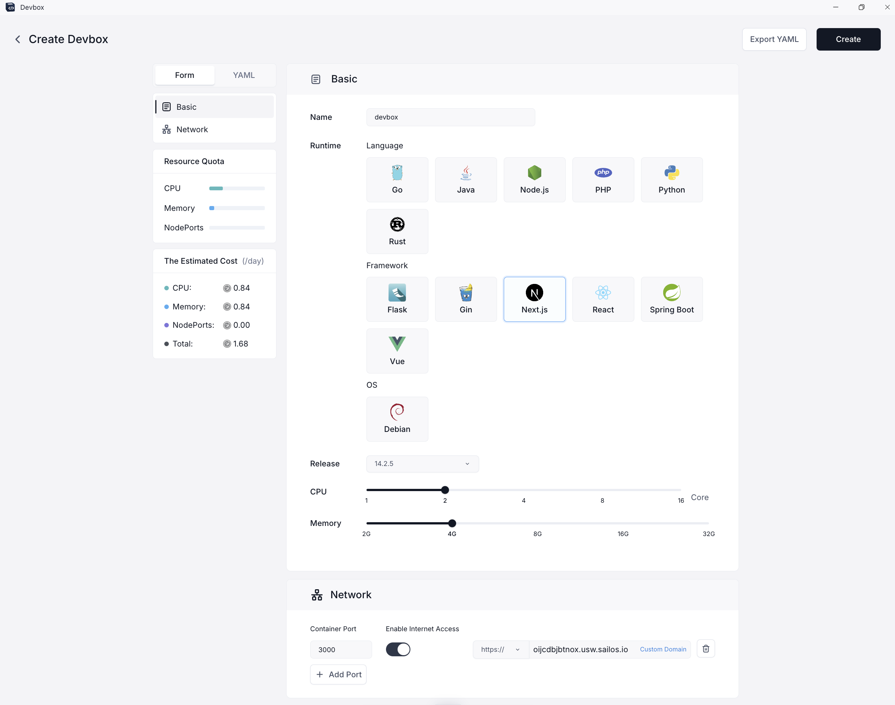
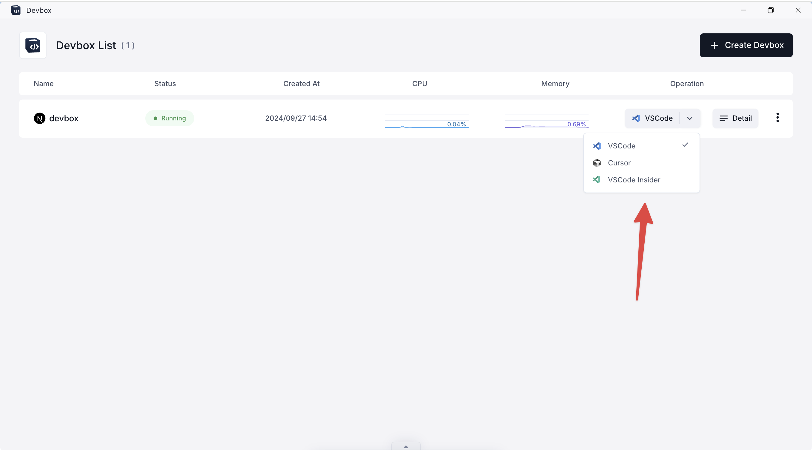
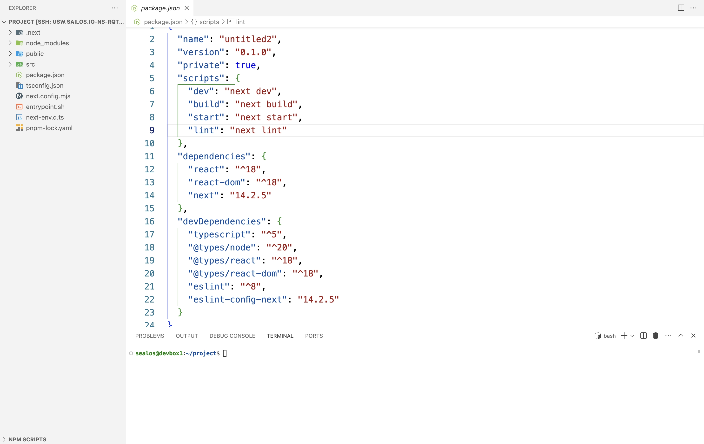
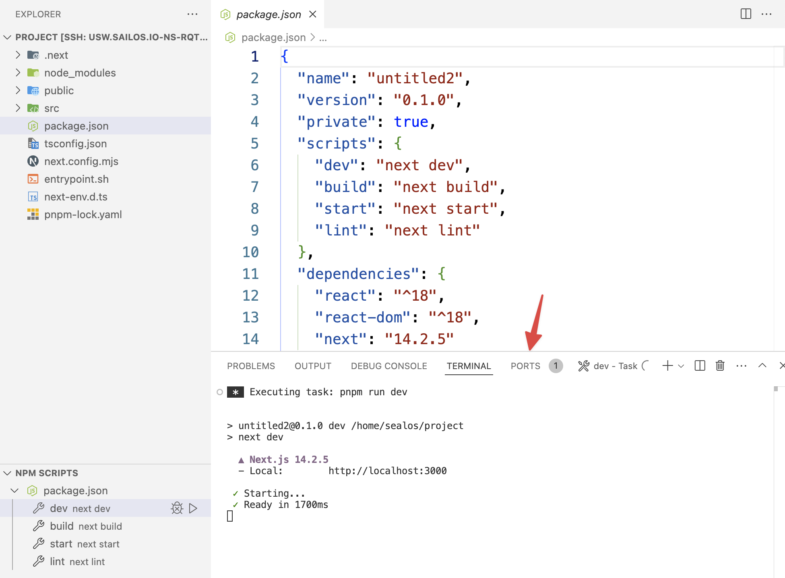
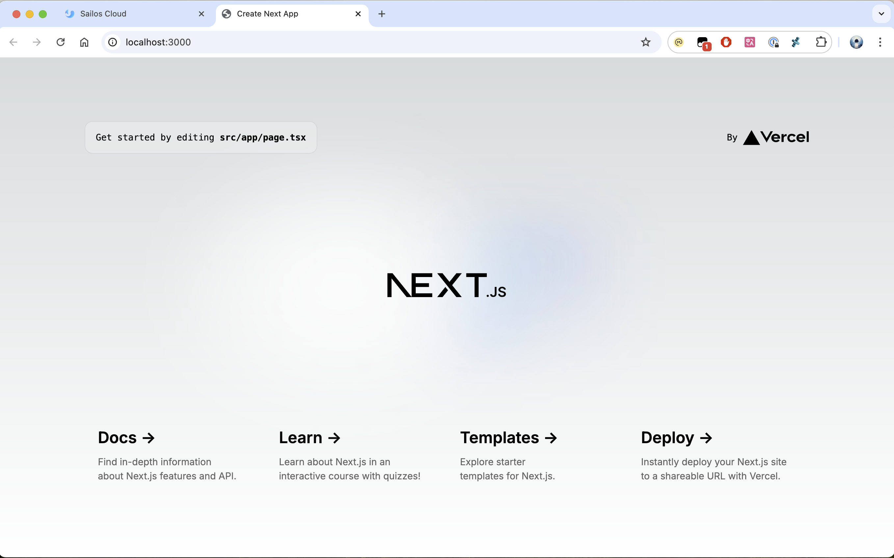
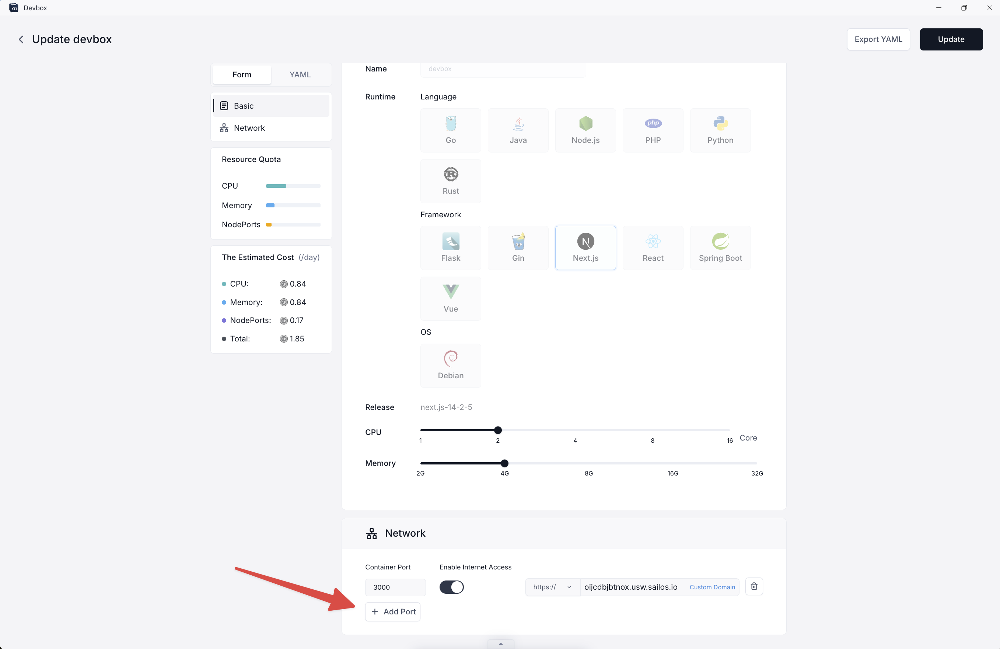
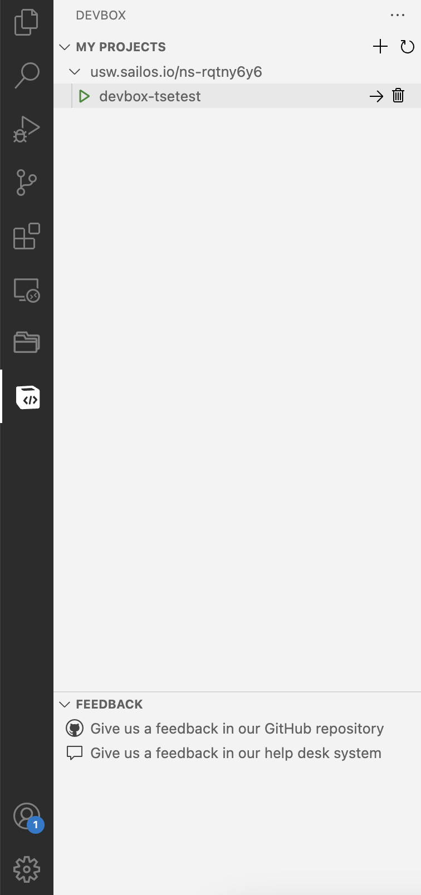
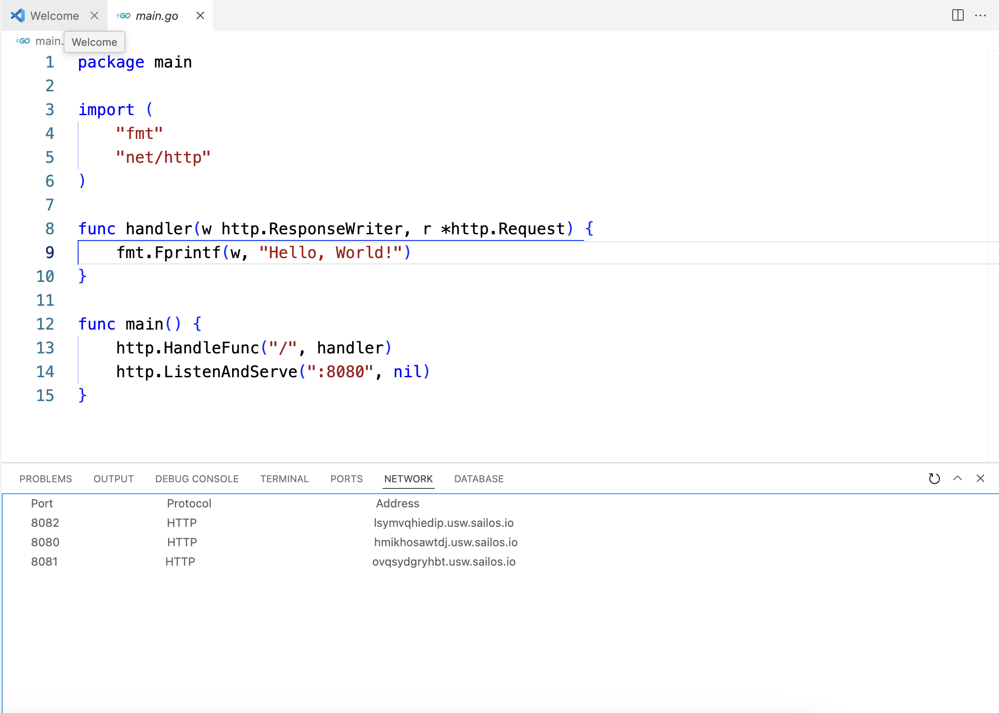
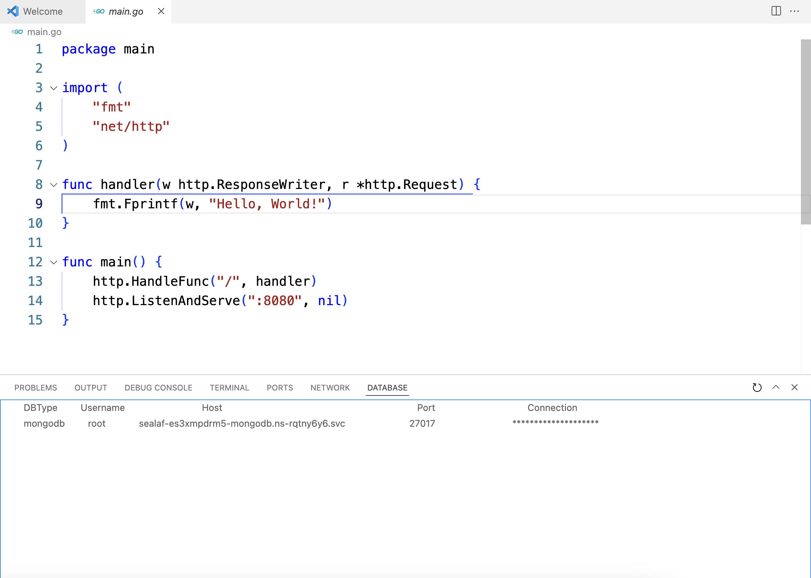

# Devbox

Sailos Devbox is a remote development&production environment that helps you develop and deploy your projects.

This plugin support connection and management of Devbox.

> Note: Currently, only connections and simple devbox management are supported, other functions(including amazing AI features integrated with sailos natively) will be supported next version.

## Features

- Remote environment is based on Kubernetes, it has the advantages of K8S's environment.
- Zero-configuration, no need to configure the environment, just connect to the Devbox.
- Preset popular languages and frameworks make it easy to get started with development.
- It has all the features of the editor, such as VSCode and Cursor.
- Support local port forwarding and public port export.

## Usage

### 1. Connect to the remote environment

Login to the [Sailos Devbox](https://usw.sailos.io/) and create a new Devbox.

Then you can connect to the Devbox by your own IDE in the list page.

After that, you can use the Devbox just like your local environment.

### 2. Develop your project just like your local environment.

### 3. Get your port export result

You can use local port forwarding supported by VSCode or Cursor to get your own page.

If you want to **share your port (maybe a page or an API) with others**,you can update your network config in Sailos Devbox Website to export your port **in public network**.

you can update a public port or there is **a preset default public export port**(Different runtime has a different default public export port).

## Managements

### 1. basic

You can do some simple management operations or give us feedback in the Devbox list page.

> Note: Delete devbox only influence local ssh config, will not delete remote devbox.

### 2. Network and Database panel

You can view the network and database(all your databases in your namespace) of the Devbox in the Network and Database panel.

## Requirements

1. You need to install `Remote - SSH` extension in your IDE firstly.
2. You need `a SSH client` in your local environment.
