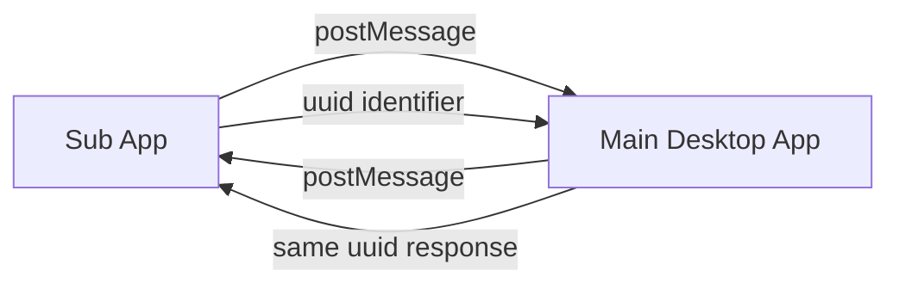

# Sealos Desktop SDK

> 🚀 Secure and efficient communication solution designed for iframe micro-frontend architecture

## 🌟 Features

- ✅ **Type Safe**: Complete TypeScript support, reducing runtime errors
- 🔒 **Secure & Reliable**: Multi-layer security validation with domain whitelist support
- 🚀 **Promise-based**: Asynchronous operations made synchronous for better DX
- 🎯 **Bidirectional Communication**: Built-in event system supporting complex interaction scenarios
- ⚡ **Lightweight & Efficient**: < 10KB gzipped, asynchronous non-blocking design
- 🔧 **Extensible**: Plugin architecture with custom API support

## 📦 Installation

```bash
# Using npm
npm install @zjy365/sealos-desktop-sdk

# Using pnpm
pnpm add @zjy365/sealos-desktop-sdk

# Using yarn
yarn add @zjy365/sealos-desktop-sdk
```

## 🚀 Quick Start

### Desktop Side (Main Application)

```typescript
import { createMasterAPP } from '@zjy365/sealos-desktop-sdk/master';

useEffect(() => {
  // Configure allowed domains (recommend using specific domains in production)
  const cleanup = createMasterAPP(['https://app.example.com']);

  return cleanup; // Cleanup on component unmount
}, []);
```

### App Side (Sub Application)

```typescript
import { createSealosApp, sealosApp } from '@zjy365/sealos-desktop-sdk';

useEffect(() => {
  // Initialize SDK
  const cleanup = createSealosApp();

  return cleanup;
}, []);

// Get user information
const getUserInfo = async () => {
  try {
    const session = await sealosApp.getSession();
    console.log('User info:', session.user);
  } catch (error) {
    console.error('Failed to get user info:', error);
  }
};

// Get language settings
const getLanguage = async () => {
  const { lng } = await sealosApp.getLanguage();
  console.log('Current language:', lng);
};
```

## 📚 Core APIs

### User Information

```typescript
// Get user session information
const session = await sealosApp.getSession();
console.log(session.user.name); // Username
console.log(session.user.id); // User ID
```

### Language Settings

```typescript
// Get current language settings
const { lng } = await sealosApp.getLanguage();
// lng: 'zh' | 'en' | other language codes
```

### Event Communication

```typescript
// Sub-app listens to main app events
const unsubscribe = sealosApp.addAppEventListen('user-update', (userData) => {
  console.log('User info updated:', userData);
});

// Sub-app sends events to main app
await sealosApp.runEvents('app-ready', { appId: 'my-app' });

// Cleanup event listeners
unsubscribe();
```

## 🏗️ Communication Architecture



1. **Initialization**: Main app and sub-app initialize their respective SDKs
2. **Request**: Sub-app generates unique ID and sends request via postMessage
3. **Processing**: Main app validates origin and processes business logic
4. **Response**: Main app replies with the same ID
5. **Callback**: Sub-app matches callback by ID to complete async call

## 🔧 Development Guide

### Local Development

```bash
# 1. Install development tools
npm i -g yalc nodemon

# 2. Start development mode
npm run dev

# 3. Link to local project
npm run link-sdk

# 4. Unlink
npm run unlink-sdk
```

### Extending APIs

1. Add new API names in `constants/api.ts`
2. Implement corresponding handler methods in `src/master.ts`
3. Add client-side call methods in `src/app.ts`

### Security Configuration

```typescript
// Recommended production configuration
const allowedOrigins = ['https://your-app-domain.com', 'https://another-app.com'];

createMasterAPP(allowedOrigins);
```

## 📖 API Reference

| API                           | Parameters         | Return Value             | Description                  |
| ----------------------------- | ------------------ | ------------------------ | ---------------------------- |
| `getSession()`                | -                  | `Promise<SessionV1>`     | Get user session information |
| `getLanguage()`               | -                  | `Promise<{lng: string}>` | Get language settings        |
| `runEvents(name, data)`       | `string, any`      | `Promise<any>`           | Trigger main app events      |
| `addAppEventListen(name, fn)` | `string, function` | `function`               | Listen to main app events    |

## 🤝 Contributing

Issues and Pull Requests are welcome!

## 📄 License

[Sealos Sustainable Use License 1.0](https://github.com/labring/sealos/blob/main/LICENSE.md)
