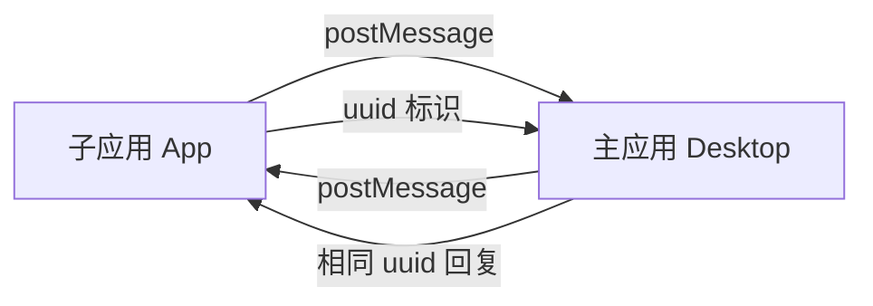

# Sealos Desktop SDK

> 🚀 专为 iframe 微前端架构设计的安全、高效通信解决方案

[](https://www.npmjs.com/package/@zjy365/sealos-desktop-sdk)
[](http://www.typescriptlang.org/)
[](https://github.com/labring/sealos/blob/main/LICENSE)

## 🌟 特性

- ✅ **类型安全**：完整的 TypeScript 支持，减少运行时错误
- 🔒 **安全可靠**：多层安全验证，支持域名白名单
- 🚀 **Promise 化**：异步操作同步化，提升开发体验
- 🎯 **双向通信**：内置事件系统，支持复杂交互场景
- ⚡ **轻量高效**：< 10KB gzipped，异步非阻塞设计
- 🔧 **易于扩展**：插件化架构，支持自定义 API

## 📦 安装

```bash
# 使用 npm
npm install @zjy365/sealos-desktop-sdk

# 使用 pnpm
pnpm add @zjy365/sealos-desktop-sdk

# 使用 yarn
yarn add @zjy365/sealos-desktop-sdk
```

## 🚀 快速开始

### Desktop 端（主应用）

```typescript
import { createMasterAPP } from '@zjy365/sealos-desktop-sdk/master';

useEffect(() => {
  // 配置允许的域名（生产环境建议使用具体域名）
  const cleanup = createMasterAPP(['https://app.example.com']);

  return cleanup; // 组件卸载时清理
}, []);
```

### App 端（子应用）

```typescript
import { createSealosApp, sealosApp } from '@zjy365/sealos-desktop-sdk';

useEffect(() => {
  // 初始化 SDK
  const cleanup = createSealosApp();

  return cleanup;
}, []);

// 获取用户信息
const getUserInfo = async () => {
  try {
    const session = await sealosApp.getSession();
    console.log('用户信息:', session.user);
  } catch (error) {
    console.error('获取用户信息失败:', error);
  }
};

// 获取语言设置
const getLanguage = async () => {
  const { lng } = await sealosApp.getLanguage();
  console.log('当前语言:', lng);
};
```

## 📚 核心 API

### 用户信息

```typescript
// 获取用户会话信息
const session = await sealosApp.getSession();
console.log(session.user.name); // 用户名
console.log(session.user.id); // 用户ID
```

### 语言设置

```typescript
// 获取当前语言设置
const { lng } = await sealosApp.getLanguage();
// lng: 'zh' | 'en' | 其他语言代码
```

### 事件通信

```typescript
// 子应用监听主应用事件
const unsubscribe = sealosApp.addAppEventListen('user-update', (userData) => {
  console.log('用户信息已更新:', userData);
});

// 子应用向主应用发送事件
await sealosApp.runEvents('app-ready', { appId: 'my-app' });

// 清理事件监听器
unsubscribe();
```

## 🏗️ 通信原理



1. **初始化**：主应用和子应用分别初始化对应的 SDK
2. **请求**：子应用生成唯一 ID，通过 postMessage 发送请求
3. **处理**：主应用验证来源，处理业务逻辑
4. **响应**：主应用带着相同 ID 回复结果
5. **回调**：子应用根据 ID 匹配回调，完成异步调用

## 🔧 开发指南

### 本地调试

```bash
# 1. 安装开发工具
npm i -g yalc nodemon

# 2. 启动开发模式
npm run dev

# 3. 链接到本地项目
npm run link-sdk

# 4. 断开链接
npm run unlink-sdk
```

### 扩展 API

1. 在 `constants/api.ts` 中添加新的 API 名称
2. 在 `src/master.ts` 中实现对应的处理方法
3. 在 `src/app.ts` 中添加客户端调用方法

### 安全配置

```typescript
// 生产环境推荐配置
const allowedOrigins = ['https://your-app-domain.com', 'https://another-app.com'];

createMasterAPP(allowedOrigins);
```

## 📖 API 参考

| API                           | 参数               | 返回值                   | 说明             |
| ----------------------------- | ------------------ | ------------------------ | ---------------- |
| `getSession()`                | -                  | `Promise<SessionV1>`     | 获取用户会话信息 |
| `getLanguage()`               | -                  | `Promise<{lng: string}>` | 获取语言设置     |
| `runEvents(name, data)`       | `string, any`      | `Promise<any>`           | 触发主应用事件   |
| `addAppEventListen(name, fn)` | `string, function` | `function`               | 监听主应用事件   |

## 🤝 贡献

欢迎提交 Issue 和 Pull Request！

## 📄 许可证

[Apache 2.0](https://github.com/labring/sealos/blob/main/LICENSE)
