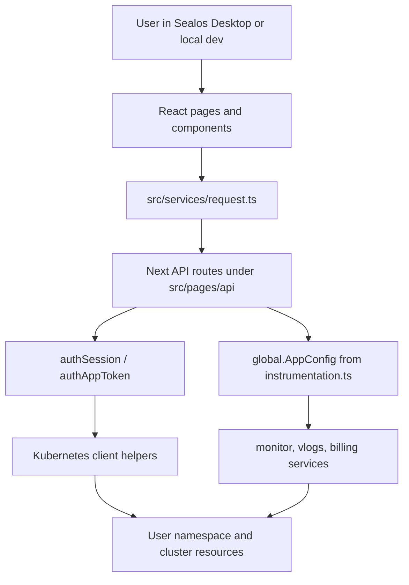

# Architecture

App Launchpad is a Next.js provider app inside the Sealos frontend workspace. It combines a React product UI, Next API routes, API schema definitions, Kubernetes resource adapters, and deploy chart material.

## Runtime Layers

## Configuration Flow

`src/instrumentation.ts` loads `global.AppConfig` on the Node.js runtime:

- Development: `data/config.yaml.local`
- Production: `/app/data/config.yaml`

The config controls cloud domain and user-domain suffixes, UI feature flags, pricing/monitor/log service URLs, file limits, domain registration links, Launchpad metadata, public-domain policy, and resource slider defaults.

`launchpad.publicDomain.reservedPrefixes` is an optional policy list. It defaults to empty, is loaded into the shared public-domain helper on both server startup and browser init data, and only affects Launchpad pre-validation. Cluster-side ingress admission remains the authoritative conflict and ownership guard.

Managed public-domain availability is checked in two stages. The form first runs local prefix validation, then `/api/platform/checkPublicDomain` uses the user's kubeconfig to perform a server-side dry-run Ingress create. The prefix editor triggers that availability check shortly after the user changes a managed public-domain prefix, and the submit flow repeats the check as a final pre-apply guard. The dry-run reaches `vingress.sealos.io`, so cross-namespace host ownership conflicts can be shown before the user applies the app. Create/update/apply paths still keep the admission-webhook error translation as the final fallback.

## Authentication Model

The browser sends an encoded kubeconfig through the `Authorization` header. In development, `src/utils/user.ts` reads it from `NEXT_PUBLIC_MOCK_USER`; in Desktop, it can come from the SDK session stored in local storage. API routes decode it with `authSession`, build a Kubernetes client, and infer the user namespace from the kubeconfig context.

App-token endpoints use `authAppToken` for token pass-through to platform services.

## UI Surfaces

- `src/pages/apps.tsx`: app list, periodic pod refresh, and monitor summary refresh.
- `src/pages/app/edit/`: create/edit form, YAML preview, permission checks, image defaults, and submit flow.
- `src/pages/app/detail/`: app metadata, service access, pods, advanced info, monitor, and logs.
- `src/pages/api-docs.tsx`: OpenAPI reference.

## Kubernetes Adaptation

Form state is converted into Kubernetes resources through:

- `src/utils/deployYaml2Json.ts` for Service, Deployment/StatefulSet, Ingress, HPA, ConfigMap, and Secret generation.
- `src/utils/adapt.ts` for converting between Kubernetes state and Launchpad form/API representations.
- `src/types/request_schema.ts` and `src/types/v2alpha/request_schema.ts` for API-facing schema contracts.

Updates often require mirrored changes in form defaults, adapters, YAML generation, backend handlers, and both API schema families.

## Backend Route Groups

- Legacy UI routes: `applyApp`, `updateApp`, `getApps`, `getAppByAppName`, lifecycle and pod helpers.
- v1/v1alpha routes: compatibility surfaces for existing external clients.
- v2alpha routes: structured API contracts and OpenAPI generation.
- Platform routes: init data, quota, price, permission, image exposed ports, domain checks.
- Monitor/log routes: proxy calls to Launchpad monitor and vlogs services using the user kubeconfig.

## Deployment

`Dockerfile` builds a standalone Next.js app. `deploy/charts/applaunchpad-frontend` packages the frontend as a Kubernetes service on port 3000 with config mounted at `/app/data/config.yaml`. `deploy/Kubefile` and the entrypoint wire image/chart artifacts into Sealos app deployment.

## Important Tradeoffs

- Development uses local mock kubeconfig instead of Desktop runtime session, so `.env.local` must stay ignored.
- App-side validation reduces user errors, but cluster-side admission webhooks remain authoritative for cross-namespace ownership and policy checks.
- Monitoring, logs, and billing are separate cluster services. Local dev must either run in-cluster or port-forward them.
