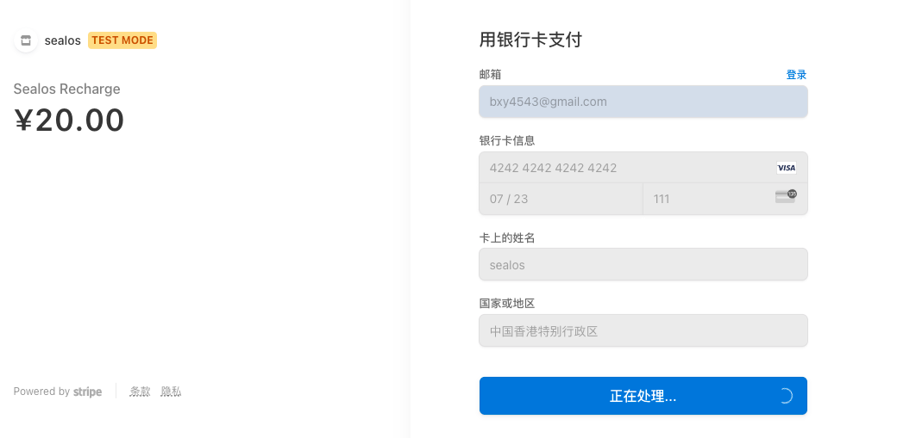

Change the stripe key in templates/index.html to your public key. Test keys can be found [here ↗](https://stripe.com/docs/keys#test-live-modes).

```shell
sed -i 's/stripe_public_key/your_stripe_public_key/g' templates/index.html
```

use test private keys in the test environment. And to run the main program, use the following command:
```shell
STRIPE_API_KEY="your_stripe_api_key" go run main.go
```

```shell
huaijiahui@huaijiahuideMacBook-Pro test % curl -X POST localhost:8080/create-checkout-session
{"sessionId":"cs_test_a1W0VrXpzOTQHq5dpC2KWADTV3A0QB6moN1gbt3DZPz9uV3WuSvoUmRac9"}%
huaijiahui@huaijiahuideMacBook-Pro test % curl -X GET 'localhost:8080/get-session?session_id=cs_test_a1W0VrXpzOTQHq5dpC2KWADTV3A0QB6moN1gbt3DZPz9uV3WuSvoUmRac9' 
{"message":"ok","status":"open"}%                                                                                                                                                                                                                                                                                       
huaijiahui@huaijiahuideMacBook-Pro test % curl -X GET 'localhost:8080/expire-session?session_id=cs_test_a1W0VrXpzOTQHq5dpC2KWADTV3A0QB6moN1gbt3DZPz9uV3WuSvoUmRac9'
{"message":"ok","status":"expired"}%
huaijiahui@huaijiahuideMacBook-Pro test % curl -X GET 'localhost:8080/get-session?session_id=cs_test_a1W0VrXpzOTQHq5dpC2KWADTV3A0QB6moN1gbt3DZPz9uV3WuSvoUmRac9'
{"message":"ok","status":"expired"}%
```

[open in browser](localhost:8080)

Open your browser and navigate to localhost:8080. Click the `Checkout` button to open the Stripe payment page. Enter your credit card information and click the `Pay` button. Upon successful payment, you'll be redirected to the pre-specified success page.
> Note: In the test environment, you can use the official test credit card number provided by Stripe, such as `4242424242424242`. The expiration date can be any time in the future, and the CVC can be `any number`. For more details, visit [https://stripe.com/docs/testing#cards ↗](https://stripe.com/docs/testing#cards)



The `CreateCheckoutSession` function is defined as follows:
```shell
func CreateCheckoutSession(amount int64, currency, successURL, cancelURL string) (*stripe.CheckoutSession, error)
```
- `currency`: The type of currency you use, such as: usd, cny (lowercase only)
- `amount`: Here, the amount is scaled by a factor of 1:100. For example, for 1 unit of currency, set `amount=100`.
- `successURL`, `cancelURL`: These are the URLs to which the user will be redirected upon successful payment or cancellation.

The `GetSession` function is defined as follows:
```shell
func GetSession(sessionID string) (*stripe.CheckoutSession, error)
```
- `sessionID`: This is the session ID returned by Stripe upon successful payment. After creating a session, you can use this function to poll the payment status and handle corresponding business processes accordingly.

The `ExpireSession` function is defined as follows:
```shell
func ExpireSession(sessionID string) (*stripe.CheckoutSession, error)
```
- `sessionID`: This is the session ID returned by Stripe upon successful payment. Once the session exceeds the expected payment time, you can call this function to handle the expiration process.
