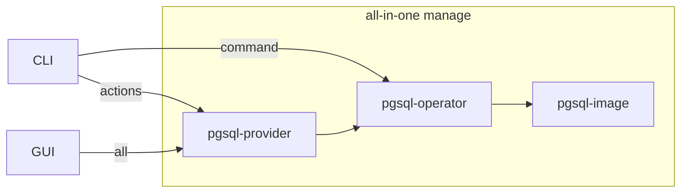
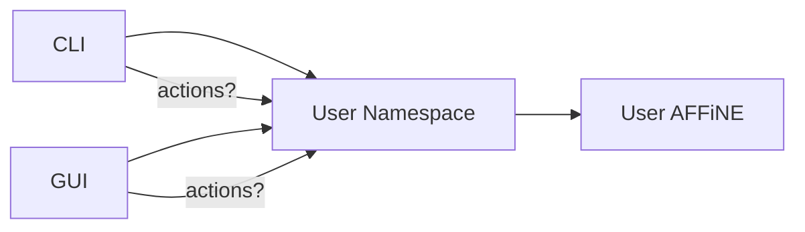
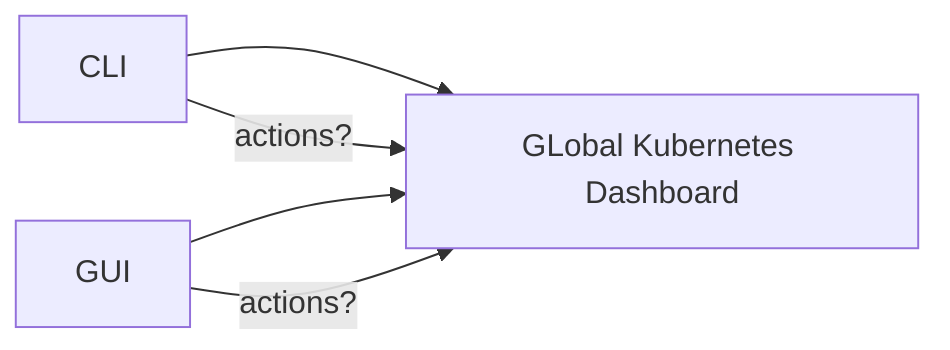

# APP-Manager 核心需求流程与设计思路

## 关键名词:
1. `clusterFile`+`actions` 集群镜像
    * mysql image `readme`
    * 自定义的actions https://www.notion.so/App-actions-566fa79ad5ef42a390e899a4b9089485
2. `operator` 第三方维护,不做修改
    * mysql-operator
    * postgress-operator
    * redis-operator
3. `provider` sealos维护,提供多集群管理,action操作透出
    * mysql-provider
    * postgres-provider
    * redis-provider
4. `cli` / `terminal` / `GUI`

## *镜像发布流程:

编写镜像(actions)sealos

#### CLI下
1. sealos `build`:
    1. 读取clusterFile,解析`readme.md`,`.sealos-actions`数据
2. sealos `push`:

#### GUI下(sealos cloud image-hub web interface)

可以修改readme和tag信息

*TODO: Demo案例*

*TODO: Image Hub* (管理中心. 实际image的blob可以继续放在docker.io/或者阿里云镜像)

### 设计模式综述

对于常见的已有的应用, 其本身可能有多种模式来运行在k8s上, 我们通过抽象一层`provider`来进行统一的与独立的管理与封装
目前总结有三种应用模式:
1. 镜像本身是一个`operator`, 实际通过监听cr的创建来管理资源, 比如`mysql-operator`
2. 镜像本身提供了管理功能与用户权限, 在`sealos cloud`内的所有用户都可以访问这一个唯一的资源, 比如`kubernetes-dashboard`
3. 镜像本身是一个纯业务的应用, 最基础的应用形态, 比如用户自己apply的应用代码,或者`AFFiNE`

下面详细的描述不同模式下的设计思路与实现方式

## 目的: 用户希望创建一个`pgsql`的高可用集群

### 模式抽象
这一类的应用, 是会有一个全局的管理器`operator`去监听实际的业务/镜像的cr, 来实际的创建需要的资源. 比如: `mysql`,`redis`,`pgsql` 等等



> 这种模式的应用, 实际 `Image Hub` 推送与启动的是sealos提供的provider服务,通过provider服务去安装operator服务,再通过operator去监听实际的业务镜像的cr, 来实际的创建需要的资源.

**Note:** 使用一个自己编写的provider的好处在于, 可以在不修改上下游的任何image的情况下(可以直接使用现成的operator和image的cr, 不需要任何重新封装), 实现整体资源的整体编排与管控

### 使用`pgsql`作为案例说明

最终的`pgsql`的`cluster`的`cr`:

**`pgsql.yaml`**
```yaml 
apiVersion: "acid.zalan.do/v1"
kind: postgresql
metadata:
  name: acid-minimal-cluster
  namespace: ns-xxx
spec:
#   image: labring/postgres:latest # image for actions or provider ???
  teamId: "acid"
  volume:
    size: 1Gi
  numberOfInstances: 3
  users:
    zalando:  # database owner
    - superuser
    - createdb
    test_user: []  # role for application test
  databases:
    test: test  # dbname: owner
  preparedDatabases:
    bar: {}
  postgresql:
    version: "14"
```

### CLI下

CLI模式下面,用户其实可以直接与operator打交道,实际provider就成为简单的提供actions的注入与管理
```bash
sealos run labring/pgsql-provider:latest #安装provider-会内部安装operator
sealos apply -f pgsql.yaml #启动一个pgsql的集群

kubectl get pgsql -n ns-xxxx #查看当前启动的集群信息

sealos delete -f pgsql.yaml #删除一个pgsql的集群

#更新一个pgsql的集群 How to?
sealos actions update pgsql --env=http://pgsql.ns-xxx.cluster.local --version=latest
```
**说明: 这里安装的是`pgsql-provider`,是因为我们需要我们自己实现的这个`provider`来提供`actions`的能力**

### GUI下

1. 用户进入 `sealos cloud`
2. 用户打开 `image hub` 应用
3. 用户进入 `postgres` 详情页
4. 用户安装 `postgres` @lingdie
    1. AppManager系统安装`postgres-provider`(如果集群内没安装的话)
        1. provider进行install的逻辑,安装`postgres-operator`(如果集群内没安装的话)
    2. AppManager系统把`postgres-provider`的图标安装到用户界面上
        1. 记录用户已安装的应用数据
        2. 管理已安装应用的启动状态(GUI层面)
5. 用户双击 `postgres` 图标
    1. 启动`postgres-provider`应用

## 目的: 用户希望使用独立的应用`AFFiNE`

### 模式抽象
这一类的应用, 会在用户的ns内启动一组pod去提供统一的对外服务, pod是完全独立于自己的ns的, 只有自己能够使用, 比如: `AFFiNE`,`wordpress` 等等



> 这种模式的应用, 如果应用提供方需要支持actions的功能, 就需要重新打包自己的镜像来做支持. 同理, 如果需要自定义计费, 也需要实现计费的插件

### CLI下

CLI模式下面, 使用方式与正常的安装无异
```bash
sealos run labring/affine:latest -n ns-xxx 

sealos actions update affine --version=latest #自定义actions,如果有的话
```
**说明: 这里是直接安装到用户的ns下面的普通应用**

### GUI下

1. 用户进入 `sealos cloud`
2. 用户打开 `image hub` 应用
3. 用户进入 `AFFiNE` 详情页
4. 用户安装 `AFFiNE`
    1. `AppManager`系统安装`AFFiNE`
    2. `AppManager`系统把`AFFiNE`的图标安装到用户界面上
        1. 记录用户已安装的应用数据
        2. 管理已安装应用的启动状态(GUI层面)
5. 用户双击 `AFFiNE` 图标
    1. 启动 `AFFiNE` 应用

## 目的: 用户希望访问`kubernetes-dashboard`进行管理

### 模式抽象
这一类的应用, 基本上全局只有一组pod去提供统一的对外服务, 多人其实共用的是一套服务能力, 基本都是单纯的web界面应用. 比如: `kubernetes-dashboard`,`redis-insight`,`kuboard`,`phpmyadmin`,`sealos cloud任务管理器`



> 这种模式的应用, 和第二种模式是一样的, 需要应用提供方去支持actions/metering功能

### CLI下

这种模式下没有cli的特殊需求或者单独的命令

### GUI下

**kubernetes-dashboard的demo**
1. 用户进入 `sealos cloud`
2. 用户打开 `image hub` 应用
3. 用户进入 `kubernetes-dashboard` 详情页
4. 用户安装 `kubernetes-dashboard`
    1. AppManager系统把`kubernetes-dashboard`的图标安装到用户界面上
        1. 记录用户已安装的应用数据
        2. 管理已安装应用的启动状态(GUI层面)
5. 用户双击 `kubernetes-dashboard` 图标
    1. 启动`kubernetes-dashboard`应用

这种模式下, 其实应用一直在后台全局的运行, `AppManager`就是单纯的负责吧图标/页面相关数据装载到用户的空间就好

## Provider的作用与边界条件

1. GUI的方式去提供operator的安装
2. GUI的方式去管理已创建的集群的数据与信息
3. 创建实际的集群/展示之前已创建的集群的数据/删除集群 [cloud provider demo](https://github.com/labring/sealos/issues/1660)
4. 提供actions的GUI界面

### 三个实体:

1. pgsql-image 实际的执行镜像
2. pgsql-operator 第三方的operator,负责监听cr启动/删除实际的镜像
3. pgsql-provider 我们实现的provider,提供gui的管理方式和actions的支持
