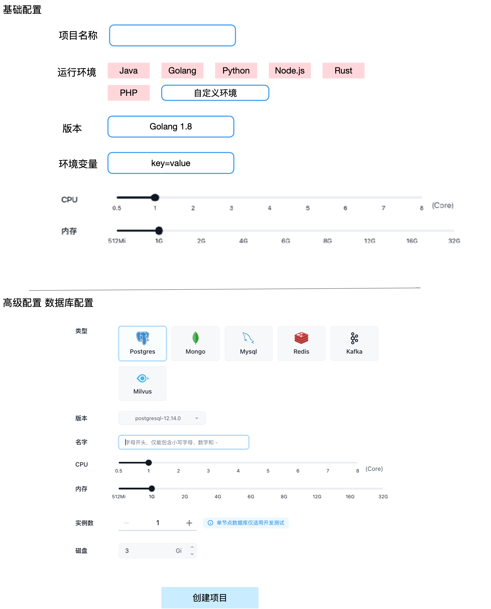

## 背景

devbox 是一个可以帮助开发者快速构建开发环境的工具，支持任意编程语言和编程框架，写完代码可以直接做集成测试，所有开发环境都在云端进行。

devbox 具备函数计算的所有优势，同时避免了函数计算的劣势如无法通用的支持任意编程语言与编程框架，开发方式割裂等问题。

## 使用场景

开发者在本地开发时首先需要安装环境，大部分工程还依赖数据库可能也需要安装，复杂一些的系统需要各模块开发者相互协作，一开始开发自测，然后才是联调，经常会遇到自测没问题，联调一大堆问题的情况。 在构建开发环境时也经常遇到依赖不兼容，版本不一致等问题，编译运行时也会遇到可能在 ARM（如苹果电脑上开发编译）到 x86 上无法运行等问题。 编程语言版本问题，比如 golang 很多个版本需要设置很多 workspace，依赖库版本不一致等问题。

准备一个开发环境就需要花大量时间，线上测试时，又需要构建，打包，上传，运行，高级一点的可能会走个 CI/CD 流程上线，但是前提也是需要写大量 pipeline 编排文件，然后每次线上测试时都等待一个漫长的 pipeline 运行过程。上线时还需要配置网关，路由，负载均衡等周边事宜。

绝大多数开发者还是不数量 Docker 的，即便熟悉也不喜欢做构建 Docker 镜像这种事，现在有很多工具可以简化这个动作但是并不能完全避免掉，devbox 就希望开发者完全不关心 Docker kubernetes，但是能获得 Docker kubernetes 带来的全部好处。

## 产品形态

创建项目

创建完后就可以使用插件进行开发，也可以使用 code server 直接在云端开发，发布版本时会产生一个新的镜像。用户也可以把这个版本作为新项目的运行环境。

点击上线时可以直接调用应用管理把项目运行起来。

IDE 插件可以通过 token 地址与项目进行连接：/cluster-name/region-name/namespace-name/project-name/token-hash128

token 主要为了安全，防止别人也通过 IDE 连接到自己的项目里。

## 实现原理

每个运行环境本质是一个 Docker 镜像，这里的核心是文件发生变化时如何保存文件，因为容器是无状态的，重启数据会丢失。虽然可以通过 commit 把镜像提交出来，但是原先的容器也得使用这个新镜像才能生效，如果把代码外挂一定程度能解决这个问题，但是用户可能会把编译产物也放到外挂目录，那在具体发版时如何保证这个目录的内容也在镜像内。

不外挂目录时可能每次保存时都需要 commit + 重启容器。

代码还是外挂，正式上线发布时通过 `COPY /work /work` 来实现生产镜像的构建，实现上变的更复杂一些了。

如果 hack containerd 可能是一个不错的选择。当容器被销毁之前先做镜像，当然也可以通过 shim 来做。下次启动时直接使用新的镜像。

kubelet ---> commit-shim ---> containerd

commit-shim 在监听到删除事件时直接触发 commit 和 push 动作，以把用户更新的内容保存到镜像中。

### 使用 k8s checkpoint 方式实现
或者基于 checkpoint 实现 https://kubernetes.io/docs/reference/node/kubelet-checkpoint-api/ 

创建检查点
可以通过向 kubelet 发送 POST 请求来创建特定容器的检查点。请求的 URL 格式如下：

POST /checkpoint/{namespace}/{pod}/{container}
Kubelet 将请求传递给底层的 CRI 实现，以创建检查点存档。默认情况下，检查点存档会被存储在 /var/lib/kubelet/checkpoints 目录下，并以 checkpoint-<podFullName>-<containerName>-<timestamp>.tar 

tar 包就可以直接 load 成镜像并 push 到仓库。

可以利用 posthook 能力触发 load push，或者写一个控制器去监听 pod 删除，如果是沙箱容器就执行 load push。 每台服务器上还是需要一个执行任务的 Agent.

这个方案的好处是几乎无侵入。

## 风险点

磁盘占用过大，commit push 完可以把镜像删除，减少磁盘占用。也可以新增服务器专门做 devbox 服务器，加污点容忍。