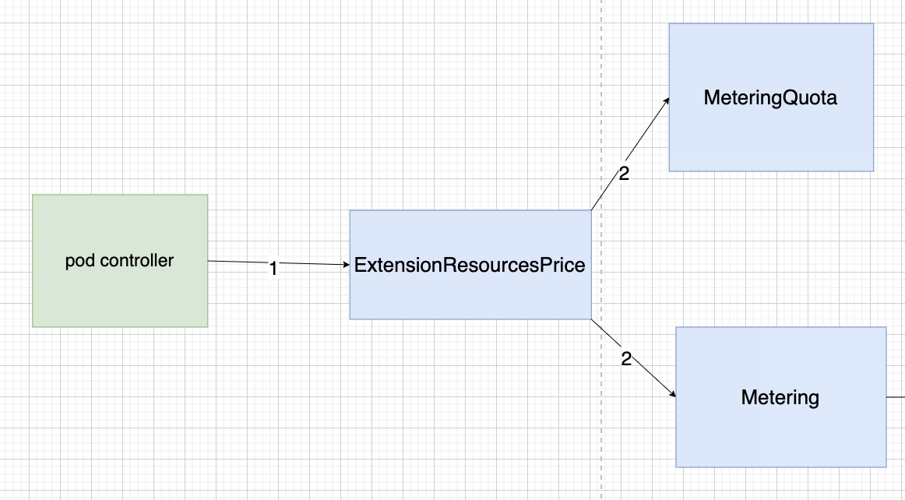
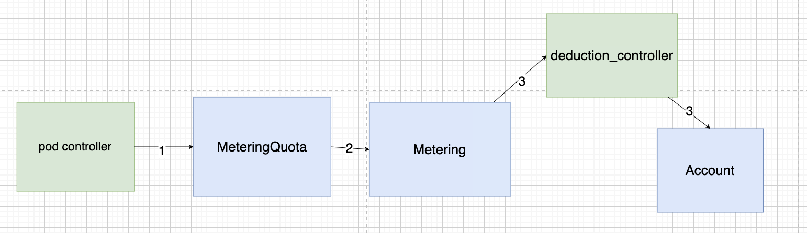
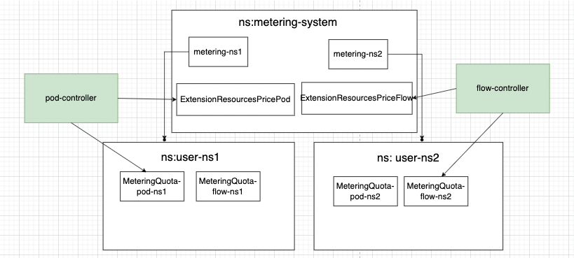

# Metering Proposal

## 一、背景介绍

需要计量计费用户在 sealos cloud 上面使用的资源，比如使用的内存，CPU，流量等资源，每个用户至少有一个自己的 Namespace ，内存和 CPU 等资源 Metering 可以通过直接遍历 pod 得到，但是流量等第三方资源 Metering 感知不到，需要设计一个计量计费系统来帮助计费。

整体流程会在官网的 design 文档中介绍， proposal 中会侧重于介绍 CRD 字段设计细节。

## 二**、各个模块介绍**

### 1**、MeteringQuota（计量模块）**

计量使用的资源量

```
Kind: MeteringQuota
Status:
resources:
  - name:xxx //resource name
  Used: 0
  - name:xxx
  Used: 0
```

### **2、Metering（计费模块）**

计费模块应扣款 =（资源价格单价 * 计量模块中资源使用量）

```go
kind: Metering
metadata:
  name: metering-nsName
  namespace:metering-system
Spec:
resources: map[string]resource
  - name:xxx
  unit: 1 /// 单位
  price:1 //  这个单位的单价
Status：
totalAmount：100 // 计费模块计算出来的应扣账款
```

### 3、Resource-controller（以 podResource-controller举例）

进行 resource 的统计，会创建 extensionresourceprice 来声明 cpu 和 memory 这两种资源要进行计量计费，并且将资源的申明注入到 Metering 和 MeteringQuota 中。

```yaml
apiVersion: metering.sealos.io/v1
kind: PodResource
metadata:
  name: podresourceprice-sample
  namespace: metering-system
spec:
  resourceName: pod
  interval: 60
  resources:
    cpu:
      unit: "1"
      price: 1
      describe: "cost per cpu per hour（price:100 = 1¥）"
    memory:
      unit: "1G"
      price: 1
      describe: "the cost per gigabyte of memory per hour（price:100 = 1¥）"
```

### 4、**ExtensionResourcesPrice**

由 resource-controller 创建，创建的时候会把资源和价格更新到对应的 Metering 和 MeteringQuota中

```yaml
apiVersion: metering.sealos.io/v1
Kind: ExtensionResourcesPrice
Spec:
resources: map[string]resource
  - name:cpu
  unit: 1  //单位使用资源
  price:1  // 单位资源价格
  - name:memory
  unit: 1  //单位使用资源
  price:1  // 单位资源价格
```

## 三、Resource-controller注册资源流程(以pod-controller举例)



### 3.1 创建 ExtensionResourcePrice

apply pod-controller 的时候，reconcile 中需要根据 resources 字段创建 ExtensionResourcePrice

```yaml
apiVersion: metering.sealos.io/v1
kind: PodResource
metadata:
  name: podresource-sample
  namespace: metering-system
spec:
  resourceName: pod
  interval: 60
  resources:
    cpu:
      unit: "1"
      price: 1
    memory:
      unit: "1G"
      price: 1
```

```yaml
apiVersion: metering.sealos.io/v1
Kind: ExtensionResourcesPrice
metadata:
  name: podresource-sample
  namespace: metering-system
Spec:
resources: map[string]resource
  - name:cpu
  unit: 1  //单位使用资源
  price:1  // 单位资源价格
  - name:memory
  unit: 1  //单位使用资源
  price:2  // 单位资源价格
```

### 3.2 ExtensionResourcePrice-controller 注册资源信息

**Metering 和 MeteringQuota 初始信息：**

```yaml
apiVersion: metering.sealos.io/v1
kind: Metering
metadata:
  name: metering-nsName
  namespace:metering-system
Spec:
resources: map[string]resource
Status：
totalAmount：0 // 计费模块计算出来的应扣账款
------------------------------------------------------------------------
apiVersion: metering.sealos.io/v1
Kind: MeteringQuota
metadata:
  name: meteringQuota-nsName
  namespace:nsName
Status:
resources:

```

**改变后：**

ExtensionResourcePrice-controller 把资源名字注册进所有MeteringQuota里面，把资源价格注册进 Metering 中。

```yaml
apiVersion: metering.sealos.io/v1
kind: Metering
metadata:
  name: metering-nsName
  namespace:metering-system
Spec:
resources: map[string]resource
  - name:cpu
  unit: 1
  price:1    
 - name:memory
  unit: 1
  price:2 
Status：
totalAmount：0 // 计费模块计算出来的应扣账款
```

```yaml
apiVersion: metering.sealos.io/v1
Kind: MeteringQuota
metadata:
  name: meteringQuota-nsName
  namespace:nsName
Status:
resources:
  - name:cpu
  Used: 0
  - name:memory
  Used: 0
```

## 四**、Metering计量计费流程**



### 4.1 计量过程

假设 apply 了一个 1 核  cpu ， 1G  内存的 pod 资源在用户 namespace ，podcontroller 会去周期性（以1个小时为周期举例）扫描所有 pod ，发现这个用户 apply 了这个 pod ，给他 namespace 的  MeteringQuota 里面计量使用了资源 1核 1G.

```yaml
apiVersion: metering.sealos.io/v1
Kind: MeteringQuota
metadata:
  name: meteringQuota-nsName
  namespace:nsName
Status:
resources:
  - name:cpu
  Used: 1
  - name:memory
  Used: 1G
```

### 4.2 计费过程

Metering-controller 会周期性去扫描所有 MeteringQuota，查看使用了多少资源，并且根据单价算出实际价格，然后把这个值加到 Metering.Status.totalAmount 中，这个例子中就应该+3，然后把 MeteringQuota 里面的值置0。

**计费后MeteringQuota结果**

```yaml
apiVersion: metering.sealos.io/v1
Kind: MeteringQuota
metadata:
  name: meteringQuota-nsName
  namespace:nsName
Status:
resources:
  - name:cpu
  Used: 0
  - name:memory
  Used: 0
```

**计费后Metering结果**

```yaml
apiVersion: metering.sealos.io/v1
kind: Metering
metadata:
  name: metering-nsName
  namespace:metering-system
Spec:
resources: map[string]resource
  - name:cpu
  unit: 1
  price:1    
 - name:memory
  unit: 1
  price:2 
Status：
totalAmount：3 // 计费模块计算出来的应扣账款
```

### 4.3 扣费过程

Deduction 扣费模块,查看 Metering 中 TotalAmount ，在对应的用户 Account 扣除对应钱，并且把 TotalAmount 清零防止二次扣费。

## 遇到的问题：

1、网关 controller 和 pod controller 会频繁更新同一个MeteringQuota的不同字段，会造成一个controller因为更新了旧版本的MeteringQuota而失败

解决方案：

一个resource-controller 有一个自己的ExtensionResourcePrice，每个Namespace 都会有自己的MeteringQuota记录自己统计的资源变化。下面有两个resource-controller，每个Namespace 就会有两个 MeteringQutoa 实例。

