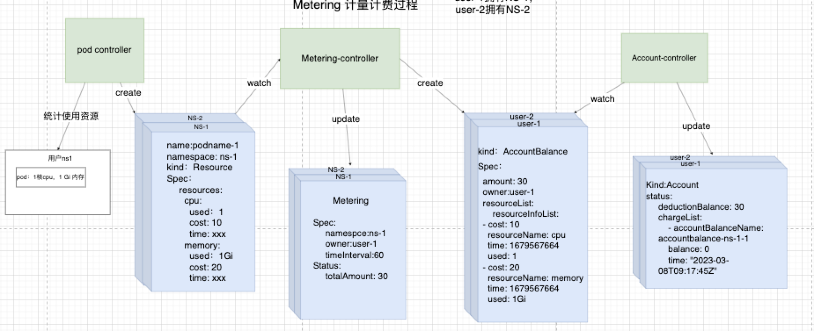

# Metering Proposal

## 一、背景介绍

​    需要计量计费用户在 sealos cloud 上面使用的资源，比如使用的内存，CPU，流量等资源，每个用户至少有一个自己的 Namespace ，内存和 CPU 等资源 Metering 可以通过直接遍历 pod 得到，但是流量等第三方资源 Metering 感知不到，需要设计一个计量计费系统来帮助计费。

​    整体流程会在官网的 design 文档中介绍， proposal 中会侧重于介绍 CRD 字段设计细节。

## 二、各个模块介绍

### 2.1、Metering

metering 的 CR（CRD 的实例化）是存储

```yaml
apiVersion: metering.sealos.io/v1
kind: Metering
metadata:
  name: metering-nsName
  namespace: metering-system
spec:
  namespace: ns-ff839a27-0a35-452f-820e-3e47d596ba68
  owner: ff839a27-0a35-452f-820e-3e47d596ba68
  timeInterval: 60 #60分钟计费一次
status:
  totalAmount: 30 #累计收费多少钱
```

### 2.2、Resource-controller（以 podResource-controller举例）

- 进行特定 resource 的统计，比如podResource-controller 会统计pod使用的cpu、memory、storage 资源，
- 会创建 extensionresourceprice 来声明自己统计资源的 GVK 是什么，方便用户欠费的时候欠费控制器知道要删除用户的什么资源。
- 会创建 Resource CR 来说明用户使用了多少资源和需要扣除多少钱

```yaml
apiVersion: metering.sealos.io/v1
kind: PodResource
metadata:
  name: podresourceprice-sample
  namespace: metering-system
spec:
  resourceName: pod
  interval: 60
  resources:
    cpu:
      unit: "1"
      price: 1
      describe: "cost per cpu per hour（price:100 = 1¥）"
    memory:
      unit: "1G"
      price: 2
      describe: "the cost per gigabyte of memory per hour（price:100 = 1¥）"
status:
  seqID: 1   //Every billing cycle will +1
```

### 2.3、ExtensionResourcesPrice

​    由 resource-controller 创建，用来记录资源的价格和统计资源的 GVK

```yaml
apiVersion: common.metering.sealos.io/v1
Kind: ExtensionResourcesPrice
Spec:
  resources: 
    cpu:
      unit: 1  #单位使用资源
      price: 1 #单位资源价格
    memory:
      unit: 1  #单位使用资源
      price: 2 #单位资源价格
  groupVersionKinds:
  - group: ""
    version: v1
    kind: pod

```

### 2.4、Resource

​    由resource-controller 产生，用于存储统计的资源使用量，metering-controller会监听不同Resource-controller 产生的Resource CR，并且暂存于Metering CR中，一个计费周期后以AccountBalance CR的形式输出这个计费周期总和的资源使用量和应扣款

```yaml
apiVersion: common.metering.sealos.io/v1
kind: Resource
metadata:
  name: ns-c220b19f-0eee-4bee-bae9-9d91270531c0-memory-1
  namespace: metering-system
spec:
  resources: 
    memory:  # resource name
      namespace: ns-c220b19f-0eee-4bee-bae9-9d91270531c0
      time: 1672898068 #时间戳
      used: 1Gi
      cost: 2
status:
  status: complete #已经被metering-controller统计过了
```

### 2.5、AccountBalance

```yaml
apiVersion: user.sealos.io/v1
kind: AccountBalance
metadata:
  name: accountbalance-b257ee11-5e85-4e3f-b1e4-4fa291dcdfd6-92
  namespace: metering-system
spec:
  amount: 6 #需要支付的金额
  owner: b257ee11-5e85-4e3f-b1e4-4fa291dcdfd6
  timestamp: 1672031381
status:
  status: complete #已支付
```


## 三**、Metering计量计费流程**



绿色代表controller，蓝色代表CR（即CRD的实例化）

#### 3.1、pod-controller统计资源过程：

pod-controller统计资源使用量后，不再是更改现有CR，而是产生一个Resource CR


#### 3.2、Metering-controller统计过程：

watch Resource的产生，会把其中的资源使用量和需要支付的金额放入Metering的 CR 中


到达一个计费周期后（一般是60分钟）,通过统计的资源使用量和价格生成Accountbalance CR


#### 4.4、扣费过程：

Account 监听了Accountbalance CR的产生，并且读取需要扣费的值，进行扣费。


