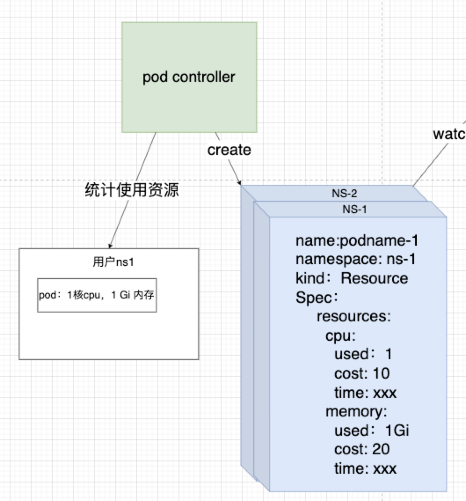

# Metering Proposal

## 一、背景介绍

需要计量计费用户在 sealos cloud 上面使用的资源，比如使用的内存，CPU，流量等资源，每个用户至少有一个自己的 Namespace ，内存和 CPU 等资源 Metering 可以通过直接遍历 pod 得到，但是流量等第三方资源 Metering 感知不到，需要设计一个计量计费系统来帮助计费。

整体流程会在官网的 design 文档中介绍， proposal 中会侧重于介绍 CRD 字段设计细节。

## 二、各个模块介绍

### 2.1、Metering（计量计费模块合一）

计费方式：used/unit *price 就是需要扣除的的价格

```yaml
apiVersion: metering.sealos.io/v1
kind: Metering
metadata:
  name: metering-nsName
  namespace:metering-system
spec:
  namespace: ns-ff839a27-0a35-452f-820e-3e47d596ba68
  owner: ff839a27-0a35-452f-820e-3e47d596ba68
  resources:
    cpu:
      describe: cost per cpu per hour（price:100 = 1¥）
      price: 67
      unit: "10"
      used: "0"
    memory:
      describe: the cost per gigabyte of memory per hour（price:100 = 1¥）
      price: 33
      unit: 10G
      used: "0"
  timeInterval: 60 //计费60分钟计费一次
```

### 2.2、Resource-controller（以 podResource-controller举例）

进行 resource 的统计，会创建 extensionresourceprice 来声明 cpu 和 memory 这两种资源要进行计量计费，并且将资源的申明注入到 Metering 中。

```yaml
apiVersion: metering.sealos.io/v1
kind: PodResource
metadata:
  name: podresourceprice-sample
  namespace: metering-system
spec:
  resourceName: pod
  interval: 60
  resources:
    cpu:
      unit: "1"
      price: 1
      describe: "cost per cpu per hour（price:100 = 1¥）"
    memory:
      unit: "1G"
      price: 2
      describe: "the cost per gigabyte of memory per hour（price:100 = 1¥）"
```

### 2.3、ExtensionResourcesPrice

由 resource-controller 创建，创建的时候会把资源和价格更新到对应的 Metering

```yaml
apiVersion: metering.sealos.io/v1
Kind: ExtensionResourcesPrice
Spec:
resources: 
  cpu:
    unit: 1  //单位使用资源
    price:1 // 单位资源价格
  memory:
    unit: 1  //单位使用资源
    price:2  // 单位资源价格
```

### 2.4、Resource

```yaml
apiVersion: metering.sealos.io/v1
kind: Resource
metadata:
  name: ns-c220b19f-0eee-4bee-bae9-9d91270531c0-memory-362
  namespace: metering-system
spec:
  resources: 
    memory:  // resource name
      namespace: ns-c220b19f-0eee-4bee-bae9-9d91270531c0
      time: 1672898068 //时间戳
      used: 1Gi
status:
  status: complete //已经被metering-controller统计过了
```

### 2.5、AccountBalance

```yaml
apiVersion: user.sealos.io/v1
kind: AccountBalance
metadata:
  name: accountbalance-b257ee11-5e85-4e3f-b1e4-4fa291dcdfd6-92
  namespace: metering-system
spec:
  amount: 6 //需要支付的金额
  owner: b257ee11-5e85-4e3f-b1e4-4fa291dcdfd6
  timeStamp: 1672031381
status:
  status: complete //已支付
```

## 三、Resource-controller注册资源流程(以pod-controller举例)


### 3.1 创建 ExtensionResourcePrice

pod-controller需要创建 ExtensionResourcePrice 来让metering 知道这个资源也需要计量计费。

yaml文件同[2.3](# 2.3、ExtensionResourcesPrice)

### 3.2 Metering-controller 注册资源信息

**Metering 初始信息：**

```yaml
apiVersion: metering.sealos.io/v1
kind: Metering
metadata:
  name: metering-nsName
  namespace:metering-system
spec:
  namespace: ns-ff839a27-0a35-452f-820e-3e47d596ba68
  owner: ff839a27-0a35-452f-820e-3e47d596ba68
  resources:
  timeInterval: 60 //计费间隔：60分钟计费一次
```

**改变后：**

Metering-controller 把资源名字和价格注册进所有Metering里面。

```yaml
apiVersion: metering.sealos.io/v1
kind: Metering
metadata:
  name: metering-nsName
  namespace:metering-system
spec:
  namespace: ns-ff839a27-0a35-452f-820e-3e47d596ba68
  owner: ff839a27-0a35-452f-820e-3e47d596ba68
  resources:
    cpu:
      price: 1
      unit: "1"
      used: "0"
    memory:
      price: 2
      unit: 1G
      used: "0"
  timeInterval: 60 
```

## 四**、Metering计量计费流程**


绿色代表controller，蓝色代表CR（即CRD的实例化）

#### 4.1、pod-controller统计资源过程：

pod-controller统计资源使用量后，不再是更改现有CR，而是产生一个资源使用量CR



#### 4.2、Metering-controller计量过程：

watch Resource的产生，产生之后会把其中的资源使用值放入Metering的 CR 中

```yaml
apiVersion: metering.sealos.io/v1
kind: Metering
metadata:
  name: metering-nsName
  namespace:metering-system
spec:
  namespace: ns-ff839a27-0a35-452f-820e-3e47d596ba68
  owner: ff839a27-0a35-452f-820e-3e47d596ba68
  resources:
    cpu:
      price: 1
      unit: "1"
      used: 1 // 这里改变，+1
    memory:
      price: 2
      unit: 1G
      used: "0"
```

#### 4.3、Metering-controller计费过程：

Metering-controller会在一个计费周期内（一般是60分钟）进行计费一次

1、根据Metering CR中统计的资源使用量和价格表计算出价格，并且会清空统计的资源使用量

2、生成一个AccountBalance的CR，里面会存放需要扣除的金额，根据使用的资源量1核 CPU 计算出需要支付1块钱（计算公式：used/unit *price）。

```yaml
# 清空Metering CR中统计的资源使用量
apiVersion: metering.sealos.io/v1
kind: Metering
metadata:
  name: metering-nsName
  namespace:metering-system
spec:
  namespace: ns-ff839a27-0a35-452f-820e-3e47d596ba68
  owner: ff839a27-0a35-452f-820e-3e47d596ba68
  resources:
    cpu:
      price: 1
      unit: "1"
      used: 0 // 这里改变，重新置为0
    memory:
      price: 2
      unit: 1G
      used: "0"
```


```yaml
apiVersion: user.sealos.io/v1
kind: AccountBalance
metadata:
  name: accountbalance-b257ee11-5e85-4e3f-b1e4-4fa291dcdfd6-92
  namespace: metering-system
spec:
  amount: 1 //需要支付的金额大小
  owner: b257ee11-5e85-4e3f-b1e4-4fa291dcdfd6 //用户名字
  timeStamp: 1672031381
```

#### 4.4、扣费过程：

Account 监听了Accountbalance CR的产生，并且读取需要扣费的值，进行扣费。
