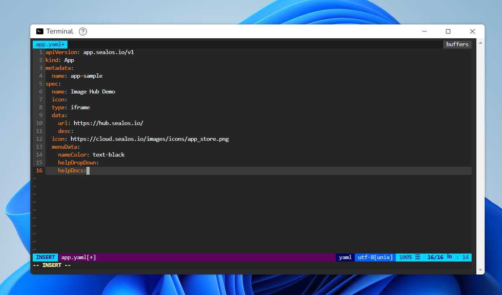

# How to deploy the application to desktop

## Use Terminal to write app.yaml

### Key Information

- type: iframe, identified as a web application
- spec name is the name displayed on the desktop
- url application address
- icon is the icon displayed on the desktop

```yaml
apiVersion: app.sealos.io/v1
kind: App
metadata:
  name: app-sample
spec:
  name: Image Hub Demo
  icon:
  type: iframe
  data:
    url: https://hub.sealos.io/
    desc:
  icon: https://cloud.sealos.io/logo.svg
  menuData:
  displayType: normal
```



### apply yaml

```
kubectl apply -f app.yaml
```


### Refresh the browser, you can see the app on the desktop
