# Quick Installation of Gitea

Git with a cup of tea! Painless self-hosted all-in-one software development service, includes Git hosting, code review, team collaboration, package registry and CI/CD.

## Step 1: Log in to Sealos

- Go to the [Sealos](https://cloud.sealos.io/) official website

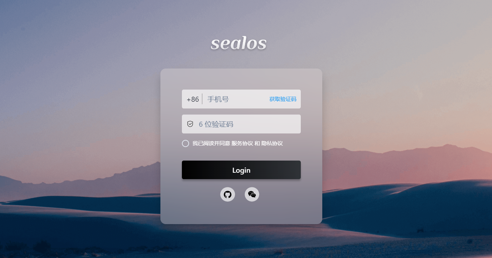

## Step 2: Open the App Launchpad 

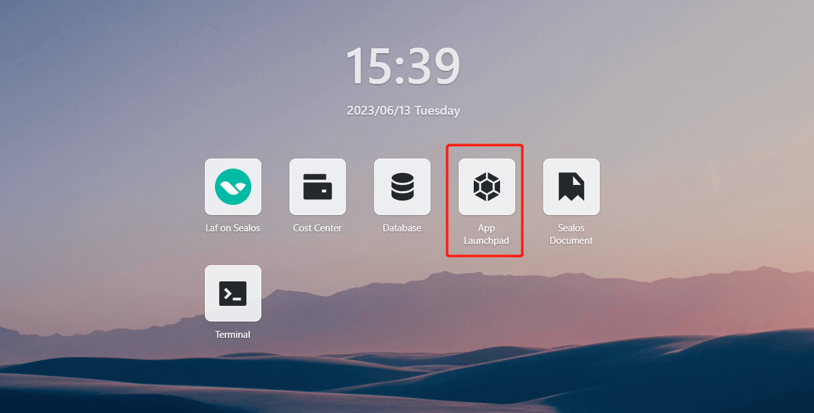

## Step 3: Create a new application

- In App Launchpad, click "Create New Application" to create a new application.

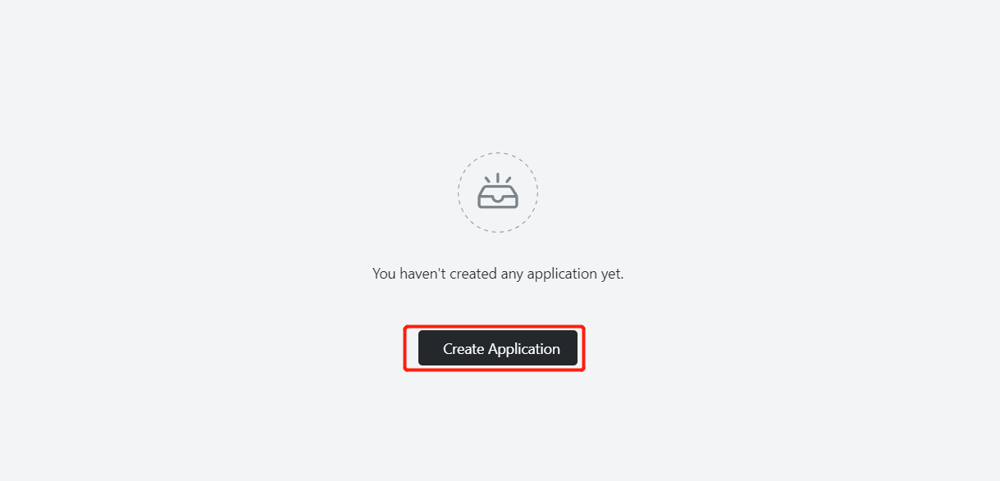

## Step 4: Application deployment

- Basic configuration:

  - Application name (custom): gitea
  - Image name (default latest version): gitea/gitea:latest-rootless
  - CPU (recommended): 1 Core
  - Memory (recommended): 1 G

- Deployment mode:

  - Number of instances (custom): 1

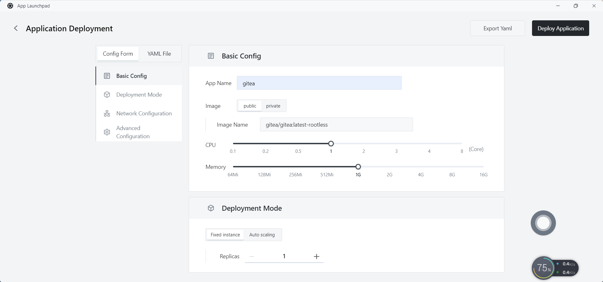

- Network configuration:

  - Container  port: 3000
  - Accessible to the Public: enabled

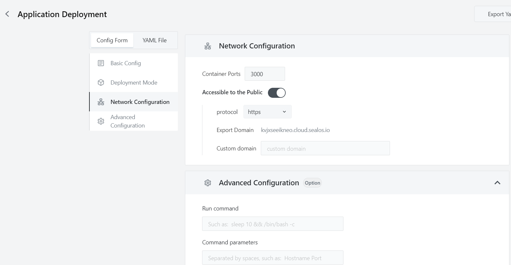

- Advanced configuration:

  - Custom local storage, persist Gitea data (recommended 1 G).
  

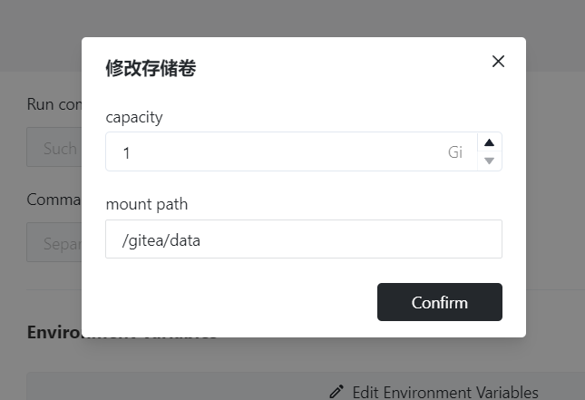

## Step 5: Deploy the application

- Click「Deploy Application」 to start deploying the application.

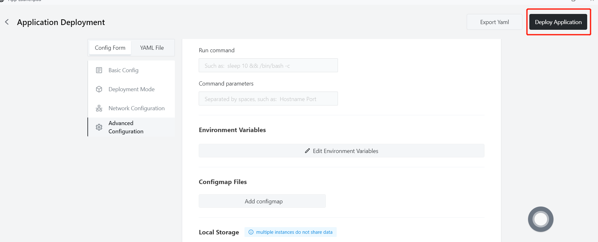

## Step 6: Configure the database

- Configure MySQL database for Gitea via Sealos
- Click Database

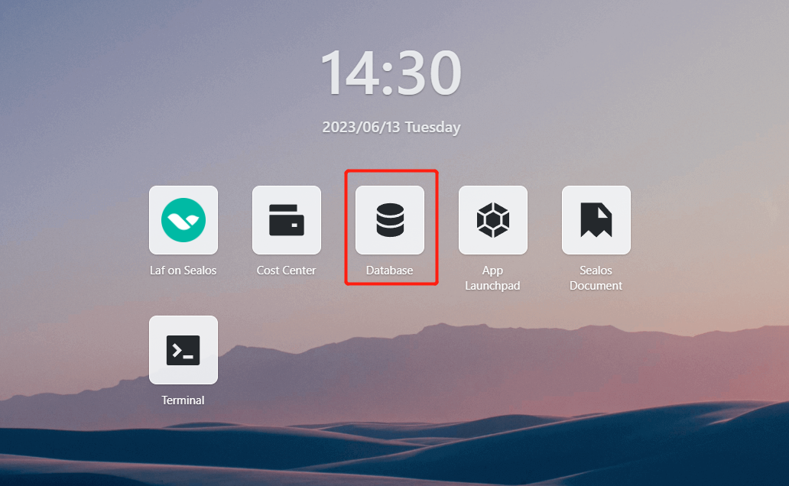

- Create a new database

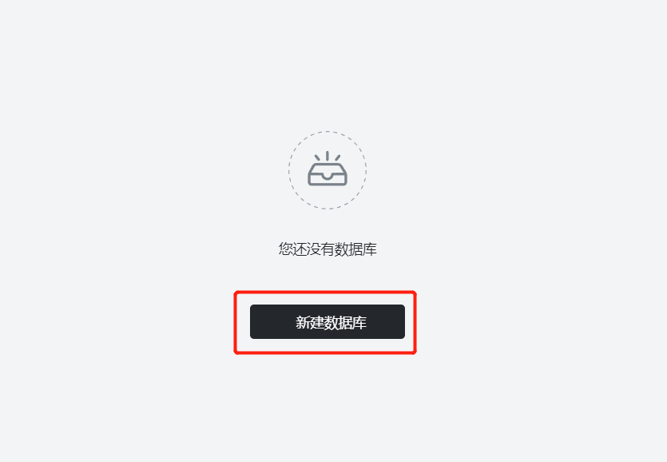

- Basic configuration:

  - Cluster type: mysql
  - Database version: ac-mysql-8.0.30
  - CPU (recommended): 1 Core
  - Memory (recommended): 1 G
  

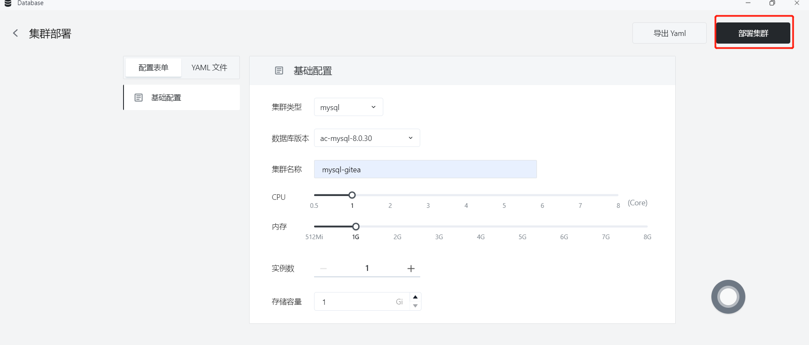

- After deployment is successful, enter the details page to view the MySQL connection information

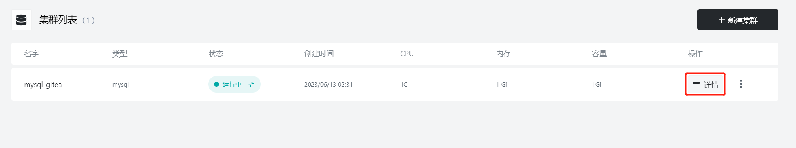

- Click "One-click Connection" to enter the MySQL terminal connection

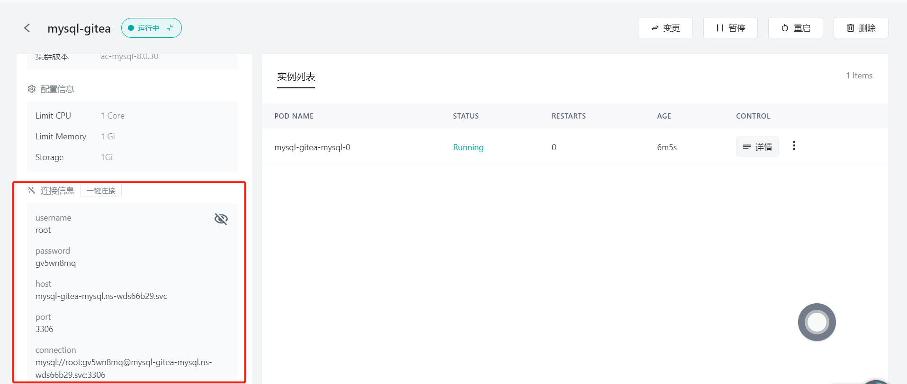

- Execute

```sql
CREATE DATABASE giteadb CHARACTER SET 'utf8mb4' COLLATE 'utf8mb4_unicode_ci';
```

Create the database needed for Gitea

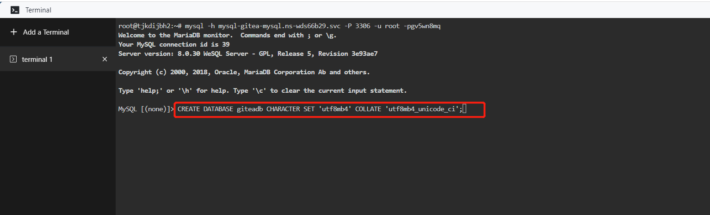

## Step 7: Access the application

- Click 「App Launchpad」 to view.When the application's STATUS changes from Pending to Running, it means the application has started successfully.

- When the STATUS is Running, you can directly access the external address.

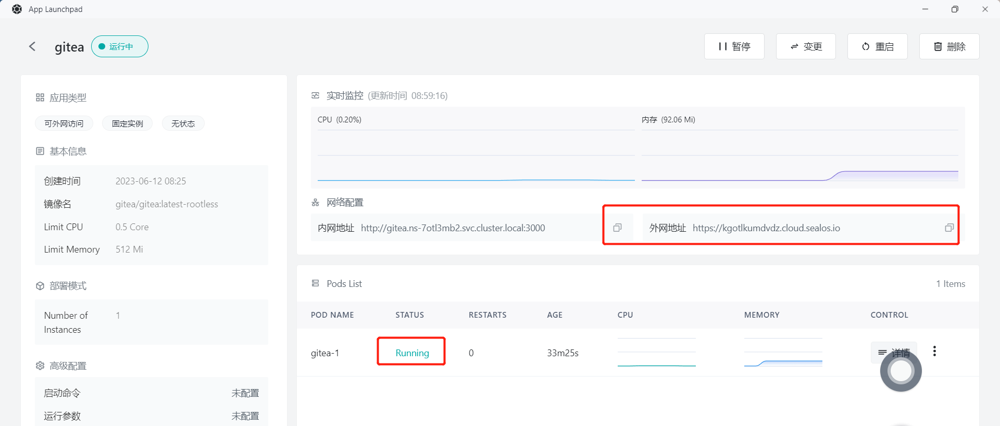

- After accessing the external address, enter the configuration page and configure according to the details of the MySQL just created

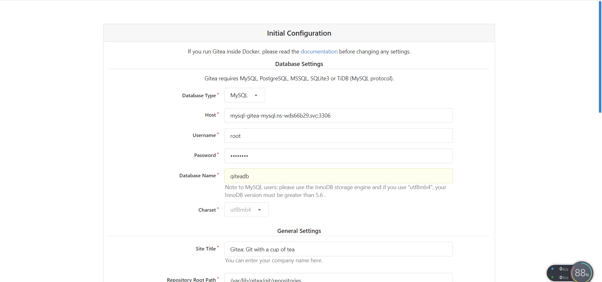

- After configuring, click Install, wait for a while and you can enter the login page, deployment successful!

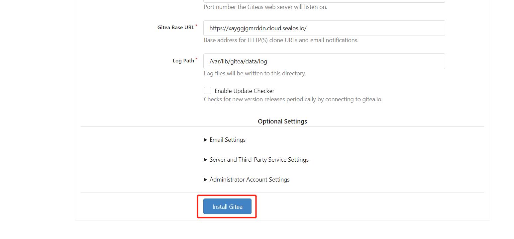

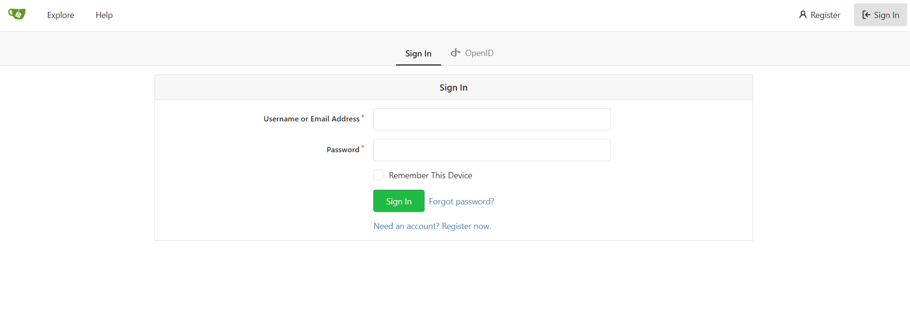

