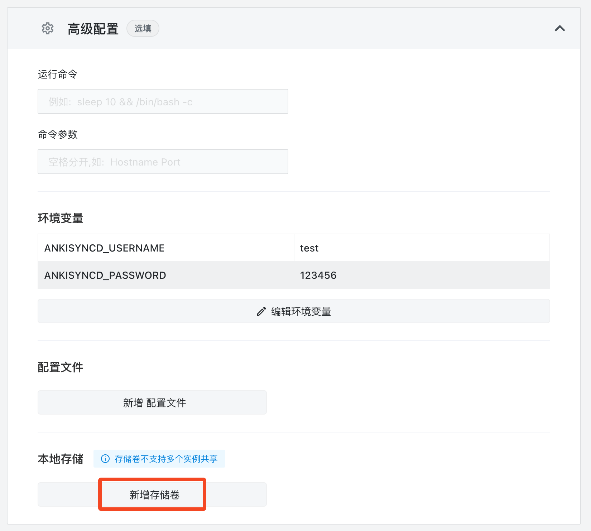
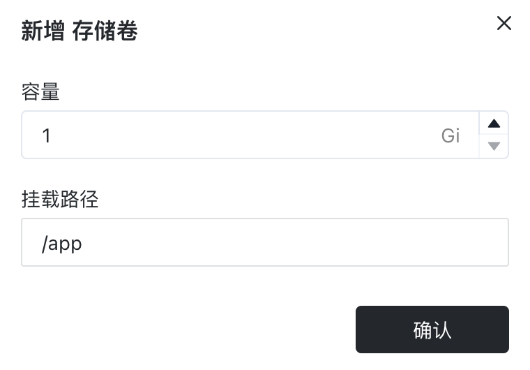

# Quick Installation of a Custom Anki Sync Server

Anki is a spaced repetition flashcard program. Essentially, it is a card sorting tool that **actively tests users on custom card content, allows users to self-grade their responses, and then uses an algorithm to reschedule cards based on the judgments to optimize long-term retention**.

The so-called "cards" are technically called flash cards. They are small cards with a question or prompt on one side and the answer on the reverse side. You first read the question/prompt, try to recall the answer mentally, then flip the card to verify against the answer provided.

The core principle of flashcard creation is:**one knowledge point per card**. As such, Anki is well-suited for learning languages, memorizing historical dates, formulas, etc.

Anki's official sync server is hosted overseas and is a personal project with limited bandwidth. Syncing is very slow. To sync learning progress and new cards across multiple clients would be extremely painful.

To address this, we need to deploy a custom sync server and have the clients connect to it instead.

## Deploying an Anki Sync Server

Since the February 2023 release of Anki 2.1.57 for desktop, Anki on desktop, Android, and iOS now support custom sync servers without needing to install plugins. Anki users no longer need to worry about sync issues. The longstanding sync problem has finally been completely solved.

Currently, the only project that supports the latest Anki versions is [anki-sync-server-rs](https://github.com/ankicommunity/anki-sync-server-rs). Other sync server projects are now mostly obsolete. This Rust project tracks progress on Anki's official sync server and also uses sqlite as the backend data store.

Below we will deploy anki-sync-server-rs on Sealos and configure it.

First, enter the URL https://cloud.sealos.io/ in your browser to access the Sealos desktop. Then open "App Launchpad":


Click "Create Application":


Enter the application name and image name. The exposed container port is `27701`. Enable external network access:


Scroll down and expand "Advanced Configuration". Click "Edit Environment Variables":


Paste the following into the environment variable input box:

```
bash
Copy code

ANKISYNCD_USERNAME=<USERNAME>  
ANKISYNCD_PASSWORD=<PASSWD>
```

Replace `<USERNAME>` with your username and `<PASSWD>` with your password.


Click "Add Storage Volume":



Set the mount path to `/app` and confirm:



Finally, click "Deploy Application" in the top right corner.

After deployment, click "Details" to enter the application details screen.


Here you can see the instance status. Wait until the status shows as "running" before proceeding. If it stays pending for a while, click "Details" to check the failure reason:


Once deployed successfully, you can monitor metrics like CPU and memory usage. Click the external URL to directly access the sync server's web interface.


If you see the following screen, the deployment succeeded:


Viewing logs is also straightforward - click the "three dots" on the instance panel and select "Logs":


## Client Configuration

### Desktop

To configure the desktop client (macOS/Windows/Linux):

1. Open "Preferences"

   

2. Click "Network" and look for the "self-hosted sync server" section. Enter your server's address:

   

3. Restart Anki and click "Sync":

   

4. A prompt will appear asking for username and password. Enter what you configured earlier:

   

5. Click OK and syncing will begin.

### Android

On Android, directly configure via "Settings -> Advanced -> Custom sync server":


Also enter username and password:

> Settings -> Basic -> AnkiWeb Account

This completes the configuration. All card decks should sync over:


The official app version is quite old. For the latest community version, download the Beta here:

- https://github.com/ankidroid/Anki-Android/releases

The **arm64-v8a** version is recommended.

After installing, the sync server can be configured under "Settings -> Sync -> Custom sync server":


Also enter the username and password:

> Settings -> Sync -> AnkiWeb Account

### iOS

AnkiMobile also supports syncing with a custom server. At least version Ankimobile 2.0.90(20090.2) seems to work based on [reports in the Anki forums](https://forums.ankiweb.net/t/ankimobile-self-sync-server-failure-the-one-bundled-in-version-2-1-60-qt6/27862).

If you encounter sync issues after configuring, try toggling "Allow Anki to access local network" off and on in iOS settings per Anki's docs:

> If you're using AnkiMobile and are unable to connect to a server on your local network, please go into the iOS settings, locate Anki near the bottom, and toggle "Allow Anki to access local network" off and on again.

The tip above is excerpted from the [Anki tutorial](https://docs.ankiweb.net/sync-server.html#client-setup).