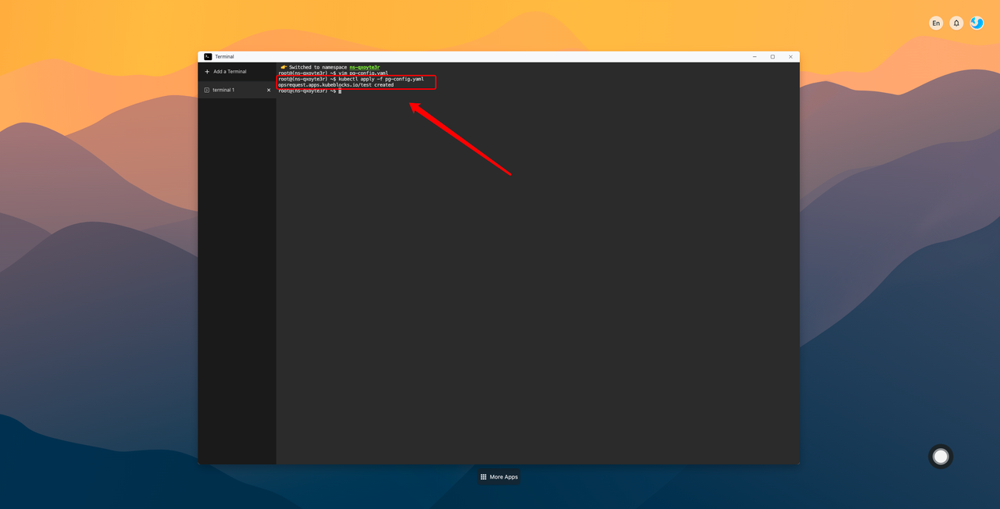

# Tutorial on modifying database parameters with yaml

Some parameters of the database cannot take effect immediately after modification. Therefore, you need to apply yaml to modify parameters and restart the database. Modifying parameters in yaml will cause the database to **restart**, and the whole process will take about **20 seconds**. The following uses the **Postgres** database as an example to modify parameters:

1. **Access the terminal**：


2. **Edit pg-config.yaml**：

```bash
$ vim pg-config.yaml
```


3. **Copy yaml to pg-config.yaml and save pg-config.yaml**：


```yaml
apiVersion: apps.kubeblocks.io/v1alpha1
kind: OpsRequest
metadata:
  name: test
spec:
  clusterRef: test-pg  #Change the database name to your own
  reconfigure:
    componentName: postgresql
    configurations: #The following configuration is for reference only. You only need to keep the part to be modified and modify the corresponding parameter values
      - keys:
          - key: postgresql.conf
            parameters:
              - key: max_connections #Sets the maximum number of simultaneous connections that can be made to the database
                value: "1000"
        name: postgresql-configuration
  ttlSecondsAfterSucceed: 0
  type: Reconfiguring
```
**Common PostgreSQL Parameters**:

|      Parameter Name     | Description                                                                                           |
|-------------------------|-------------------------------------------------------------------------------------------------------|
| max_connections         | Sets the maximum number of connections that can be <br/>established with the database simultaneously. |
| max_wal_size            | Sets the maximum size of WAL (Write-Ahead Logging) files.                                             |
| min_wal_size            | Sets the minimum size of WAL files.                                                                   |
| max_worker_processes    | Sets the maximum number of background processes that<br/> PostgreSQL can start.                       |
| shared_buffers          | The size of memory used for data caching.                                                             |

**Common MySQL Parameters**:

|      Parameter Name     | Description                                               |
|-------------------------|-----------------------------------------------------------|
| innodb_buffer_pool_size | Sets the size of the InnoDB buffer pool.                  |
| max_connections         | The maximum number of concurrent connections allowed.     |
| query_cache_size        | The size of the query cache.                              |
| thread_cache_size       | The size of the thread cache.                             |
| max_allowed_packet      | The maximum packet size.                                  |
| innodb_log_file_size    | The size of the InnoDB log file.                          |

**Common MongoDB Parameters**:

|      Parameter Name     |                                      Description          |
|-------------------------|-----------------------------------------------------------|
| storage.dbPath          | The path for storing data files.                          |
| storage.journal.enabled | Sets the maximum size of WAL (Write-Ahead Logging) files. |
| min_wal_size            | Enables logging.                                          |
| net.port                | The server port.                                          |
| net.bindIp              | The bound IP address.                                     |

**Common Redis Parameters**:

| Parameter Name          |                                      Description          |
|-------------------------|-----------------------------------------------------------|
| maxclients              | The maximum number of client connections.                 |
| maxmemory               | The maximum amount of memory usage.                       |
| maxmemory-policy        | The memory eviction policy.                               |
| appendonly              | Switch for AOF persistence.                               |
| appendfsync             | The frequency of AOF file flushing.                       |

4. **Apply pg-config.yaml**：

```bash
$ kubectl apply -f pg-config.yaml
```


5. **Check whether pg-config.yaml is successfully applied**：
```bash
# If the status of OpsRequest is Succeed and the status of pod is Running, the application is successfully configured
$ kubectl get OpsRequest
$ kubectl get pod
```


6. **Access the database to check whether the configuration takes effect**：
```bash
$ show max_connections;
```


