# Database

** Database ** is the core component of an application, Sealos provides a database cluster deployment management tool, can help you quickly deploy database clusters. It supports MySQL, PostgreSQL, MongoDB, Redis, Kafka, and more. Currently the ** database ** supports the following features.

+ Elastic expansion
+ Support multi-version and multi-type databases
+ Database connection: one-click connection, external network access
+ Database connection: manual backup, automatic backup
+ Database monitoring: resource, status, and performance monitoring
+ Database migration: public network migration and file migration
+ Database high availability: Supports multiple database instances
+ Visual database management: Create, delete, update, pause, restart the database


## Quick start

Take deploying a PostgreSQL database as an example to experience the convenience of a database.

Deployment and access in just 6 steps:

1. Enter the Database application from the [Sealos](https://cloud.sealos.io) desktop：


2. Click on the creation of a new cluster.：


3. Select the corresponding database and parameters：

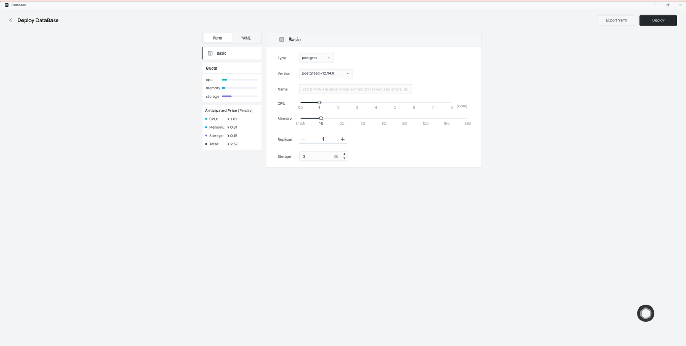

4. Click on deployment：

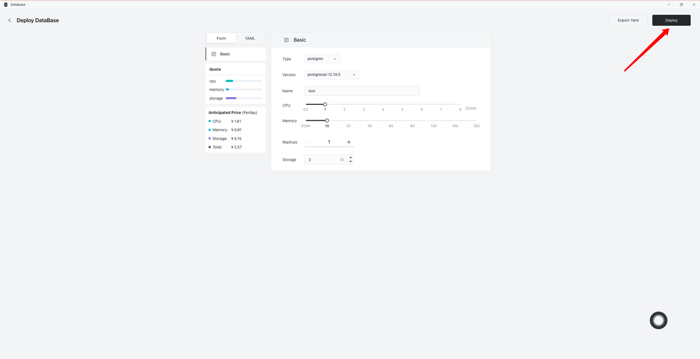

5. Enter DB to view details：


6. Database details：

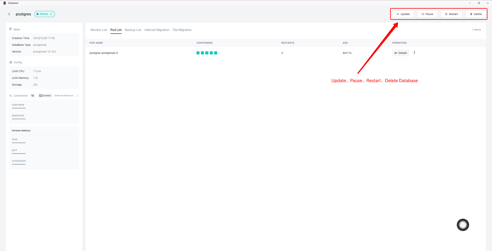

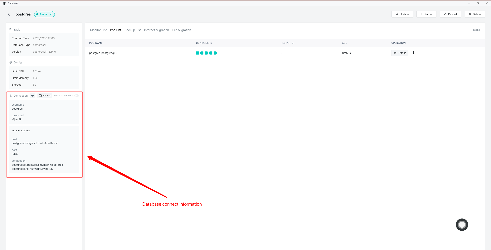


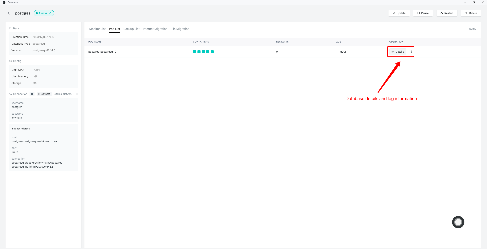


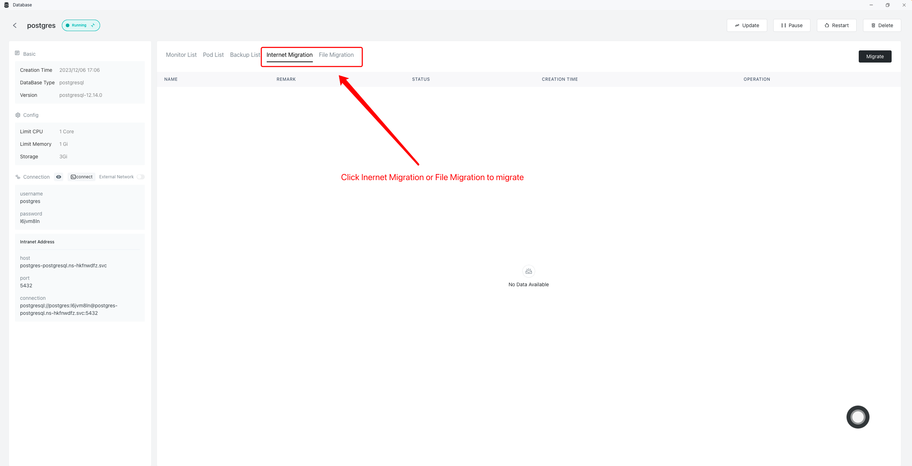


## Database connection

### One-click connection

1. Enter ** database **, click Connect:

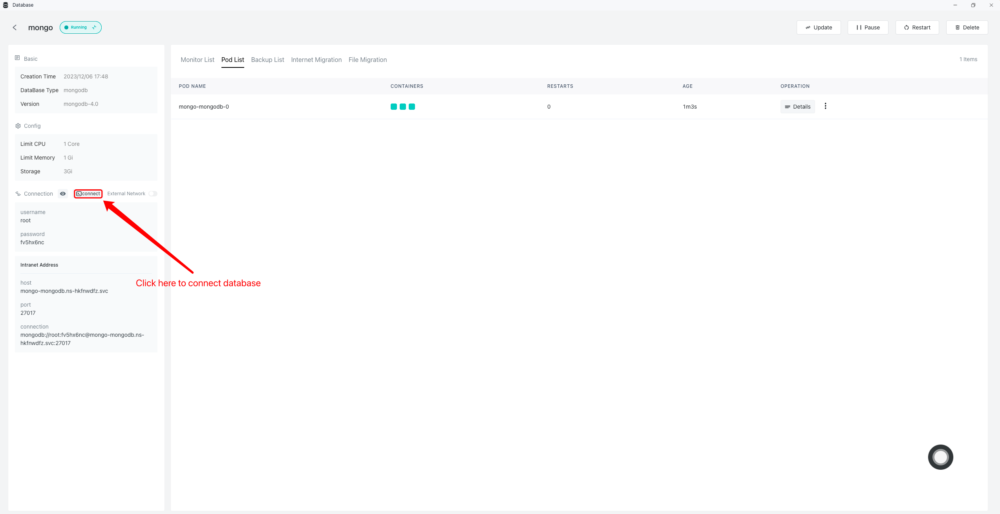

2. Manipulate the database at the terminal：


### Extranet access

1. Enter ** database **, click Connect：

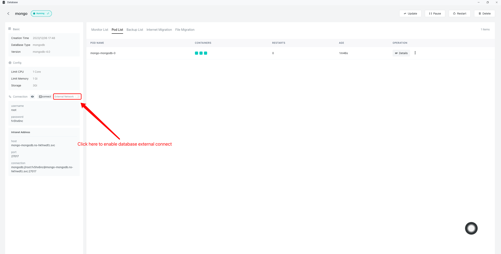

2. Confirm open ** database **：

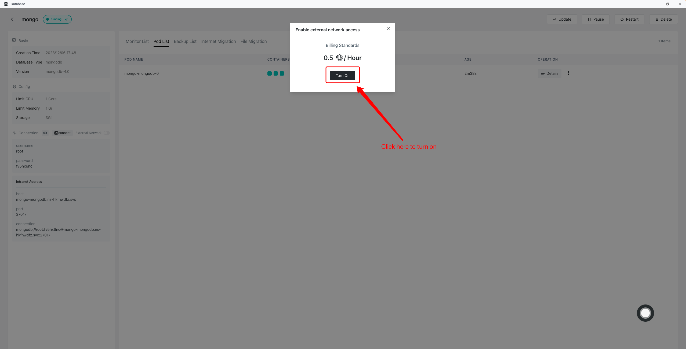

3. Copy the database connection information：


4. Connect to the database in the Database Connection tool：


## Database backup

### Manual backup
1. Enter the database backup page, click Backup：


2. Enter the backup information to start the backup：


3. Check Backup status：


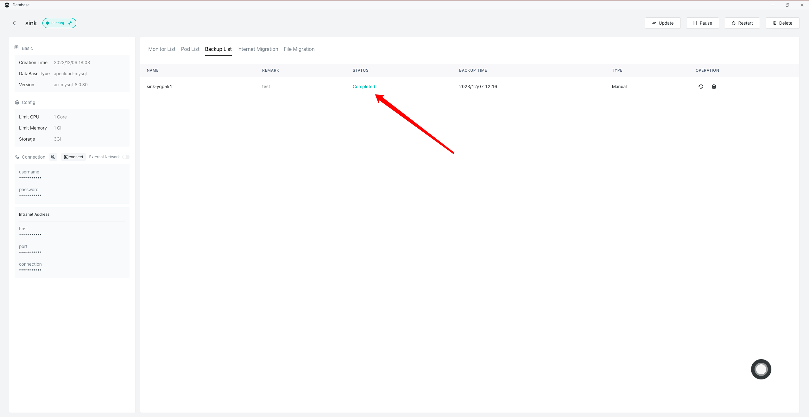


### Automatic backup
1. Enter the database backup page, click Backup：

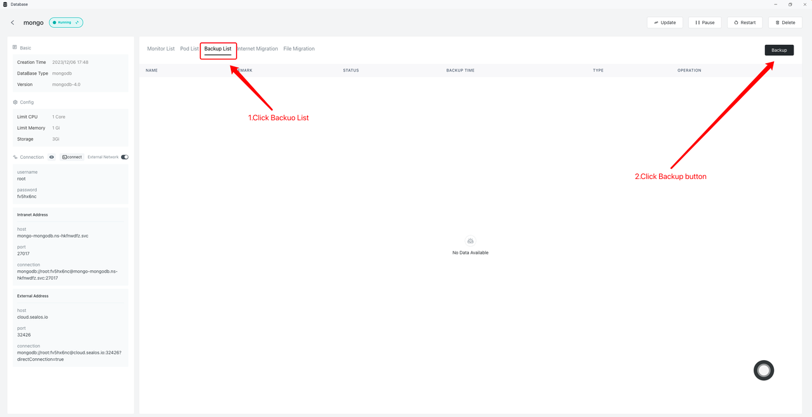

2. Enable automatic backup and enter backup information：


## Database migration

This section uses the MySQL database as an example to describe how to migrate a database.

### Public network migration

Public network migration involves two databases: the source database and the target database. The source database is the data source for migration, and the target database is the data destination for migration. The following introduction demonstrates the local database as the source database.

1. Enter the target database and connect to the target database：


2. Create the corresponding database in the terminal interface (skip this step if the corresponding database already exists)：

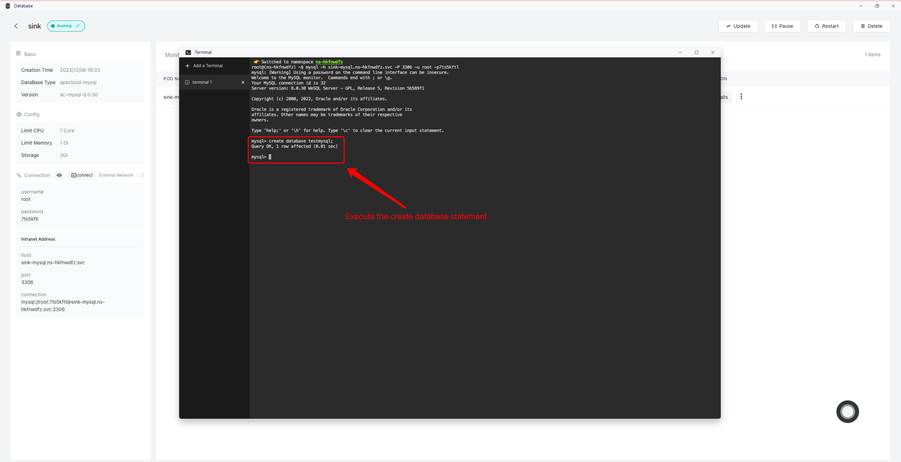
```bash
# Example of creating a database sql statement：
$ create database testmysql;
```

3. Enter the public network migration page of the target database, click the Migrate button：

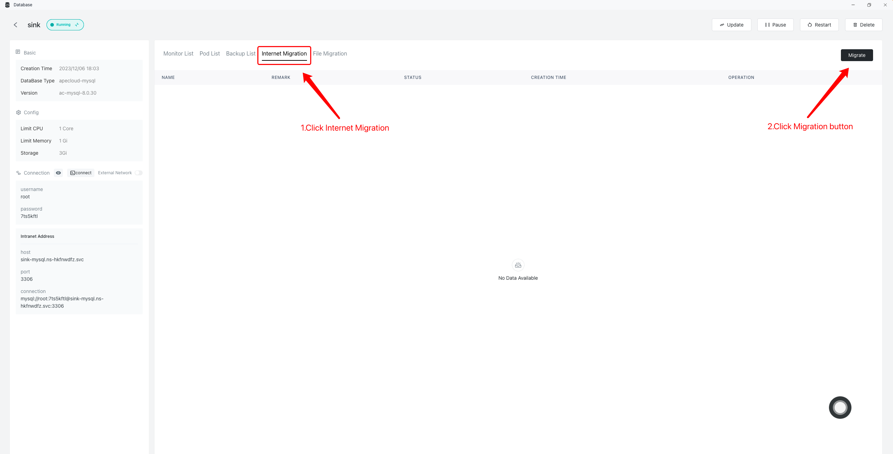

4. View migration configuration information：

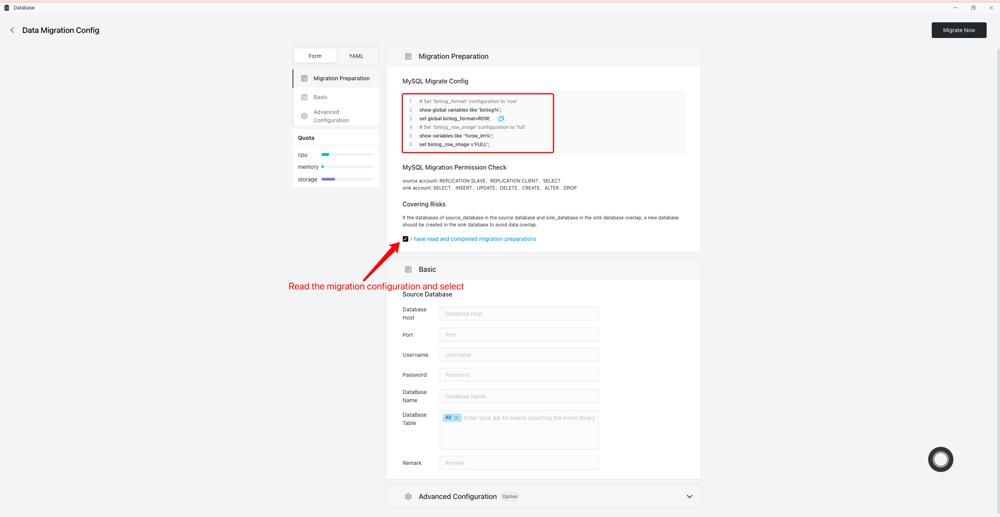

Copy the migration configuration information as follows：
```bash
# Example of an sql statement for setting configuration information：
$ set global binlog_format=ROW;
$ set binlog_row_image ='FULL';
```

5. Set the configuration information in the source database (MySQL and Postgres require manual configuration information, Mongo does not require configuration)：
```bash
# xample of an sql statement for setting configuration information：
$ set global binlog_format=ROW;
$ set binlog_row_image ='FULL';
```


6. Enter the target database, fill in the migration information of the source database, which tables to migrate, and fill in which database in the target database to migrate：


If you need to continuously migrate data from the source database, enable continuous migration in the advanced configuration as follows：


7. View migration task information：

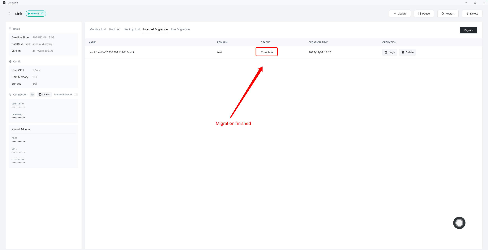

8. Enter the target database, connect to the target database, and check whether the migration data is complete：


### File migration

1. Enter the target database and connect to the target database：


2. Create the corresponding database in the terminal interface (skip this step if the corresponding database already exists)：
```bash
# Example of creating a database sql statement：
$ create database testmysql;
```
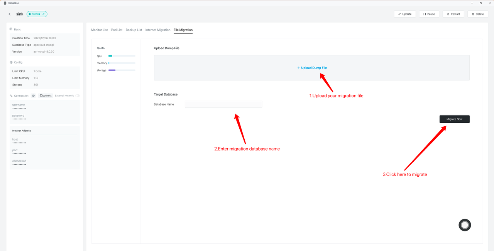

3. Upload the migration file, enter the database name, and start the migration：


4. File migrating, Wait for the migration result：

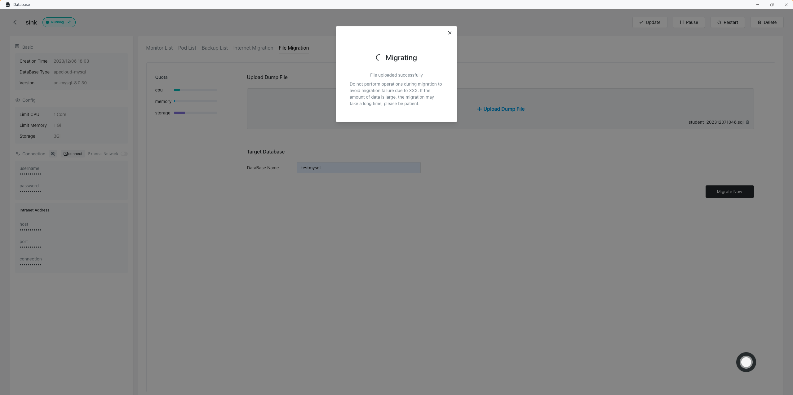


5. Connect to the database to check whether the migrated data is complete：

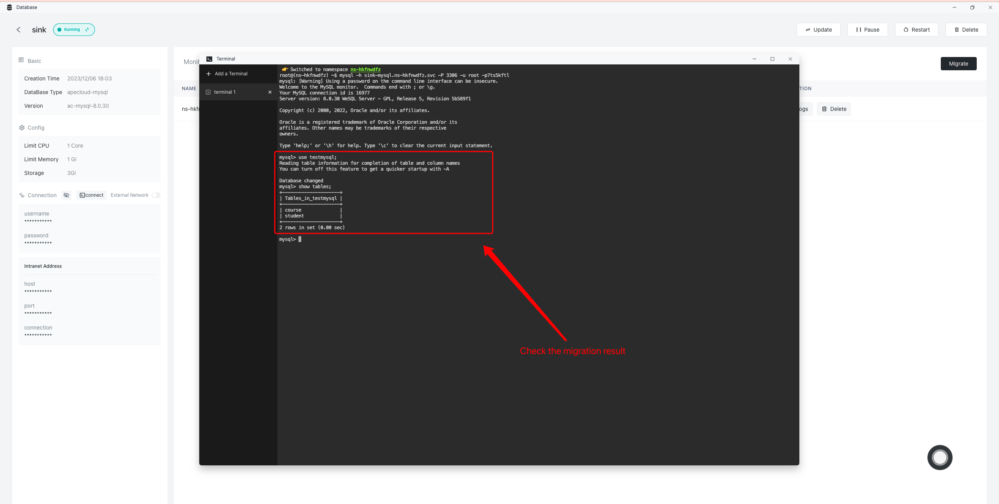