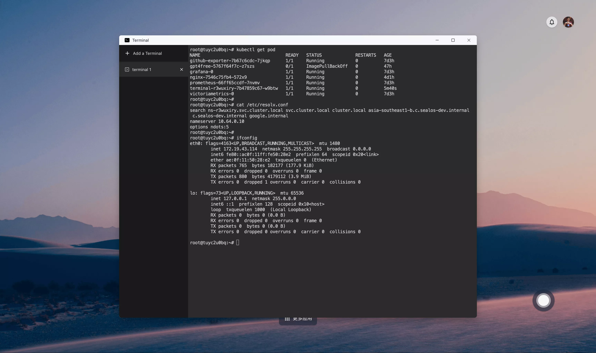
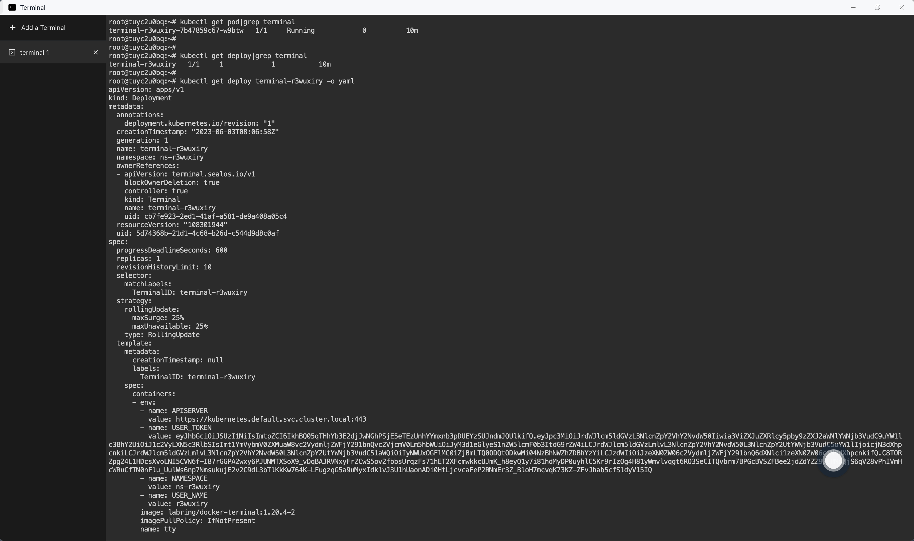
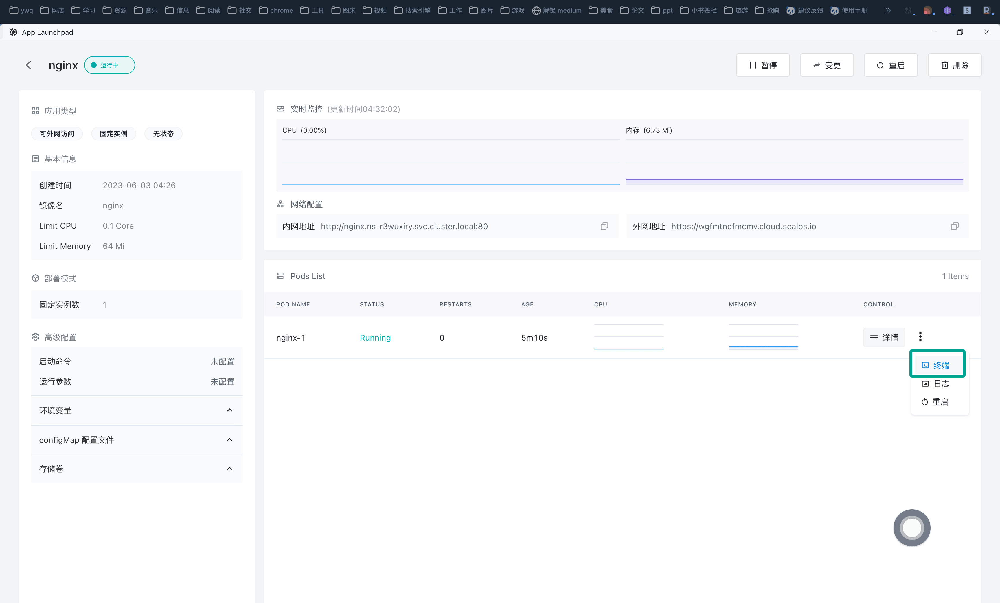
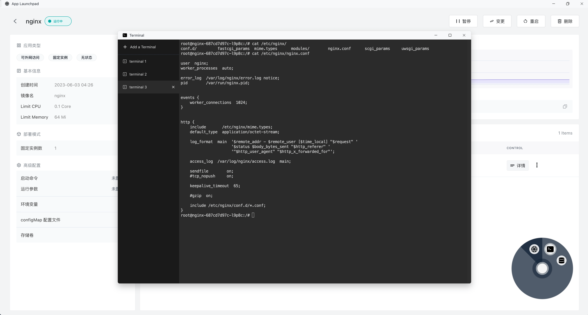
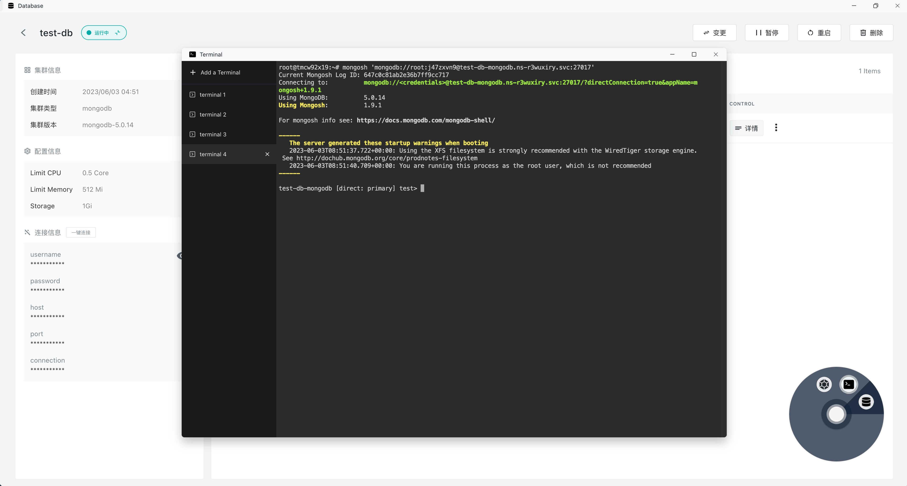

# Terminal

Integrated within the [Sealos](https://cloud.sealos.io) Cloud Operating System is the Terminal, an application of profound potency. Mirroring the terminal in standalone operating systems, it facilitates users to interact directly with the operating system, executing various operations via command entry.



The value of the Terminal rests in its efficiency, flexibility, and powerful capabilities. For a plethora of tasks, employing the Terminal proves swifter and more concise than utilizing a Graphical User Interface (GUI). It is an indispensable instrument for developers, permitting users to gain a profound understanding and control of the Sealos Cloud Operating System.

**Every user's Terminal is in fact operating within a Pod of Kubernetes**, which can be observed in the Terminal using the following command:



## Accessing the Terminal of an Application Container

One may directly access the Terminal of any application container via the Terminal App. Suppose you have deployed an application such as Nginx via application management, one can navigate directly to the Nginx application's detail page, click on the three dots on the right side of the details, and then click on 'Terminal' to access the Terminal of the Nginx application.





## 终端一键直连数据库

It is also possible to establish a direct connection to the database created in the[Database App](../dbprovider/dbprovider.md) with a single click via the Terminal.

Navigate to the database details page and click on '一键连接' on the left:


This will take you directly to the Terminal App and connect to the database:



## Direct Manipulation of Kubernetes Resources via Terminal

:::danger

The following operations necessitate foundational knowledge of Kubernetes and container-related concepts, avoid casual execution without this understanding.

:::

Veteran Kubernetes users can utilize the Terminal to manipulate Kubernetes resources directly, affording many advantages for such seasoned users:

+ Enables batch operations and automation
+ Offers high flexibility
+ Allows in-depth troubleshooting

Below are examples of common operations with Kubernetes resources within the Terminal:

+ View the list of user's Pods

```bash
kubectl get pods
```

+ Create and manage resource

```bash
# Create resources using YAML or JSON files
$ kubectl create -f <filename>

# Create or update resources using YAML or JSON files
$ kubectl apply -f <filename>

# Delete specified resource type and name
$ kubectl delete <resource-type> <resource-name>

# View the status of a specified Deployment's rolling update
$ kubectl rollout status deployment/<deployment-name>
```

+ Troubleshooting

```bash
# Obtain detailed information about a specific resource, including events and status
$ kubectl describe <resource-type> <resource-name>

# Obtain logs of a specific container in a specific Pod
$ kubectl logs <pod-name> -c <container-name>

# Open a terminal in a specific Pod for debugging purposes
$ kubectl exec -it <pod-name>
```