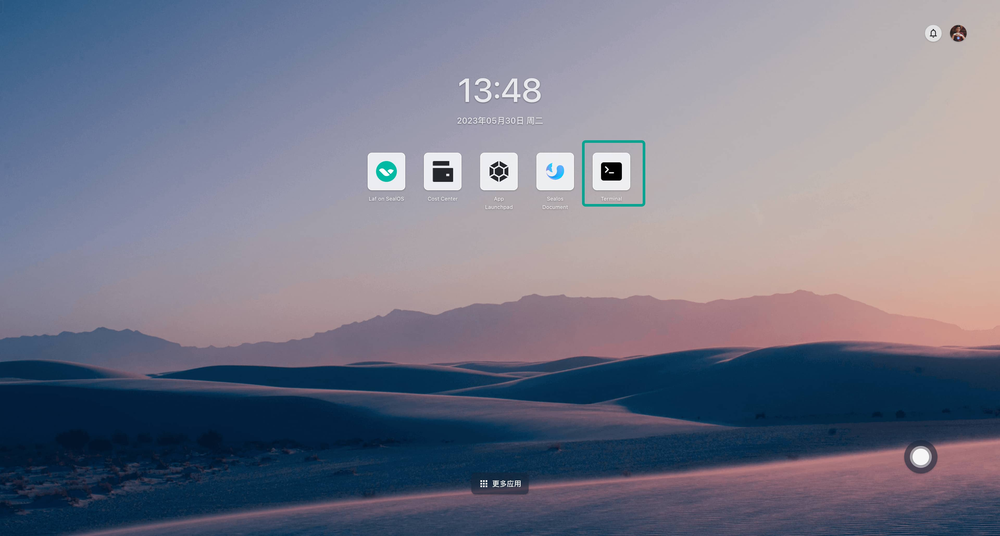

# Use Terminal

Users familiar with Kubernetes and container fundamentals may opt to deploy applications using the **[Terminal](/guides/terminal/terminal.md)** app. This guide will show you how to use the terminal for deployment, using Nginx as an example.

Start by launching the Terminal app within the [Sealos](https://cloud.sealos.io) desktop.



Upon opening the Terminal app, a terminal window is automatically allocated, enabling you to execute various command-line operations.


① Begin by creating a deployment manifest for Nginx Deployment:

```yaml
# deployment.yaml
apiVersion: apps/v1
kind: Deployment
metadata:
  name: nginx
  labels:
    app: nginx
spec:
  replicas: 1
  selector:
    matchLabels:
      app: nginx
  template:
    metadata:
      labels:
        app: nginx
    spec:
      containers:
      - name: nginx
        image: nginx:1.14.2
        ports:
        - containerPort: 80
        resources:
          requests:
            cpu: 0.2
            memory: 32Mi
          limits:
            cpu: 0.2
            memory: 32Mi
```

② Subsequently, create a deployment manifest for Nginx Service:

```yaml
# service.yaml
apiVersion: v1
kind: Service
metadata:
  name: nginx
  labels:
    app: nginx
spec:
  type: ClusterIP
  ports:
    - port: 80
      targetPort: 80

  selector:
    app: nginx
```

③ Deploy both the Deployment and Service by executing the following:

```bash
kubectl apply -f deployment.yaml
kubectl apply -f service.yaml
```

Verify Nginx's accessibility:

```bash
$ kubectl get pod -l app=nginx
NAME                     READY   STATUS    RESTARTS   AGE
nginx-7546c75fb4-572x9   1/1     Running   0          5m37s

$ kubectl get svc -l app=nginx
NAME    TYPE        CLUSTER-IP      EXTERNAL-IP   PORT(S)   AGE
nginx   ClusterIP   10.64.204.173   <none>        80/TCP    5m36s

$ curl 10.64.204.173
<!DOCTYPE html>
<html>
<head>
<title>Welcome to nginx!</title>
<style>
    body {
        width: 35em;
        margin: 0 auto;
        font-family: Tahoma, Verdana, Arial, sans-serif;
    }
</style>
</head>
<body>
<h1>Welcome to nginx!</h1>
<p>If you see this page, the nginx web server is successfully installed and
working. Further configuration is required.</p>

<p>For online documentation and support please refer to
<a href="http://nginx.org/">nginx.org</a>.<br/>
Commercial support is available at
<a href="http://nginx.com/">nginx.com</a>.</p>

<p><em>Thank you for using nginx.</em></p>
</body>
</html>
```

④ To expose Nginx to the internet and access it via a public domain, create an Ingress resource. Start by creating a deployment manifest:

```yaml
# ingress.yaml
apiVersion: networking.k8s.io/v1
kind: Ingress
metadata:
  annotations:
    kubernetes.io/ingress.class: nginx
    nginx.ingress.kubernetes.io/backend-protocol: HTTP
    nginx.ingress.kubernetes.io/client-body-buffer-size: 64k
    nginx.ingress.kubernetes.io/proxy-body-size: 32m
    nginx.ingress.kubernetes.io/proxy-buffer-size: 64k
    nginx.ingress.kubernetes.io/server-snippet: |
      client_header_buffer_size 64k;
      large_client_header_buffers 4 128k;
    nginx.ingress.kubernetes.io/ssl-redirect: "false"
  name: nginx
spec:
  rules:
  - host: nginx.cloud.sealos.io
    http:
      paths:
      - backend:
          service:
            name: nginx
            port:
              number: 80
        path: /
        pathType: Prefix
  tls:
  - hosts:
    - nginx.cloud.sealos.io
    secretName: wildcard-cloud-sealos-io-cert
```

⑤ Deploy the Ingress resource:

```bash
$ kubectl apply -f ingress.yaml
```

⑥ Confirm the Nginx's accessibility through the public domain:

