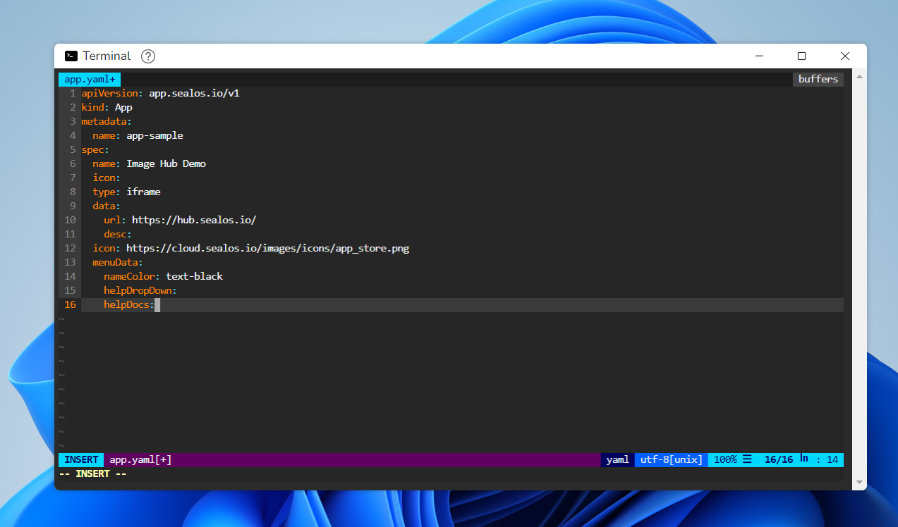

# 如何部署应用到 desktop

## 使用 Terminal 编写 app.yaml

### 关键信息

- type: iframe，标识为一个 web 应用
- spec name 为桌面显示的名称
- url 应用地址
- icon 是在 desktop 上显示的图标

```yaml
apiVersion: app.sealos.io/v1
kind: App
metadata:
  name: app-sample
spec:
  name: Image Hub Demo
  icon:
  type: iframe
  data:
    url: https://hub.sealos.io/
    desc:
  icon: https://cloud.sealos.io/logo.svg
  menuData:
  displayType: normal
```



### apply yaml

```
kubectl apply -f app.yaml
```


### 刷新浏览器，桌面即可看到 App
