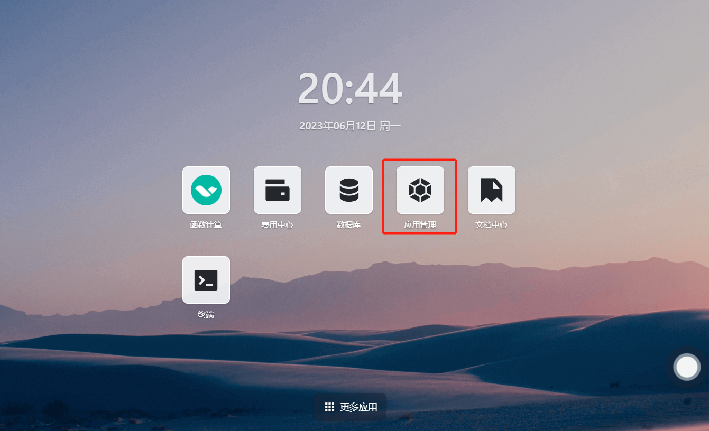
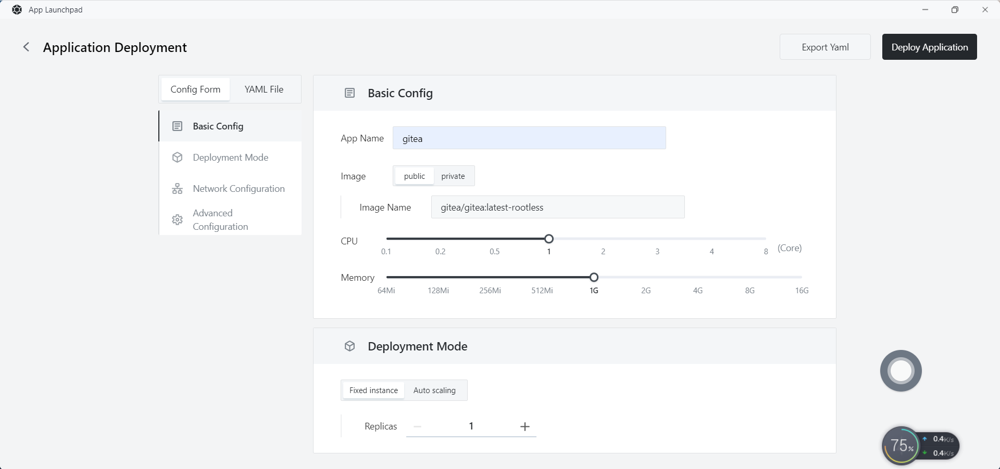
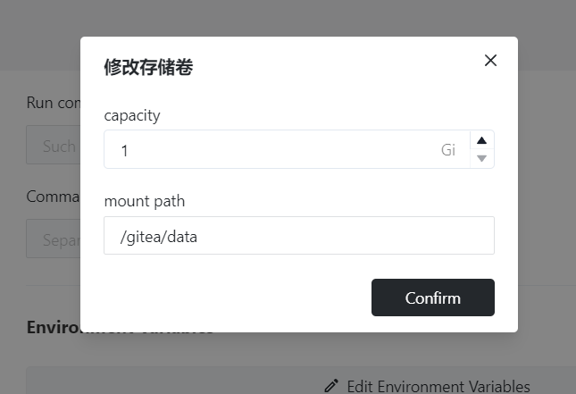
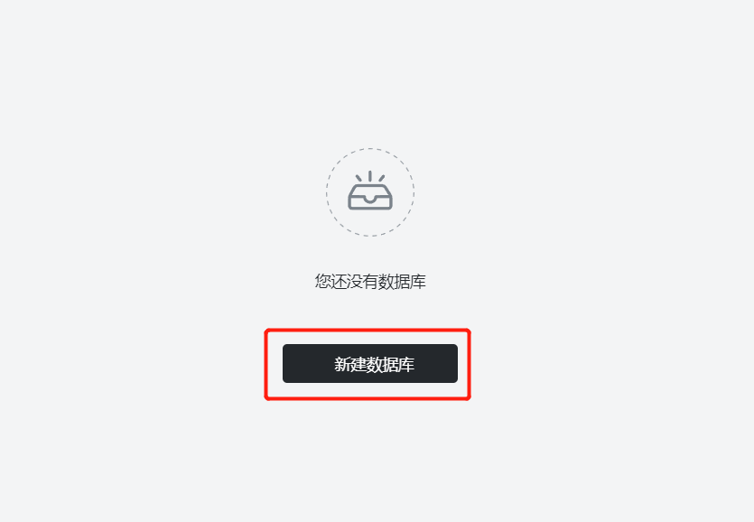
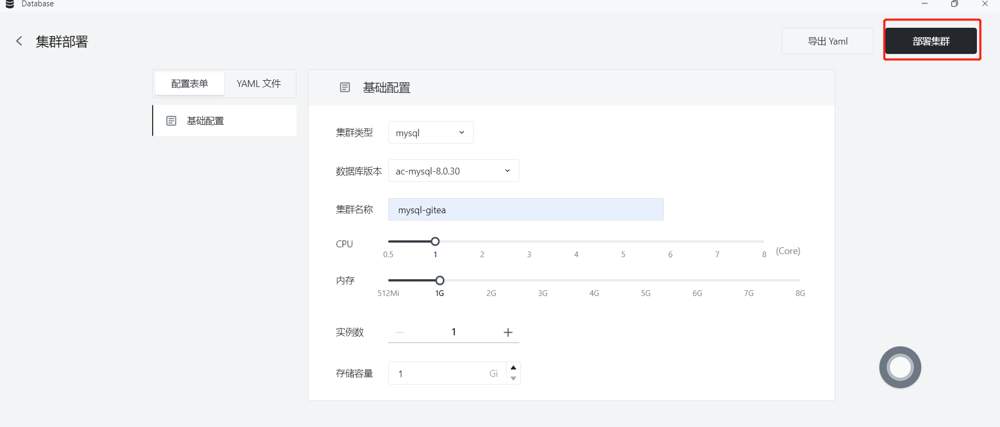
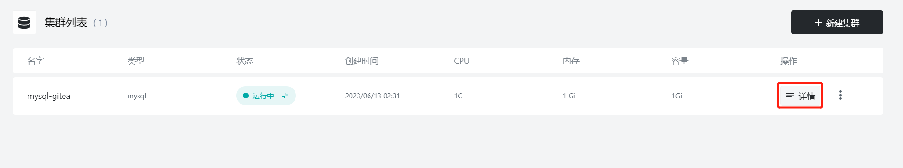
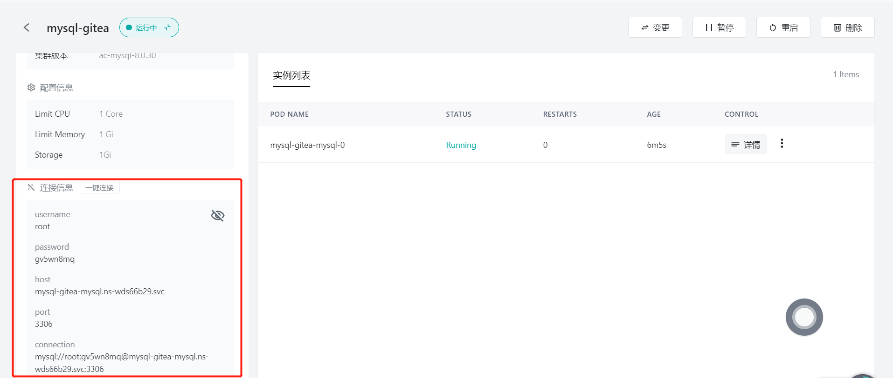
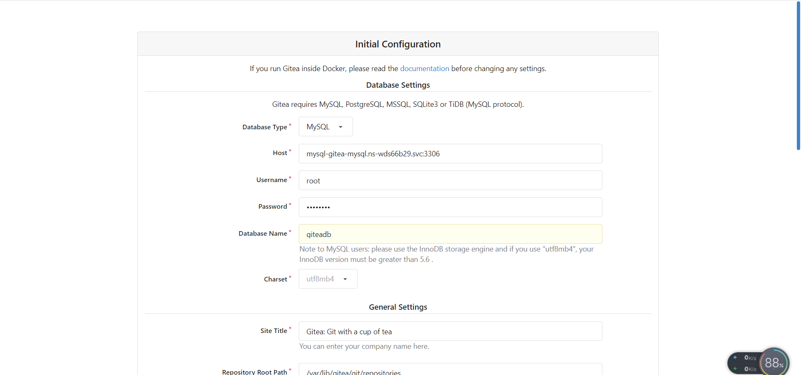
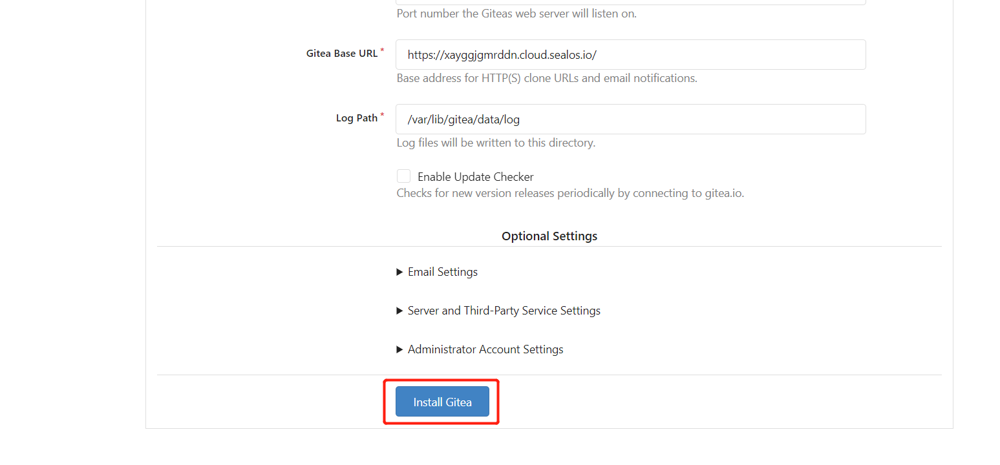
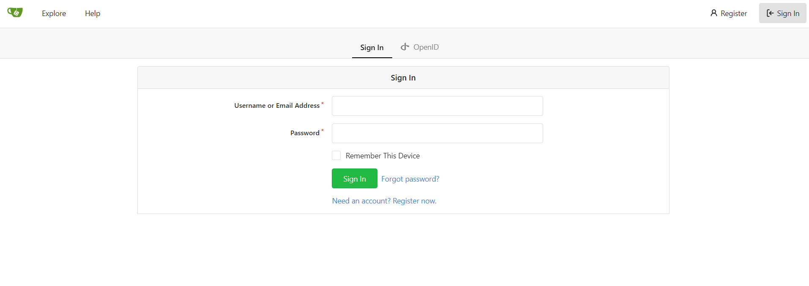

# 快速安装 Gitea

喝杯茶吧！无痛自托管多合一软件开发服务，包括 Git 托管、代码审查、团队协作、包注册和 CI/CD。

## 步骤 1：登陆 Sealos

- 进入 [Sealos](https://cloud.sealos.io/) 官网


## 步骤 2：打开 「应用管理」 应用



## 步骤 3：新建应用

- 在 「应用管理」 中，点击「新建应用」来创建一个新的应用。


## 步骤 4：应用部署

- 基础配置：

  - 应用名称（自定义）：gitea
  - 镜像名（默认最新版本）：gitea/gitea:latest-rootless
  - CPU（推荐）：1 Core
  - 内存（推荐）：1 G

- 部署模式：

  - 实例数（自定义）：1

  

- 网络配置：

  - 容器暴露端口：3000
  - 外网访问：开启

  

- 高级配置：

  - 自定义本地存储，持久化 Gitea 的数据（推荐 1 G）。



## 步骤 5：部署应用

- 点击「部署应用」开始部署应用。


## 步骤6：配置数据库

- 通过 Sealos 为 Gitea 配置 MySQL 数据库
- 进入 Database


- 新建数据库



- 部署集群

- 基础配置：

  - 集群类型：mysql
  - 数据库版本：ac-mysql-8.0.30
  - CPU（推荐）：1 Core
  - 内存（推荐）：1 G
  



- 部署成功后进入详情页面查看 MySQL 连接信息



- 点击一键连接进入 MySQL 终端连接



- 执行

```sql
CREATE DATABASE giteadb CHARACTER SET 'utf8mb4' COLLATE 'utf8mb4_unicode_ci';
```

创建 Gitea 所需要的数据库


## 步骤 7：访问应用

- 点击「App Launchpad」查看，当应用的 STATUS 由 Pending 变为 Running，则表明该应用已成功启动。

- 当 STATUS 为 Running，即可直接访问外网地址。


- 访问外网地址后进入到配置页面，根据刚刚创建的 MySQL 的详情页面进行配



配置好后点击安装，等待一会便可进入到登陆页面，部署成功！





