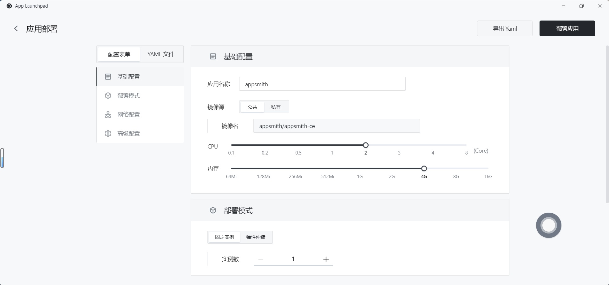
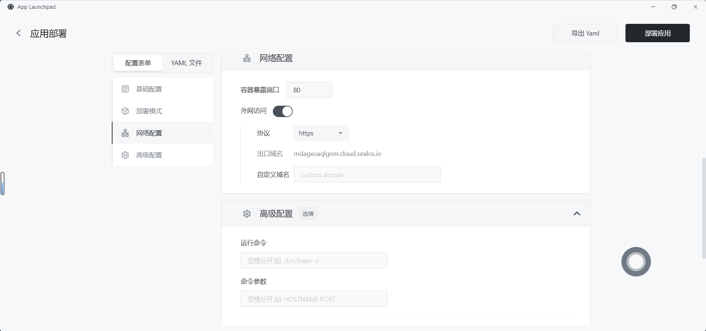
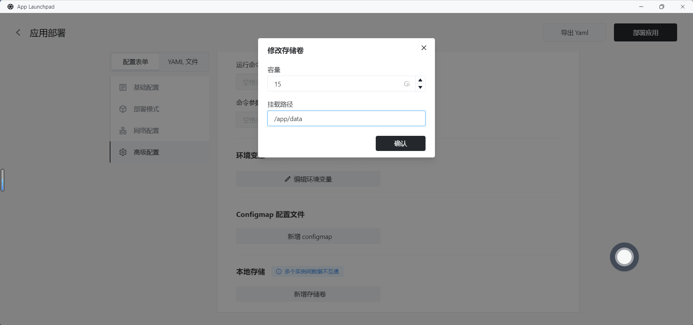

# 快速安装 Appsmith

[Appsmith](https://github.com/appsmithorg/appsmith) 是一个用于构建、部署和维护内部应用程序的开源平台。您可以构建任何东西，从简单的 CRUD 应用程序、管理面板、仪表板到自定义业务应用程序和复杂的多步骤工作流。

## 步骤 1：在 [Sealos](https://cloud.sealos.io) 桌面环境中打开 「应用管理」 应用

## 步骤 2：新建应用

- 在 「应用管理」 中，点击「新建应用」来创建一个新的应用。

## 步骤 3：应用部署

- 基础配置：
  
  - 应用名称（自定义）：appsmith
  
  - 镜像名（默认最新版本）：appsmith/appsmith-ce
  
  - CPU（推荐）：2 Core
  
  - 内存（推荐）：4 G

- 部署模式：
  
  - 实例数（自定义）：1

- 网络配置：
  
  - 容器暴露端口：80
  
  - 外网访问：开启

- 高级配置：
  
  - 自定义本地存储，持久化 Appsmith 的数据（推荐 15 G）。

## 步骤 4：部署应用

- 点击「部署应用」开始部署应用。

## 步骤 5：访问应用

- 点击「详情」查看，当应用的 STATUS 由 Pending 变为 Running，则表明该应用已成功启动。

- 当 STATUS 为 Running，即可直接访问外网地址。

- 访问成功！

