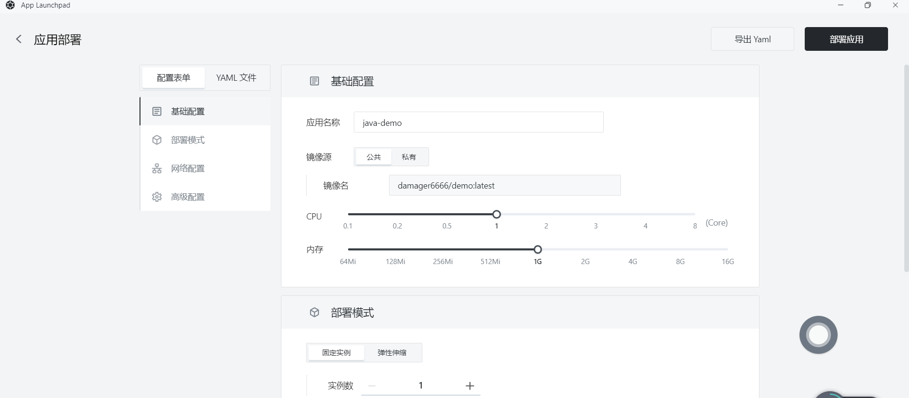
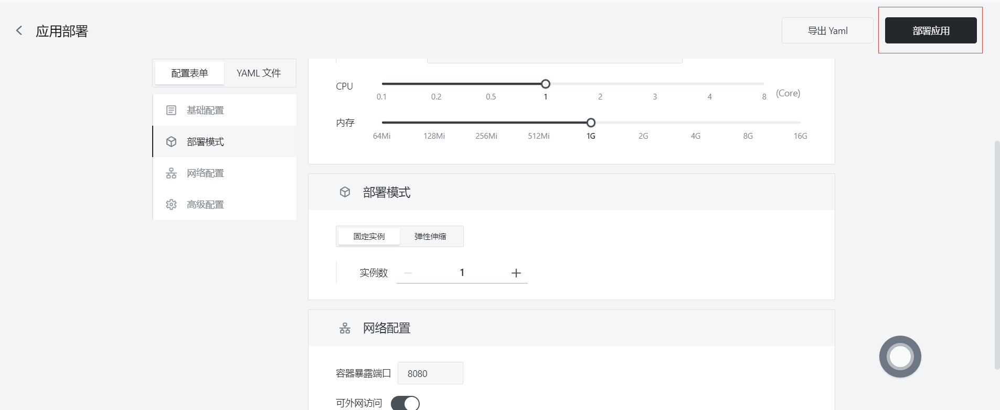
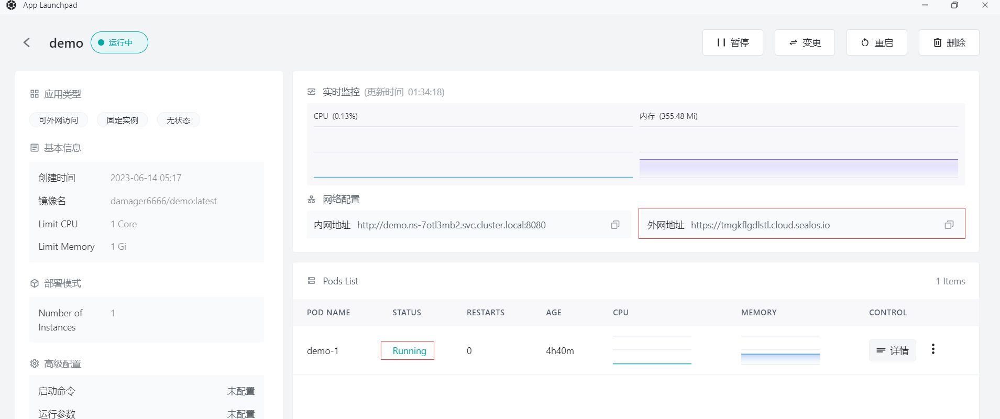
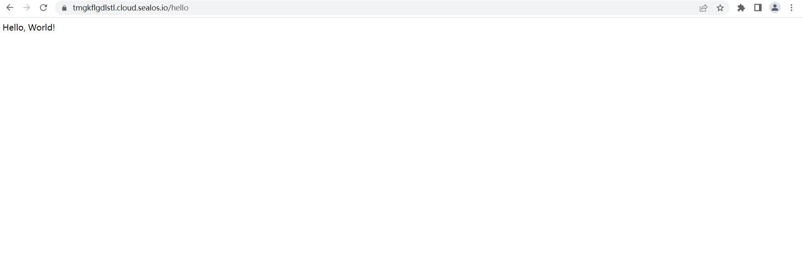

# 快速安装 Go 程序

首先，确保你已经安装了以下工具：

- Docker

## 步骤1：编写你的 Go 程序

```go
package main

import (
	"fmt"
	"net/http"
)

func main() {
	http.HandleFunc("/", func(w http.ResponseWriter, r *http.Request) {
		fmt.Fprintf(w, "Hello,Wolrd!")
	})

	http.ListenAndServe(":8080", nil)
}
```

## 步骤2：创建Docker镜像

- 在与`main.go`相同的目录中，创建一个名为`Dockerfile`的文件，包含以下内容：

```
FROM golang:1.17 as builder

WORKDIR /app
COPY . .

RUN go mod init myapp
RUN CGO_ENABLED=0 GOOS=linux go build -a -installsuffix cgo -o main .

FROM alpine:latest
RUN apk --no-cache add ca-certificates
WORKDIR /app
COPY --from=builder /app/main /app/

EXPOSE 8080
ENTRYPOINT ["/app/main"]
```

这个`Dockerfile`定义了一个多阶段构建过程。在第一阶段，我们使用官方的`golang`镜像作为基础镜像，然后编译Go应用程序。在第二阶段，我们使用轻量级的`alpine`镜像，将编译好的二进制文件复制到`/app`目录，并将8080端口暴露。

- 在`Dockerfile`所在的目录运行以下命令，为Go应用程序构建Docker镜像：

```
docker build -t your_image_name .
```

将`your_image_name`替换为您的镜像名称和标签。


## 步骤3：推送Docker镜像

- 将创建的Docker镜像推送到Docker仓库，如Docker Hub或者私有仓库。**假设您已经登录到Docker仓库**，使用以下命令推送镜像

  - 首先标记Docker镜像，在推送镜像之前，需要为其添加一个标签，以便 Docker 知道将其推送到哪个仓库。运行以下命令为镜像添加标签：

    ```
    docker tag your-image-name your-dockerhub-username/your-repo-name:your-tag
    ```

    将 `your-image-name` 替换为你的本地镜像名称，`your-dockerhub-username` 替换为你的 Docker Hub 用户名，`your-repo-name` 替换为你在 Docker Hub 上要创建的仓库名称，`your-tag` 替换为你为镜像设置的标签（例如：latest）。

    例如：

    ```
    docker tag demo damager6666/demo:latest
    ```

  - 接下来推送Docker镜像，使用以下命令将镜像推送到 Docker Hub：

    ```
    docker push your-dockerhub-username/your-repo-name:your-tag
    ```

    将 `your-dockerhub-username`、`your-repo-name` 和 `your-tag` 替换为实际的值。例如：

    ```
    docker push damager6666/demo:latest
    ```

## 步骤4：登陆 Sealos

- 进入 [Sealos](https://cloud.sealos.io/) 官网


## 步骤5：打开 「应用管理」 应用


## 步骤 6：新建应用

- 在 「应用管理」 中，点击「新建应用」来创建一个新的应用。


## 步骤7：应用部署

- 基础配置：

  - 应用名称（自定义）：go-demo
  - 镜像名（**步骤5**中推送的镜像）：damager6666/demo:latest
  - CPU（推荐）：1 Core
  - 内存（推荐）：1 G

- 部署模式：

  - 实例数（自定义）：1



- 网络配置：

  - 容器暴露端口：8080

  - 外网访问：开启


## 步骤8：部署应用

- 点击「部署应用」开始部署应用。



## 步骤9：访问应用

- 点击「应用管理」查看，当应用的 STATUS 由 Pending 变为 Running，则表明该应用已成功启动。
- 当 STATUS 为 Running，即可直接访问外网地址。



- 在浏览器上输入

```
https://tmgkflgdlstl.cloud.sealos.io/hello
```



- 页面上显示 ”Hello，World! “ ，表示你的 Go 应用程序已经在 Sealos 上运行

