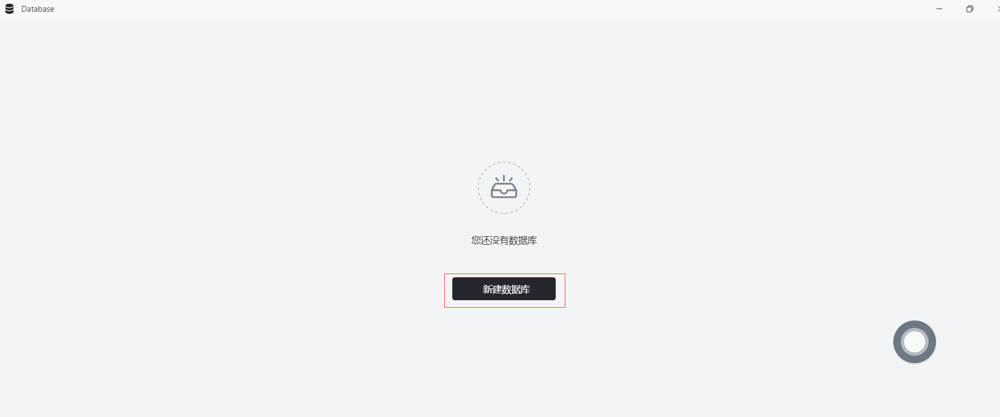
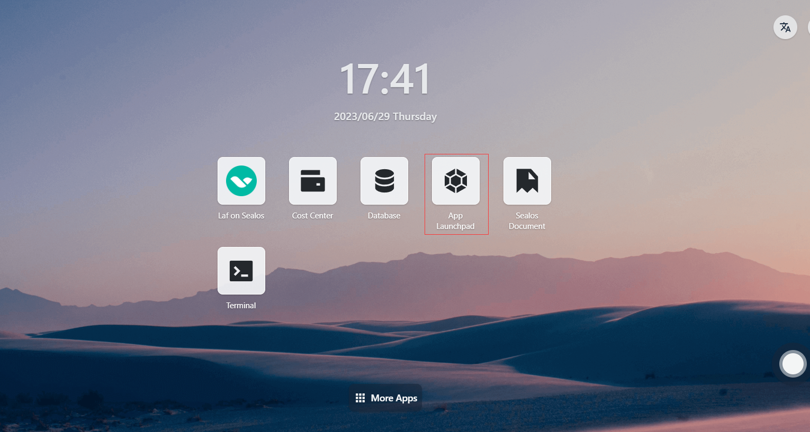
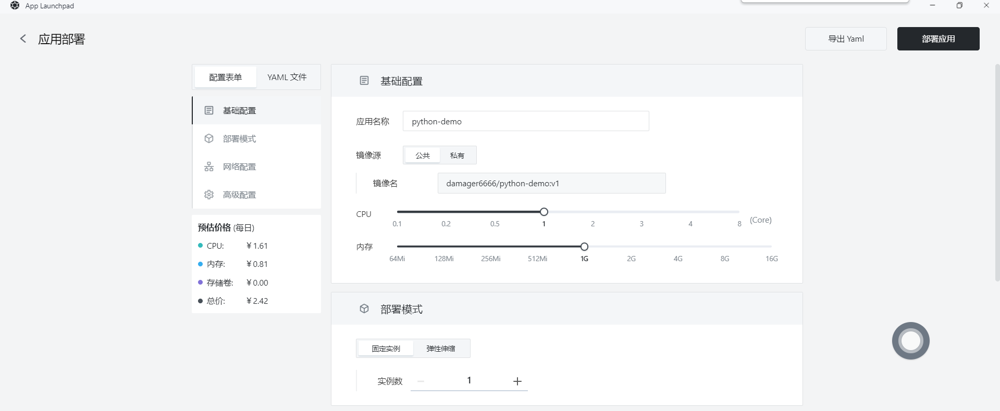
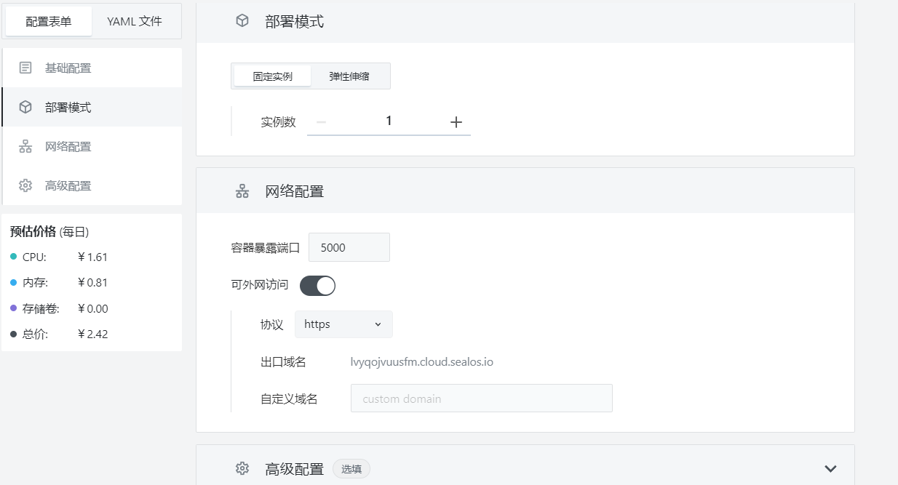
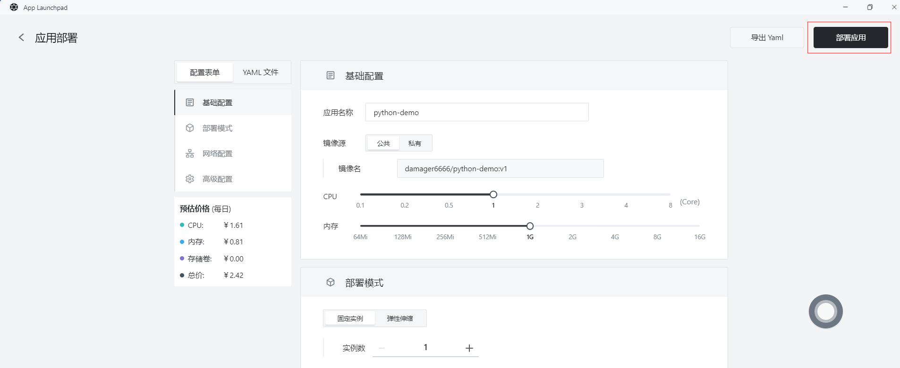
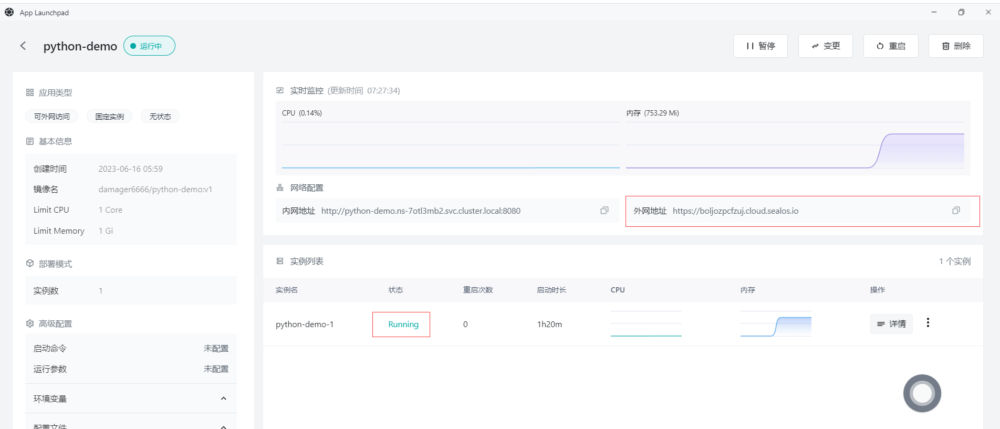

# 快速安装 Python 程序

首先，确保你已经安装了以下工具：

- Docker

## 步骤1：编写你的 Python 程序

- 在目录下创建一个名为 `app.py` 的文件，并添加以下代码：

  ```python
  from flask import Flask, render_template
  import mysql.connector
  
  app = Flask(__name__)
  
  def get_data_from_database():
      cnx = mysql.connector.connect(
          host="java-demo-db-mysql.ns-7otl3mb2.svc",
          user="root",
          password="l9h8f24b",
          database="test_db"
      )
  
      cursor = cnx.cursor()
      cursor.execute("SELECT * FROM test")
      data = cursor.fetchall()
      cursor.close()
      cnx.close()
  
      return data
  
  @app.route('/')
  def index():
      data = get_data_from_database()
      return render_template('index.html', data=data)
  
  if __name__ == '__main__':
      app.run(host='0.0.0.0', debug=True)
  ```

- 在项目目录下创建一个名为 `requirements.txt` 的文件，以列出应用程序所需的依赖。

```
Flask
mysql-connector-python
```

- 在项目目录中创建一个名为 `templates` 的文件夹，并在其中创建一个名为 `index.html` 的文件。将以下内容添加到 `index.html`：

  ~~~html
  <!doctype html>
  <html lang="en">
    <head>
      <meta charset="utf-8">
      <title>Data from MySQL</title>
    </head>
    <body>
      <h1>Data from MySQL</h1>
      <table>
        <tr>
          <th>Column1</th>
          <th>Column2</th>
          <th>Column3</th>
        </tr>
        
          <tr>
            <td>{{ row[0] }}</td>
            <td>{{ row[1] }}</td>
            <td>{{ row[2] }}</td>
          </tr>
        
      </table>
    </body>
  </html>
  ```
  
  请将 `Column1`、`Column2` 和 `Column3` 替换为您要显示的实际列名。
  ~~~

## 步骤2：创建 Docker 镜像

- 在项目的根目录下，创建一个名为 `Dockerfile` 的文件。这个文件将包含构建 Docker 镜像所需的指令。以下是一个简单的示例 Dockerfile：

  ```dockerfile
  FROM python:3.8
  
  WORKDIR /app
  
  COPY requirements.txt .
  
  RUN pip install --no-cache-dir -r requirements.txt
  
  COPY . .
  
  EXPOSE 5000
  
  CMD ["python", "app.py"]
  ```

## 步骤3：构建 Docker 镜像

- 在包含 `Dockerfile` 的目录中运行以下命令来构建 Docker 镜像：

  ```
  docker build -t python-demo .
  ```

## 步骤4：推送Docker镜像

- 将创建的Docker镜像推送到Docker仓库，如Docker Hub或者私有仓库。**假设您已经登录到Docker仓库**，使用以下命令推送镜像

  - 首先标记Docker镜像，在推送镜像之前，需要为其添加一个标签，以便 Docker 知道将其推送到哪个仓库。运行以下命令为镜像添加标签：

    ```
    docker tag your-image-name your-dockerhub-username/your-repo-name:your-tag
    ```

    将 `your-image-name` 替换为你的本地镜像名称，`your-dockerhub-username` 替换为你的 Docker Hub 用户名，`your-repo-name` 替换为你在 Docker Hub 上要创建的仓库名称，`your-tag` 替换为你为镜像设置的标签（例如：latest）。

    例如：

    ```
    docker tag python-demo damager6666/python-demo:v1
    ```

  - 接下来推送Docker镜像，使用以下命令将镜像推送到 Docker Hub：

    ```
    docker push your-dockerhub-username/your-repo-name:your-tag
    ```

    将 `your-dockerhub-username`、`your-repo-name` 和 `your-tag` 替换为实际的值。例如：

    ```
    docker push damager6666/python-demo:v1
    ```

    

## 步骤5：登陆 Sealos

- 进入 [Sealos](https://cloud.sealos.io/) 官网


## 步骤6：打开 「数据库」 应用


## 步骤7：创建数据库

- 点击新建数据库



- 基础配置：
  - 集群类型：mysql
  - 集群名称 : demo-db
  - CPU（推荐）：1 Core
  - 内存（推荐）：1 G
  - 实例数：1
  - 存储容量： 1 Gi
- 点击 部署集群

## 步骤8：配置数据库


- 点击一键连接到数据库执行以下语句：

  - 创建 test_db 数据库

    ```sql
    create database test_db;
    ```

  - 创建 test 表

    ```sql
    CREATE TABLE `name_info` (
      `id` int(11) NOT NULL,
      `name` varchar(12) COLLATE utf8mb4_unicode_ci DEFAULT NULL,
      PRIMARY KEY (`id`)
    );
    ```

  - 插入数据

    ```sql
    insert into test values (1,'Sealos');
    ```

    

## 步骤9：打开 「应用管理」 应用



## 步骤 10：新建应用

- 在 「应用管理」 中，点击「新建应用」来创建一个新的应用。


## 步骤11：应用部署

- 基础配置：

  - 应用名称（自定义）：python-demo
  - 镜像名：damager6666/python-demo:v1
  - CPU（推荐）：1 Core
  - 内存（推荐）：1 G

- 部署模式：

  - 实例数（自定义）：1



- 网络配置：

  - 容器暴露端口：5000


  - 外网访问：开启



## 步骤12：部署应用



## 步骤13：访问应用

- 点击「应用管理」查看，当应用的 STATUS 由 Pending 变为 Running，则表明该应用已成功启动。
- 当 STATUS 为 Running，即可直接访问外网地址。



- 在浏览器上输入外网地址，可以访问到刚刚存入到 MySQL 中的数据，表示程序已经成功 Sealos 上

  ```http
  https://mkqreaqfgwac.cloud.sealos.io/
  ```

