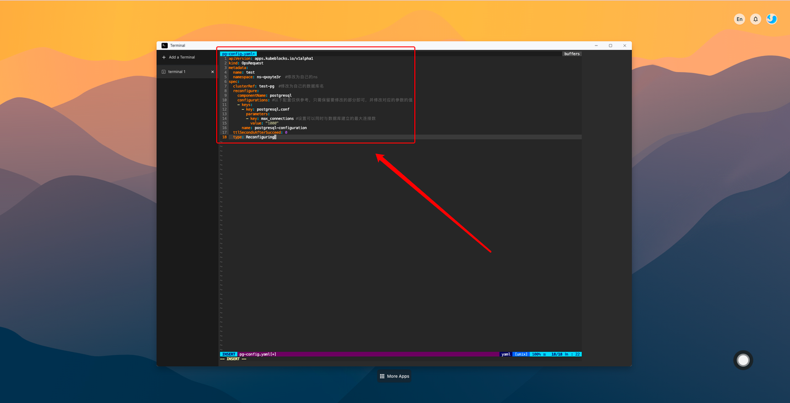

# 通过yaml修改数据库参数教程

由于数据库的某些参数在修改后无法立即生效，因此需要通过应用yaml来实现修改参数并重启数据库通过yaml修改参数会导致数据库**重启**，整个过程大概会持续**20s**左右。这里以**Postgres**数据库的参数修改为例，具体操作步骤如下：
1. **进入终端**：


2. **编辑pg-config.yaml**：

```bash
$ vim pg-config.yaml
```


3. **复制yaml到pg-config.yaml中，保存pg-config.yaml**：


```yaml
apiVersion: apps.kubeblocks.io/v1alpha1
kind: OpsRequest
metadata:
  name: test
spec:
  clusterRef: test-pg  #修改为自己的数据库名
  reconfigure:
    componentName: postgresql
    configurations: #以下配置仅供参考，只需保留要修改的部分即可，并修改对应的参数的值
      - keys:
          - key: postgresql.conf
            parameters:
              - key: max_connections #设置可以同时与数据库建立的最大连接数
                value: "1000"
        name: postgresql-configuration
  ttlSecondsAfterSucceed: 0
  type: Reconfiguring
```
**常见的postgres参数**：

|       参数名             |              描述                  |
|-------------------------|-----------------------------------|
| max_connections         | 设置可以同时与数据库建立<br/>的最大连接数    |
| max_wal_size            | 设置WAL文件的最大大小                |
| min_wal_size            | 设置WAL文件的最小大小                |
| max_worker_processes    | 设置PostgreSQL可以启动<br/>的最大后台进程数 |
| shared_buffers          | 设置PostgreSQL可以启动<br/>的最大后台进程数 |

**常见的mysql参数**：

|          参数名          |              描述                  |
|-------------------------|-----------------------------------|
| innodb_buffer_pool_size | 设置InnoDB缓冲池的大小               |
| max_connections         | 允许的最大并发连接数                  |
| query_cache_size        | 查询缓存的大小                       |
| thread_cache_size       | 线程缓存的大小                       |
| max_allowed_packet      | 最大数据包大小                       |
| innodb_log_file_size    | InnoDB日志文件的大小                 |

**常见的mongo参数**：

|          参数名          |              描述                   |
|-------------------------|------------------------------------|
| storage.dbPath          | 数据文件存放路径                     |
| storage.journal.enabled | 启用日志                            |
| net.port                | 服务器端口                          |
| net.bindIp              | 绑定的IP地址                        |

**常见的redis参数**：

|          参数名         |              描述                    |
|------------------------|-------------------------------------|
| maxclients             | 最大客户端连接数                       |
| maxmemory              | 最大内存使用量                        |
| maxmemory-policy       | 内存淘汰策略                          |
| appendonly             | AOF持久化开关                         |
| appendfsync            | AOF文件刷新频率                       |


4. **应用pg-config.yaml**：

```bash
$ kubectl apply -f pg-config.yaml
```


5. **检查pg-config.yaml是否应用成功**：
```bash
# OpsRequest中对应的状态为Succeed且pod对应的状态为Running则说明配置应用成功
$ kubectl get OpsRequest
$ kubectl get pod
```


6. **进入数据库查看配置是否生效**：
```bash
$ show max_connections;
```


