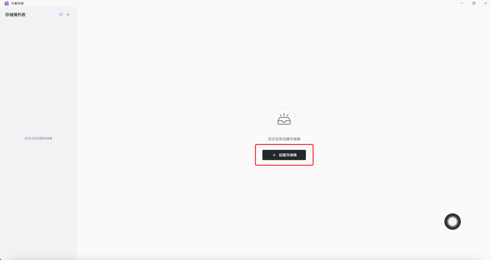
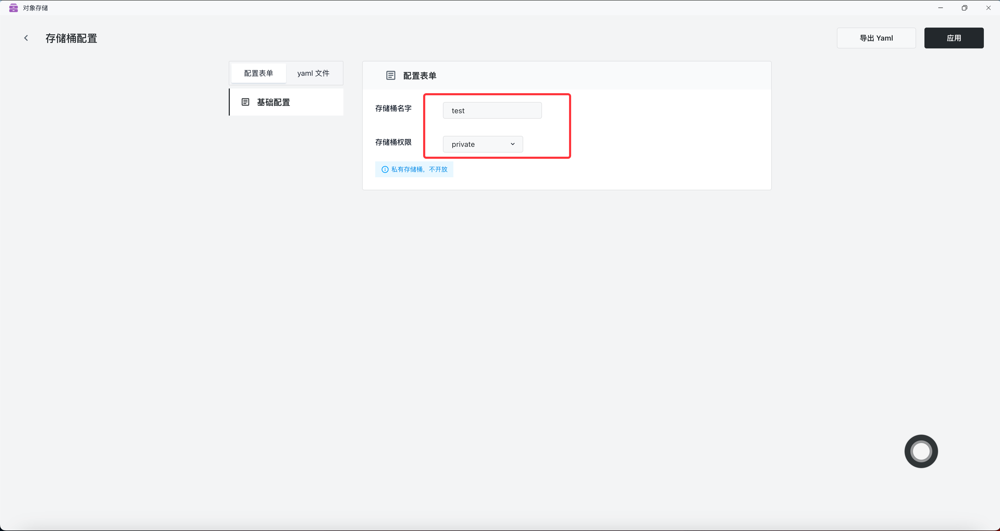
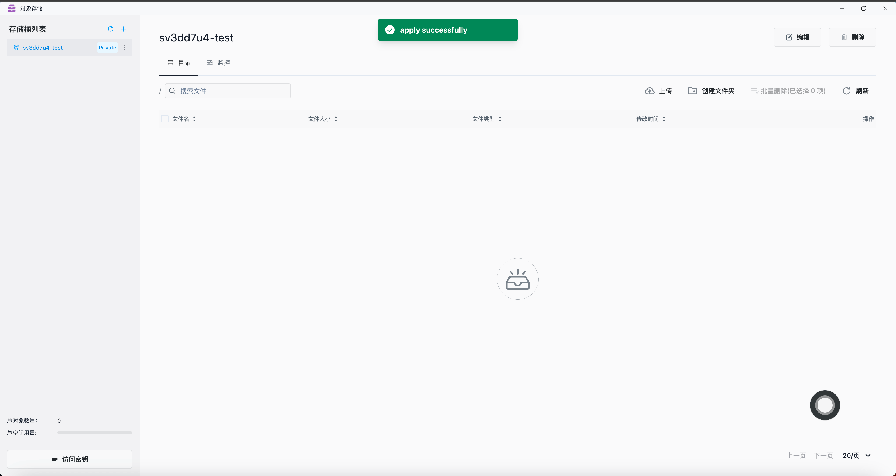
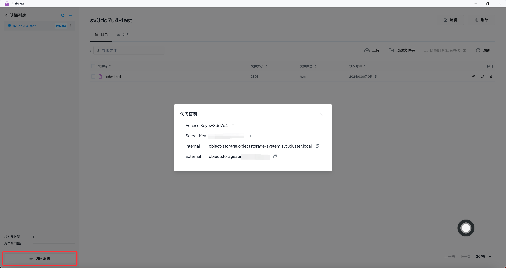
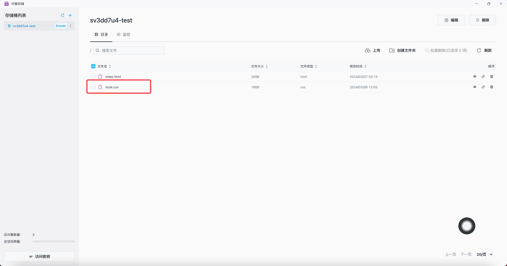

# 对象存储

「对象存储」是 Sealos 内置的对象存储服务，主要用于存储和管理非结构化数据。

目前「对象存储」具备以下功能：

- 上传文件到「存储桶」
- 从「存储桶」下载文件
- 公开「存储桶」的访问权限
- 使用 SDK 访问「存储桶」
- 监控「存储桶」资源指标
- 静态托管

## 快速开始

### 上传文件

进入「对象存储」


创建「存储桶」


设置「存储桶」名字为 test，权限为 private


「存储桶」创建成功


上传文件


上传文件成功


### 公开「存储桶」的访问权限

点击「编辑」


设置「存储桶权限」为 publicRead，点击「应用」


复制文件链接


粘贴到浏览器地址栏访问文件


### 查看访问密钥配置

对象存储用户由唯一的 Access Key（用户名）和对应的 Secret Key（密码）组成。Internal 为对象存储的内部访问地址，External
为对象存储的外部访问地址。


### 使用 SDK 访问「存储桶」

SDK 访问「存储桶」需要三个参数：AccessKey、SecretKey、Endpoint。参数都在访问密钥中，Internal 是内网地址 Endpoint，External 是外网地址
Endpoint。如果需要使用 Region 参数，默认使用 us-east-1。

#### Go Client SDK

详细文档参考：https://min.io/docs/minio/linux/developers/go/API.html

例子：使用 Go Client SDK 上传 style.css 文件到 sv3dd7u4-test 存储桶，将 Endpoint 设置为外网地址 External。如果服务部署在当前
K8s 集群内，可以将 Endpoint 改为内网地址 Internal。

```go
package main

import (
	"context"
	"fmt"
	"log"
	"os"
)
import "github.com/minio/minio-go/v7"
import "github.com/minio/minio-go/v7/pkg/credentials"

func main() {
	endpoint := "objectstorageapi.xxx.xxx.xxx"
	accessKey := "xxxxxxxx"
	secretKey := "xxxxxxxxxxxxxxxx"
	// init minio client
	minioClient, err := minio.New(endpoint, &minio.Options{
		Creds: credentials.NewStaticV4(accessKey, secretKey, ""),
	})
	if err != nil {
		log.Fatalln(err)
	}
	// get local file
	file, err := os.Open("./style.css")
	if err != nil {
		fmt.Println(err)
		return
	}
	defer file.Close()

	fileStat, err := file.Stat()
	if err != nil {
		fmt.Println(err)
		return
	}
	// put object
	uploadInfo, err := minioClient.PutObject(context.Background(), "sv3dd7u4-test", "style.css", file, fileStat.Size(), minio.PutObjectOptions{ContentType: "text/css"})
	if err != nil {
		fmt.Println(err)
		return
	}
	fmt.Println("Successfully uploaded bytes: ", uploadInfo)
}
```

文件上传成功


#### Java Client SDK

详细文档参考：https://min.io/docs/minio/linux/developers/java/API.html

例子：使用 Java Client SDK 上传 style1.css 文件到 sv3dd7u4-test 存储桶，将 Endpoint 设置为外网地址 External。如果服务部署在当前
K8s 集群内，可以将 Endpoint 改为内网地址 Internal。

```xml

<dependency>
    <groupId>io.minio</groupId>
    <artifactId>minio</artifactId>
    <version>8.5.9</version>
</dependency>
```

```javascript
package org.example;

import io.minio.MinioClient;
import io.minio.UploadObjectArgs;

public class FileUploader {
    public static void main(String[] args) throws Exception {

        MinioClient minioClient =
                MinioClient.builder()
                        .endpoint("https://objectstorageapi.xxx.xxx.xxx")
                        .credentials("xxxxxxxx", "xxxxxxxxxxxxxxxx")
                        .build();


        minioClient.uploadObject(
                UploadObjectArgs.builder()
                        .bucket("sv3dd7u4-test")
                        .object("style1.css")
                        .filename("src/main/java/org/example/style1.css")
                        .build());

        System.out.println("Successfully uploaded bytes.");
    }
}
```

文件上传成功


#### 其他语言 SDK 略

详细文档参考：https://min.io/docs/minio/linux/developers/minio-drivers.html

### 静态托管

创建一个权限为 publicRead/publicReadwrite 的「存储桶」，点击「打开托管」


点击地址跳转访问


点击「自定义域名」


跳转到「应用管理」的「变更」中，可以自定义域名


