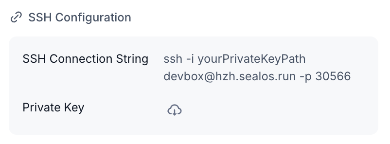
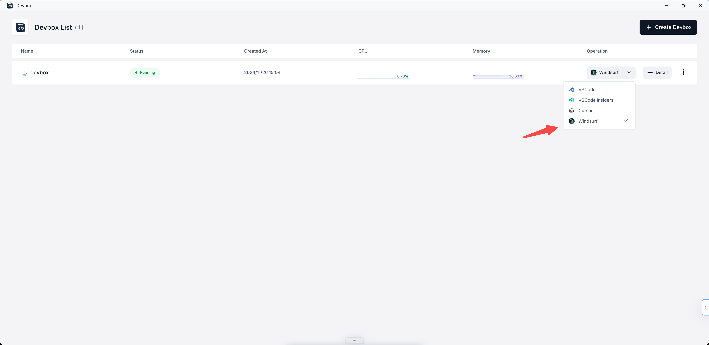
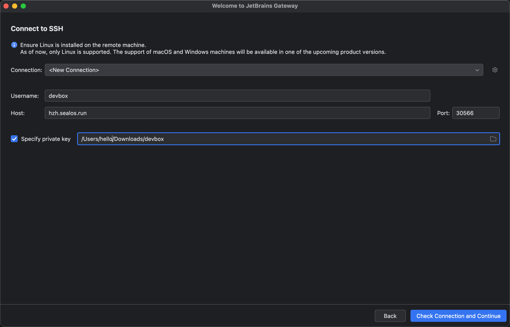
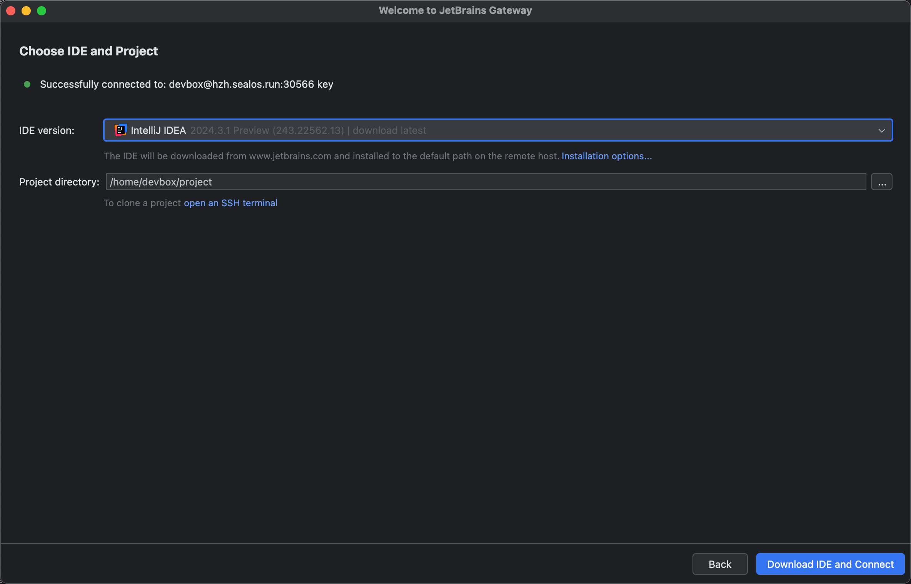
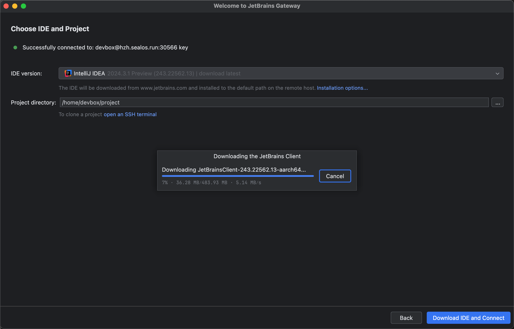
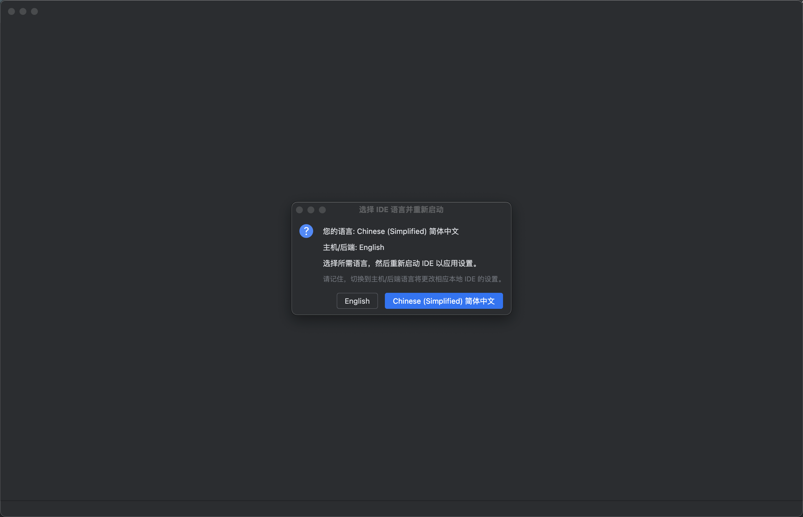
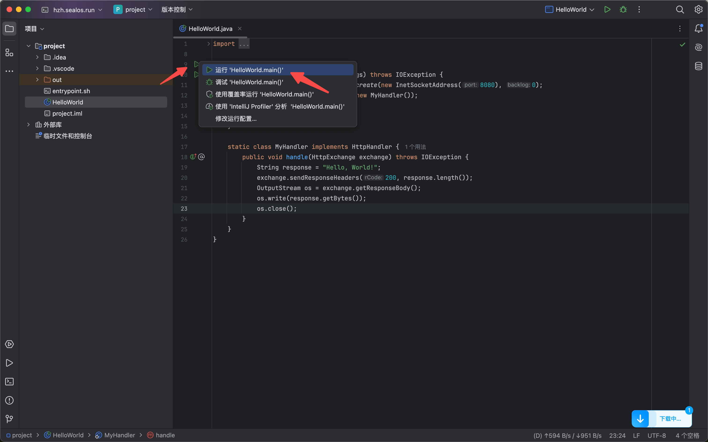
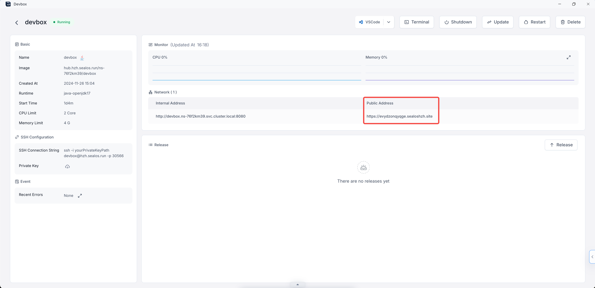
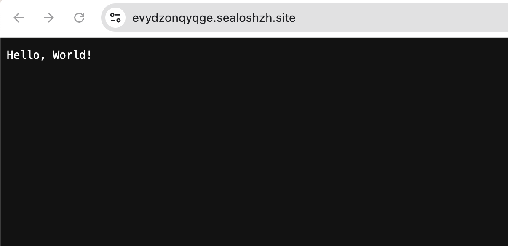

# Develop with JetBrains IDE

> This guide describes how to use IntelliJ IDEA in the JetBrains IDE to develop a Java-based Devbox.

## Prerequisites

1. Download the [JetBrains Gateway](https://www.jetbrains.com/remote-development/gateway/) application.

2. Start a Devbox project.

3. Download the private key of the Devbox project to your local computer. View the SSH configuration in the Devbox project detail (Username: devbox, Host: hzh.sealos.run, Port: 30566).

## Get Started

1. Open Devbox, select JetBrains IDE and click on it.

2. Automatically invoke the local JetBrains Gateway and click `New Connection`.

3. Open JetBrains Gateway, fill in Username, Host and Port, check Specify private key, and select the path to the private key. Click `Check Connection and Continue` to test the SSH connection.

4. Select `IntelliJ IDEA 2024.3.1 Preview` for the IDE version and `/home/devbox/project` for the project path. Click Download IDE and Connect to download the IDE and connect.

You need to wait for the IDE to download.

5. Automatically invoke the local IntelliJ IDEA, select English as the language, open the project file, and click the green arrow to run the Java service.

6. Open the detail of the Devbox project and click the public address to access the Java service.

7. Successfully accessed the Java service.

