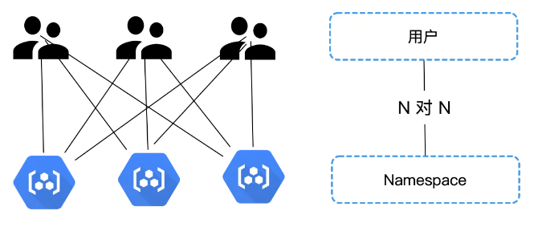

# 用户系统

## 概述

Sealos 通过在公有云中，让多个用户共享一个 Kubernetes 集群的方式最大程度的调度了服务器的性能，而用户体系的设计就是为此服务，在满足隔离性要求的基础上，尽可能以简单，容易理解的实现满足需求。

## 用户设计

Kubernetes 本身不具备原生的用户管理系统，而 Sealos 使用名为 User 的 CR 来代表用户在不同可用区的权限等信息。而用户的姓名，手机号等信息则持久化在数据库中。

### 持久化设计

由于 Sealos 存在多个可用区，因此无法使用一套数据源来完成所有功能。

因此采用 CockroachDB 这种分布式关系型数据库存储在不同可用区之间保持一致的用户信息。

## 用户与命名空间

命名空间是 Kubernetes 中优秀的隔离资源机制，Sealos 基于命名空间打造了用户之间的隔离机制。

每当一个新的用户创建时，Sealos 会为其创建一个新的命名空间，称为个人空间，这个空间与用户绑定，用户拥有其最高的权限，当其用户注销的时候个人空间就会销毁。

Sealos 还提供了工作空间机制，每个用户可以创建自己的新工作空间，并可以邀请别人进入。

这样，就形成了用户与命名空间的多对多关系，即一个用户可以在多个命名空间中，一个命名空间内也可以有多个用户。



## 授权

Sealos 基于 Kubernetes 的 RBAC 模式实现用户授权。

当用户创建一个命名空间（包括新建用户时创建的个人空间）时，控制器会在这个新创建的命名空间下创建三个 Role 资源，对应三个角色。同时创建一个
RoleBinding 资源将这个命名空间的 Owner 授予该用户。

同理，当用户拉其他人进入工作空间时，控制器会创建新的 RoleBinding 资源，将权限授予对应的用户。

## 认证

针对系统外部用户与内部 Pod,Kubernetes 提供了两种认证对象：Normal User 与 Service Account.而由于公有云上

用户的操作都在系统内部的 Pod 上执行，所以 Sealos 采用 Service Account 的方式实现用户认证。

当创建新用户时，系统会为其创建 Service Account,然后将 Service Account Token 导入进 Kubeconfig 中。

当用户访问各个应用程序时，系统会从用户的 Kubeconfig 中获取到 Token，然后挂载到启动的访问容器中，从而完成用户认证。

## 隔离

Sealos 除了在 Kubernetes 层面使用命名空间做了用户隔离，还在其他多方面实现了底层隔离。

如使用 OpenEBS 进行存储的块级别隔离，Firecracker 以及 Cloud Hypervisor 用于计算运行时的隔离，以及通过 Cilium
实现网络隔离等等。这些措施确保即使在共享环境中，每个租户的操作也不会影响到其他租户。

## 实现

用户系统主要代码放在 Sealos/controllers/user 部分，包含自定义资源的定义与控制器。整体采用 KubeBuilder 生成。

用户创建等操作相关的主要逻辑放在 user/controllers/user_controller 部分。其 Reconcile 方法的核心流程如下，由一系列函数组成：

```
pipelines := []func(ctx context.Context, user *userv1.User) context.Context{
	r.initStatus,
	r.syncNamespace,  #处理命名空间
	r.syncServiceAccount,    #处理SA
	r.syncServiceAccountSecrets,  #处理SAS
	r.syncKubeConfig,  #处理kubeconfig
	r.syncRole, #处理用户角色
	r.syncRoleBinding,  #处理RoleBinding
	r.syncFinalStatus,
}
	
for _, fn := range pipelines {
		ctx = fn(ctx, user)
}	
```

而 operationrequest_controller 主要处理工作空间的相关逻辑。