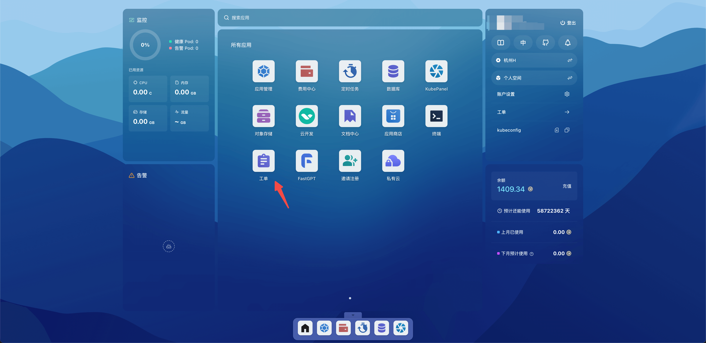
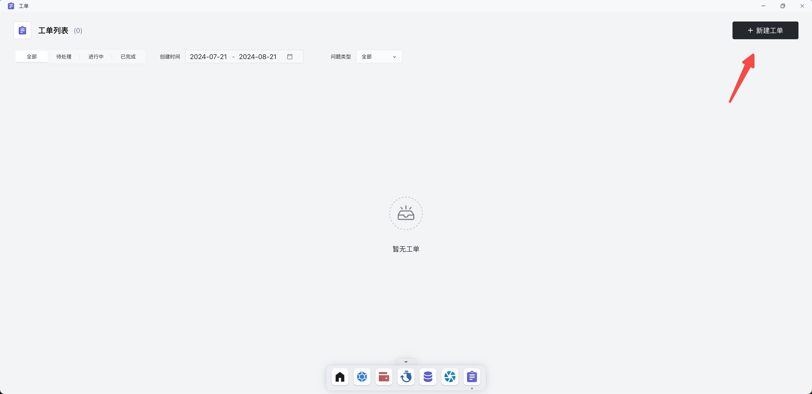

# 工单

当您在使用 Sealos 的过程中，遇到任何问题，都可以使用工单提出您的疑问和反馈，我们会尽快为您处理。

## 快速开始

打开 Sealos 桌面，点击工单。

点击新建工单。

选择问题的类型，上传与问题相关的附件，描述问题的详细情况，最后点击提交工单。

工单提交成后之后，会有🤖机器人客服回答问题，如果觉得机器人的回复无法解决问题，可以点击转人工客服。

点击工单的详情，可以重新进入聊天界面，如果问题已经解决，可以点击关闭工单。

