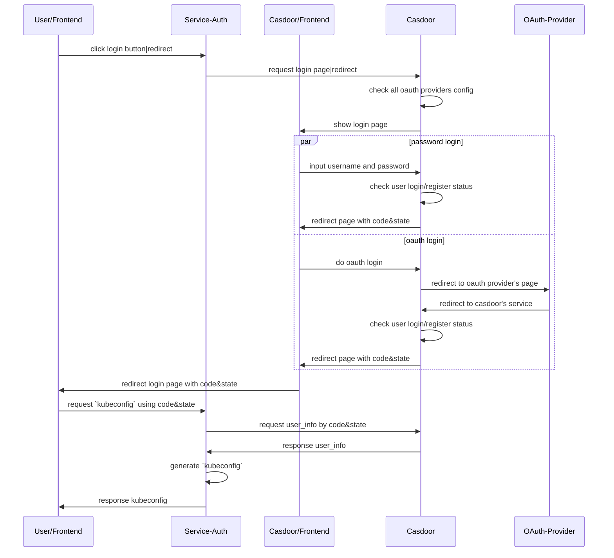

# service-auth 
Auth service to manage all namespaces and users.

## Description
The auth service is to manage all namespaces and users.
It handle all login actions and pages using [casdoor](https://github.com/casdoor/casdoor).
Users can easily add oauth2 providers to login.

## Start

### Step by step installation and run

1. A Running `sealos kubernetes` cluster with admin access.  
    ```shell
    sealos run labring/kubernetes:v1.25.0 labring/helm:v3.8.2 labring/calico:v3.24.1 --masters xxx --nodes xxx -p/-pk
    ```
2. Cluster must have `helm` and `openebs` installed as base requirement.
    ```shell
    sealos run labring/helm:v3.8.2 
    sealos run labring/openebs:v1.9.0
    ```
3. Apply auth's requirement: `casdoor.yaml`
    ```shell
    kubectl apply -f pkg/auth/conf/casdoor.yaml
    ```
4. Apply auth's service `auth.yaml`, *must change 3rd login types and keys.*
    ```shell
    kubectl apply -f deploy/manifests/auth.yaml
    ```
5. Open browser head to `http://ip*:30007/login`

## UML Graph



## Development

1. `service/auth` is the entry point for api service, any routes and config check should be done here.
2. `pkg/auth` is the base implementing of auth service.
    1. It's duty to start all auth service's internal needed backend, like `mysql`,`openebs`,`casdoor` etc.
    2. It should provide sdk access to auth service and manage all information up to date, not aware of api calls and/or sdk calls.

Since the `go.work` workspace structure, currently we cannot build docker under `service/auth` dir, so we build binary using makefile and then package it to docker image.

### Troubleshooting

1. Callback urls cannot auto update at mysql db level.

## RoadMap

1. Combine service-auth with cluster images like below:
    ```shell
    sealos apply -f deploy/Kubefile
    ```
2. Add support for more third-party login methods

## License

Copyright 2022 labring.

Licensed under the Apache License, Version 2.0 (the "License");
you may not use this file except in compliance with the License.
You may obtain a copy of the License at

    http://www.apache.org/licenses/LICENSE-2.0

Unless required by applicable law or agreed to in writing, software
distributed under the License is distributed on an "AS IS" BASIS,
WITHOUT WARRANTIES OR CONDITIONS OF ANY KIND, either express or implied.
See the License for the specific language governing permissions and
limitations under the License.

